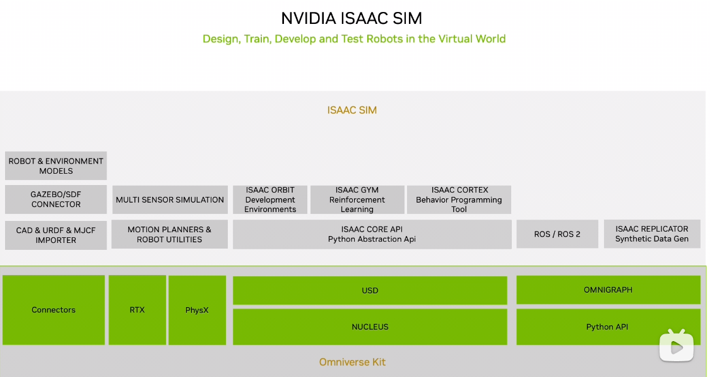
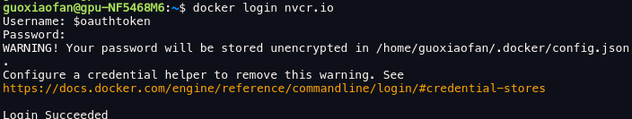

英伟达dockerhub    Godfery110120





```
sudo docker run --name isaac-sim --entrypoint bash -it --gpus all --rm --network=host \
    -e "ACCEPT_EULA=Y" \
    -e "PRIVACY_CONSENT=Y" \
    -e "DISPLAY_WIDTH=1920" \
    -e "DISPLAY_HEIGHT=1080" \
    -e "STREAMING_RTX_MODE=1" \
    -v ~/docker/isaac-sim/cache/kit:/isaac-sim/kit/cache:rw \
    -v ~/docker/isaac-sim/cache/ov:/root/.cache/ov:rw \
    -v ~/docker/isaac-sim/cache/pip:/root/.cache/pip:rw \
    -v ~/docker/isaac-sim/cache/glcache:/root/.cache/nvidia/GLCache:rw \
    -v ~/docker/isaac-sim/cache/computecache:/root/.nv/ComputeCache:rw \
    -v ~/docker/isaac-sim/logs:/root/.nvidia-omniverse/logs:rw \
    -v ~/docker/isaac-sim/data:/root/.local/share/ov/data:rw \
    -v ~/docker/isaac-sim/documents:/root/Documents:rw \
    nvcr.io/nvidia/isaac-sim:4.5.0
    
    
    sudo docker exec -it isaac-sim bash
```

