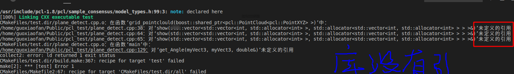
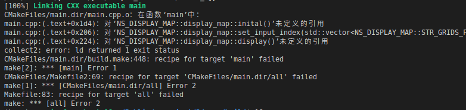
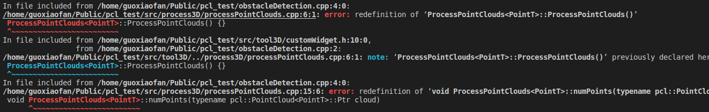

# C++编程BUG记录及编程习惯

> ***人类对于所面对的灾难总是毫无创意可言。***        
>
> ​                                                                                               ***——查理-芒格***

#### 1.常用模块

##### 1.1关于路径问题全部写成

```c++
std::string file_name("/home/guoxiaofan/Public/3d_env/image_917/pc_5.ply");
        if (pcl::io::loadPLYFile<pcl::PointXYZ>(file_name, *cloud1) == -1) //* load the file 
        {
            PCL_ERROR("Couldn't read file test_pcd.pcd \n");
            system("PAUSE");
            return;
        }
```

注意：路径位置如果是相对位置话是基于build文件

##### 1.2 耗时

```c++
auto startTime = std::chrono::steady_clock::now();
//加入待计算耗时代码块
auto endTime = std::chrono::steady_clock::now();
auto elapsedTime = std::chrono::duration_cast<std::chrono::milliseconds>(endTime - startTime);
std::cout << "Point cloud filtering took " << elapsedTime.count() << " milliseconds" << std::endl;
```

**1.3 匿名函数，只调用一次，display()**

```c++
#include<iostream>
void hello()
	{
		int a = 9;
		auto tsert = []()
		{
			int a = 0;
		};
		tsert();
	}
 int main()
{
	
	hello();
	return 0;
}
```

**1.4 读取文件图片，简化的循环方式，适合vecter的迭代器**

```C++
 glob(folder, calib_files);
        for (auto &file : calib_files) //记住这种读取数据的方式  比较让人接受
        {
            
        }
```


#### 2.工程bug解决案例

##### 2.1 没存在的函数名

编译器自动会波浪线标红。头文件没导入

##### 2.2 未定义引用

实现(.cpp)等没有导入，可能编译通过了，链接阶段头文件没有找到实现，编译器会自动绑定同名的cpp和h，一般情况是cmake没写好。



如果控制台没报错，全程没有标红err，编译过了还报错，说明是CMakeLists.txt包含定义//==一个月后又犯这问题==




##### 2.3 模版类应用的注意事项

一种是直接写成hpp的文件，另一种是按照普通的类的写法，不过在调用的时候不仅包含头文件还需要包含cpp文件。

##### 2.4 重复定义

这种情况说明说明头文件(即申明)，被别的文件重复引用。这种报错类似以下：

```c++
int a;
int a=10; //错误写法
    
int a;
a=10;//正确写法
//同名声明只能一次，而赋值多次，这个问题后续在类成员变量和成员函数也会遇到，谨记。
```

***关于头文件的引用习惯：*****1.cpp函数只写同名的h，而h文件全部写需要引的头文件，再编译器看来，二者是穿连裆裤的。**

​                                          **2.可以显示引用也可以隐式引用。目的是把各个头文件包含再类，但不能重复包含。**



##### 2.5 在循环中的局部指针变量

循环内每次运行都会清理里面的变量，如果循环体外定义变量指针，则每次都是一个地址，里面的值每次循环都变化，那最终读取的时候只会读到指针所对应的最后一次循环的值。

```c++
//说明：在循环中赋值指针一定定义在函数体内。
for (size_t i = 0; i < column; i++)
        {
                // cout << "//////////////////////////////////////" << i +1<< " 行"    << "///////////////////////////////////////////" << endl;
                for (size_t j = 0; j < row; j++)
                {
                        // if (    (i == 5 && j == 12)
                        // ||      (i == 6 && j == 13)
                        // )
                        {
                                pcl::PointCloud<pcl::PointXYZ>::Ptr cloud_out(new pcl::PointCloud<pcl::PointXYZ>);
                                pcl::PointCloud<pcl::PointXYZ>::Ptr cloud_temp(new pcl::PointCloud<pcl::PointXYZ>);
                                pcl::PointCloud<pcl::PointXYZ>::Ptr cloud_clear(new pcl::PointCloud<pcl::PointXYZ>);
                                extract.setIndices(grid[i][j].grid_inliers); //创建抽取出来的点的索引（编号）
                                extract.setNegative(false);
                                extract.filter(*cloud_temp); //在循环中初始化cloud_out！！！！
                                cloud_out = cloud_temp->size() > 3 ? cloud_temp : cloud_clear;
                                grid[i][j].grid_cloud = cloud_out;
                                grid[i][j].m_mean_y = get_y_mean(cloud_out);
                                grid[i][j].m_std_y = get_y_std(cloud_out);
                                grid[i][j].m_gradient = calAngle(cloud_out);
                                cout << "(" << i << "," << j << ")"
                                     << " "
                                     << "属性size1: " << grid[i][j].grid_cloud->size() << "  "
                                     << "属性size2:  " << grid[i][j].grid_inliers->indices.size() << "  "
                                     << "属性mean: " << grid[i][j].m_mean_y << " "
                                     << "属性std: " << grid[i][j].m_std_y
                                     << "属性angle: " << grid[i][j].m_gradient << endl;
                                //  cloud_out->points.clear();
                        }
                }
        }
```

##### 2.6 成员函数调用成员变量问题

头文件声明变量没有初始化，在cpp文件初始化赋值。临时变量直接在函数体里面初始化，相当于中转，运行完即销毁，重要变量在头文件声明，局部变量为期加工。

//说明：头文件定义了成员变量，成员函数初始化时，不应该加（类型：变量名=初值），而是直接（变量名=初值），不然，把它看成了新的局部变量，函数运行后就销毁了数据，而外部的成员变量依旧没有赋值。如果整体写一个main函数的话被报错为重定义，分文件写或者函数包装来写(void test())的话相当于局部变量，不会报错，但不会赋值改变类成员变量。


```c++
//头文件：
                 int column;
                int row=4;
                int grid_size ;
               Grid grid[20][30];
              
                vector<vector<double>> vector_gridsize;
                vector<vector<double>> vector_grid_y;
                vector<vector<double>> vector_gridstd;
                vector<vector<double>> vector_grid_angle;
                vector<vector<double>> vector_grid_class4;
                vector<vector<double>> vector_grid_class2;


//实现文件：
void NS_OBSTACLE_DETECTION::obstacle_detection::init()
{     
   		// int row=30;//
        row = 30;
        column=20;
        grid_size=20;调试技巧
        vector<vector<double>> vector_gridsize{column, vector<double>(row)};
        vector<vector<double>> vector_grid_y{column, vector<double>(row)};
        vector<vector<double>> vector_gridstd(column, vector<double>(row));
        // vector<vector<double>> vector_grid_angle(column, vector<double>(row));

        vector_gridsize = vector<vector<double>>(column, vector<double>(row));
        vector_grid_y = vector<vector<double>>(column, vector<double>(row));
        vector_gridstd = vector<vector<double>>(column, vector<double>(row));
        vector_grid_angle = vector<vector<double>>(column, vector<double>(row));
        show1(vector_grid_angle);
}
void NS_OBSTACLE_DETECTION::obstacle_detection::output()
{
        pcl::PointCloud<pcl::PointXYZ>::Ptr cloud(new pcl::PointCloud<pcl::PointXYZ>);
        init();
        set_intput_points(cloud);
       show1(vector_grid_angle);
```

##### 2.7 指针未清理造成数据异常

> 先说现象：反复读取一张点云图的时候，算法求出的边界线随时间一直往后延，排查问题很久，一步步调试问题，直到定位到读入点云时索引问题，指针没清理！！！

清理指针的两种方法：1.直接清理delete。2.清理指针所指向的数据，此方法地址不变，只是数据没了。

```c++
 {
                                pcl::PointCloud<pcl::PointXYZ>::Ptr cloud_out(new pcl::PointCloud<pcl::PointXYZ>);
                                pcl::PointCloud<pcl::PointXYZ>::Ptr cloud_temp(new pcl::PointCloud<pcl::PointXYZ>);
                                pcl::PointCloud<pcl::PointXYZ>::Ptr cloud_clear(new pcl::PointCloud<pcl::PointXYZ>);
                                extract.setIndices(grid[i][j].grid_inliers); //创建抽取出来的点的索引（编号）
                                extract.setNegative(false);
                                extract.filter(*cloud_temp); //在循环中初始化cloud_out！！！！
                                cloud_out = cloud_temp->size() > 3 ? cloud_temp : cloud_clear;
                                grid[i][j].grid_cloud = cloud_out;
                                grid[i][j].m_mean_y = get_y_mean(cloud_out);
                                grid[i][j].m_std_y = get_y_std(cloud_out);
                                grid[i][j].m_gradient = calAngle(cloud_out); 
                                grid[i][j].grid_inlier->indices.clear();/////////!!!!!!!!!!!!!!!!!!!!!!!!!!!!!!!!!!!!!!!!!!!!!!!!注意，就差这句让我调试了8H
                        }
```

> 我截取一行的点云，栅格化后不是一行，数据不规则！！

这个问题在三天后又困扰我四个小时，原因是我想在后面单独写一个函数来清理这个指针所对应的索引，出现数据错乱问题。

```c++


void NS_OBSTACLE_DETECTION::obstacle_detection::add_grid_properity()
{
        // Grid grid[column][row];
        double mean_guo = 0;
        double std_guo = 0;
        double gra_guo = 0;
        double size_guo = 0;
        extract.setInputCloud(cloud_in); //从哪里抽取
        for (size_t i = 0; i < column; i++)
        {
                for (size_t j = 0; j < row; j++)
                {               
                        {
                                pcl::PointCloud<pcl::PointXYZ>::Ptr cloud_out(new pcl::PointCloud<pcl::PointXYZ>);
                                pcl::PointCloud<pcl::PointXYZ>::Ptr cloud_temp(new pcl::PointCloud<pcl::PointXYZ>);
                                pcl::PointCloud<pcl::PointXYZ>::Ptr cloud_clear(new pcl::PointCloud<pcl::PointXYZ>);
                                extract.setIndices(grid[i][j].grid_inliers); //创建抽取出来的点的索引（编号）
                                extract.setNegative(false);
                                extract.filter(*cloud_temp); //在循环中初始化cloud_out！！！！
                                cloud_out = cloud_temp->size() > 3 ? cloud_temp : cloud_clear;
                                grid[i][j].grid_cloud = cloud_out;
                                grid[i][j].m_mean_y = get_y_mean(cloud_out);
                                grid[i][j].m_std_y = get_y_std(cloud_out);
                                grid[i][j].m_gradient = calAngle(cloud_out);
                                size_guo += cloud_temp->size();
                                mean_guo += grid[i][j].m_mean_y;
                                std_guo += grid[i][j].m_std_y;
                                gra_guo += grid[i][j].m_gradient;

                                grid[i][j].grid_inliers->indices.clear();//!!!!!!!!!!!!!!!!!!!!!!!!!!!!!!!!!!!!!!!!!!!!!!!!!!!!!!!!!!!!!!!!!!!!!!!!!!!!!l加深理解
                        }
                }
        }
}

//这样清除不可行
void NS_OBSTACLE_DETECTION::obstacle_detection::clear_all()
{

        for (size_t i = 0; i < 20; i++) //每个栅格都有一个索引的vector 需要在循环里面clear。
        {
                for (size_t j = 0; j < 30; j++)
                {
                       grid[i][j].grid_inliers->indices.clear();
                }
        }
}


class Grid
{
public:
        pcl::PointCloud<pcl::PointXYZ>::Ptr grid_cloud;
        pcl::PointIndices::Ptr grid_inliers{new pcl::PointIndices};
        //bool low_emp = true;
        double m_mean_y ;
        double m_std_y;
        double m_gradient;
        double m_angle;

        void grid_clear()
        {
                grid_inliers->indices.clear();
             //   grid_cloud->points.clear();

        }
};

/////////////////////////////////////////没调通///////////////////////////////////////////////////////////////
grid[i + column / 2][j] .grid_inliers = pcl::PointIndices::Ptr(new pcl::PointIndices);

grid[i + column / 2][j].grid_inliers->indices.push_back(m);
```

**2.8  重定义冲突**  

error: conflicting declaration

```c++
int a,b,c,a[30][30],brr[30][30];  a定义了两次
```


#### 3.编程习惯总结记录

##### 3.1 void test()函数的本质

- 可读性强，可以命名模块功能，方便管理。
- 由main函数单线处理到自定义跳跃式处理，一根筋到装配式处理。
- 加入到函数类的都变成为局部变量，在外边的都是全局变量，作用域变化。

##### 3.2 谈谈作用域

- 作用域的思想贯穿始末，变量、函数、类/结构体、命名空间、文件。
- 一个文件=main函数→函数模块→类(命名空间)     
- 分文件=只有函数→类→命名空间
- 针对以上三种情况，声明实现调用的语法区别，对应不同的作用域。其中函数就最简单 只要头文件包含后，任何位置调用，不需要定义对象撒的。
- 对于调用函数和变量 一定要两个方面：1.当前位置的作用域(谁的地盘)；2.要调用的成员的作用域(被谁管)。
- 分文件不影响作用域，主要看要用的变量和函数是不是class或namespace。

##### 3.3 习惯养成

- ==结构体（定义）写在头文件里面，记得写在最前面，如果写在后面则需要加声明！！！==编译实时化栅格地图接口出现问题

- 1.main和CMakeLists反正最外层；
  2.核心代码可以写成src（包含.h和.cpp也可以只用.h在里面函数实现）
     代码多的化可以按照避障代码一样文件名按照模块命名再封装；
  3.命名一定规范：结构体=STR_大写名字  
                                     类=首字母大写
                                     函数=驼峰或小写_  首字母小写第二单词大写 动词开头
                                     类成员变量=m_小写名字  
                                     宏定义=全大写

- #### 4.加深理解概念的代码


##### 4.1 数据类型声明及初始化

```c++
//指针和变量定义有些区别，指针类型：名字=地址 除此之外还要指向值

pcl::PointCloud<pcl::PointXYZ>::Ptr cloud(new pcl::PointCloud<pcl::PointXYZ>);    

pcl::PointCloud<pcl::PointXYZ>::Ptr cloud
 cloud= pcl::PointCloud<pcl::PointXYZ>::Ptr(new pcl::PointCloud<pcl::PointXYZ>);   
、、、、、、、、、、、、、、、、、、、、、、、、、、、、、、、、、、、、、、、
vector<vector<double>>  vector_gridsize(column, vector<double>(row));
    
vector<vector<double>>  vector_gridsize
vector_gridsize = vector<vector<double>>(column, vector<double>(row));

 pcl::PointIndices::Ptr inliers{new pcl::PointIndices};
 pcl::PointXYZ point;
```

##### 4.2 特别经典的案例

包含：循环 判定 赋值

从哪里拿数据(外循环)，放在那里(内循环)，那些数据合规(判断)，执行操作。

```c++
  for (int m = 0; m < cloud_in->size(); m++) //栅格化
        {
                for (i = -column / 2; i < column / 2; i++)
                {
                        if (((cloud_in->points[m].x > i * grid_size) && (cloud_in->points[m].x < i * grid_size + grid_size))) //如果x在某范围内
                        {
                                for (j = 0; j < row; j++)
                                {
                                        if ((cloud_in->points[m].z > j * grid_size) && (cloud_in->points[m].z < j * grid_size + grid_size)) //如果z在某范围内
                                        {
                                                //grid_inliner是pointindices类型的指针,pointindices类型的内容，包括header和索引向量indices
                                                //header就直接赋值为输入点云的header
                                                grid[i + column / 2][j].grid_inliers->indices.push_back(m);
                                                grid[i + column / 2][j].grid_inliers->header = cloud_in->header;
                                                pcl::PointXYZ t_point;
                                                t_point.x = cloud_in->points[m].x;
                                                t_point.z = cloud_in->points[m].z;
                                                t_point.y = cloud_in->points[m].y;
                                                // grid[i + column / 2][j] .grid_cloud->push_back(t_point);
                                                //grid[i + column / 2][j].all_x += t_point.x = cloud_in->points[m].x;
                                        }
                                }
                        }
                }
```


#### 5.代码调试技巧与思想

**思想：对与一些数据出问题的情况，往前排查，一步一步的打logo，定位出差点。**

*项目开发的流程：1.了解项目需求，归纳功能点，算法流程，组织框架。*

​                               *2.按上述想法实现，编译通过。（解决语法问题）* 

  							 *3.整体调试，一个模块，一个函数的打印logo。（解决core dumped） //医生诊断 探针 查电路的万用表*

//补充：**==调试实时避障后对项目的思考==**

调试技巧：

- 循环内部打印特定次序的代码

  ```c++
  控制循环：1.循环自身长度。2 .下面这种特定数据。3.i、j赋值自定义不连续次序？  4.continue跳过余下部分，条件可用a/10==7  a%7==0 a%10==7
    for (size_t i = 0; i < column; i++)
   {
            for (size_t j = 0; j < row; j++)
                  {
                          if (    (i == 5 && j == 12)
                          ||      (i == 6 && j == 13)
                        执行语句
                          }
                  }
          }
                              
  // if (k == 19)break;    补充
  ```

- 循环内部只读一次块代码，其他继续执行

  ```c++
  static bool is_first = true;          
  if(is_first)
   {
         pcl::io::loadPLYFile<pcl::PointXYZ>(pathfile, *cloud_guo);
        is_first = false;
   }
  ```

  

- 开启一个分支便于装换调试(开关)    

  ```c++
  #if 10
  detector.set_intput_points(cloud_guo);
   #else
  detector.set_intput_points(pre_points);
   #endif
  ```

- 小综合——对流程的自定义控制  

  ```c++
  限制条件：1.一次就好 2.到此就好  ！！！！
  while(1)
  {
  if(!is_corection)
              {
                  printf("original_points size = %d\n",(int)original_points->points.size());//先点云校准
                  pre_treatment.preprocess(original_points);
                  is_corection = true;
                  continue;//很精髓，校准只需一次，一次校准可以够后续多次处理，没必要每次计算校准，跳出本次循环(不是跳出循环)
              }    
    }
  ```

- 打logo方式while (1)sleep(1);) 一直停在某处。  dbg

#### 6.vscode调试配置

`需要在.vscode下建立三个文件:`

- c_cpp_properties.json : 该文件是c/c++ 插件进行代码提示和纠错的设置,与编译无关.

- tasks.json:该文件是设置编译的配置文件,command参数,设置编译器,args参数,设置编译器参数. 按按Ctrl + Shift + B键进行编译.

```json
{
        "version": "2.0.0",
        "tasks": [
                {
                        "label": "build",                                               //修改 和后面  "preLaunchTask": "build" 一致名称
                        "type": "shell",
                        "command": "bash ./.vscode/build.sh",                 //修改
                        "group": {
                                "kind": "build",
                                "isDefault": true
                        }
                }
        ]
}
```

.vscode/build.sh

```json
cd ./build/
# cmake -DCMAKE_BUILD_TYPE=Dedug              #set(CMAKE_BUILD_TYPE DEBUG) 在cmakelists加上这句 不然不能单步执行
make -j8
```

- launch.json : 调试器的配置文件, program设置要调试的程序, 

  ```json
  {
          "version": "0.2.0",
          "configurations": [
                  {
                          "name": "(gdb) 启动",
                          "type": "cppdbg",
                          "request": "launch",
                          "program": "${workspaceFolder}/build/StereoCalibMatch",   //修改
                          "args": [],
                          "stopAtEntry": false,
                          "cwd": "${workspaceFolder}",
                          "environment": [],
                          "externalConsole": false,
                          "MIMode": "gdb",
                          "setupCommands": [
                                  {
                                          "description": "为 gdb 启用整齐打印",
                                          "text": "-enable-pretty-printing",
                                          "ignoreFailures": true
                                  } 
                          ],
                          "preLaunchTask": "build" //可以新增一条
                  }
          ]
  }
  ```

  

#### 5.cmake编译问题汇总

- 各个模块：静/动态库封装或直接源文件.cpp    

  aux_source_directory(display_map DIR_DISPALY)

  add_executable(main main.cpp ${DIR_DISPALY})//把头文件都包含在里面去了
  
- 单步调试需加：set(CMAKE_BUILD_TYPE DEBUG)  

#### 6.工程项目构建


4.项目框架：data src/include test_demo  build  docs   output
5.config配置文件的重要性 路径和固有不变参数


vscode开发效率工具：

1、git 代码管理记录对比
2、local history刷新备份 
3、调试工具 方便定位问题及快速理解流程；
4、脚本执行 Ctrl+shift+B

参考：
宏威、李博、文高；


#### 7.一些小测试验证

打断点调试及vector赋值

```c++
    int i = 0;
    vector<int> a;
    vector<int> a(4);
    while (1)
    {
        i++;
        sleep(1);
        cout << i << endl;
    }
    for (int i = 0; i < 4; i++)
        a[i] = i;
  
    cout << a.size() << endl;
```

