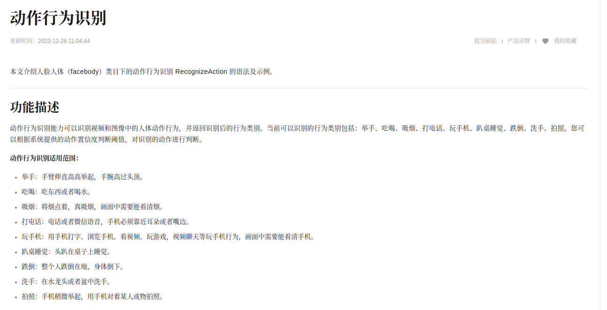
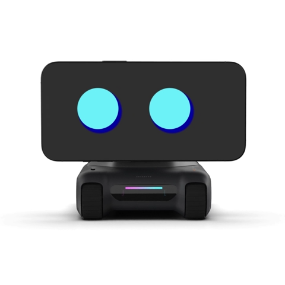
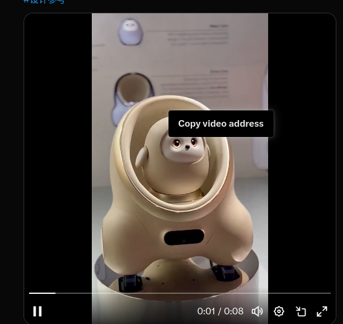
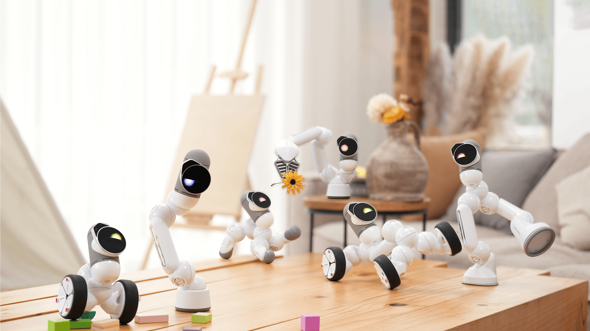
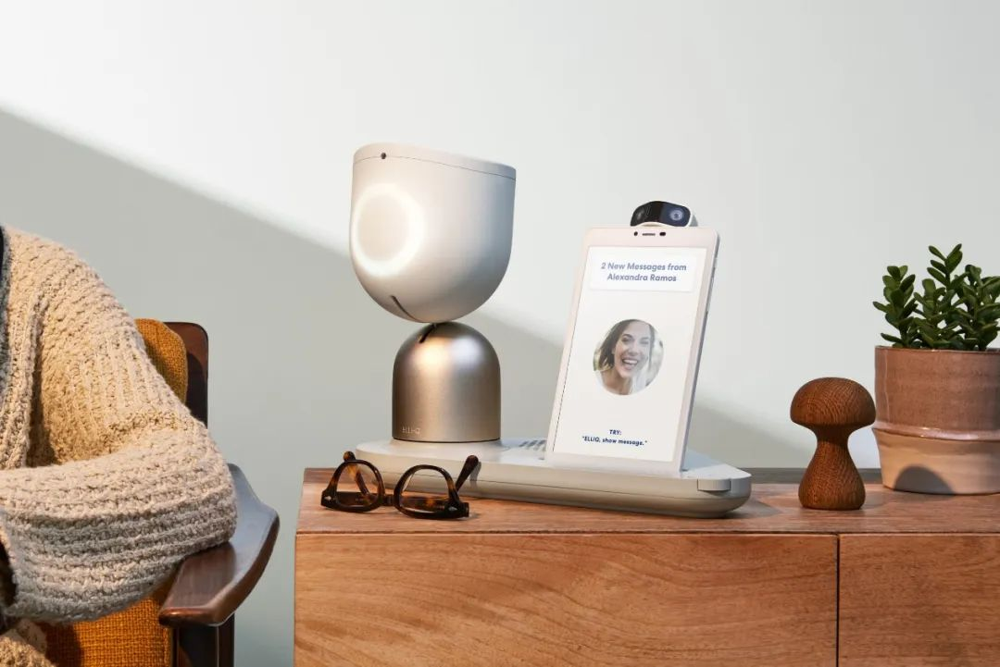

https://help.aliyun.com/zh/viapi/developer-reference/api-action-recognition?spm=a2c4g.11186623.help-menu-142958.d_4_3_3_4_2.3d1621c62LVC3P

https://x.com/i/status/1767765295094206673

Looi智能桌面机器人     https://looirobot.com/products/looi-robot?variant=49092007690453

珞博智能  https://www.leiphone.com/category/robot/cvgvPR9TDPX08Ysh.html

TCL 在 CES 2025 上发布了 Aime

ClicBot  https://keyirobot.com/pages/products-page

<video src="../O_1VertP7t1zhylK.mp4"></video>

<video src="../../../下载/O_1VertP7t1zhylK.mp4"></video>

ElliQ   

| 测试项 | 材质                       | 尺寸         | 方位                 |
| ------ | -------------------------- | ------------ | -------------------- |
|        | 常规反色滤物体（类似纸箱） | 长宽10cm物体 | 前后各三个位置；     |
|        | 低反色滤物体（黑色箱子）   | 长宽20cm物体 | 左右两侧各三个位置； |
|        | 高反色滤物体（贴反光贴）   | 长宽50cm物体 |                      |

https://www.toptechim.com/h-pd-23.html
