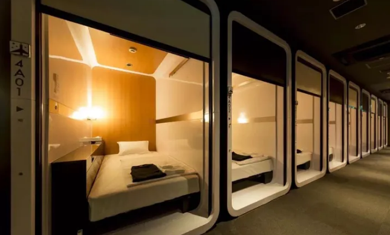
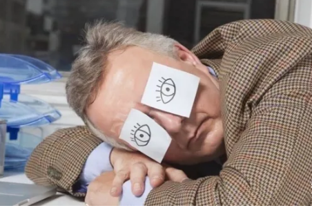

### **午睡背后的生物机制**

从生物学的角度来说，我们在夜晚会睡比较久，并在一天中的中间时段也需要短暂的睡眠。**通常在下午 1 点到 3 点这个时间段中，我们的身体温度会下降，而[褪黑激素](https://www.zhihu.com/search?q=褪黑激素&search_source=Entity&hybrid_search_source=Entity&hybrid_search_extra={"sourceType"%3A"answer"%2C"sourceId"%3A499877212})会上升，这两种情况都会起到促进睡眠的作用。**即使现代文化并不推崇在白天小憩，但我们的身体还是坚持这种习惯。

### **健康午睡的好处**

人们通常以为，午睡是一种懒惰的表现。实际上，经常打盹的人更有精力和动力工作。他们知道睡眠的重要性，只有获得充足的睡眠，他们才能在日常生活中、工作中和人际交往中发挥出最好的表现。

- 帮助你更好地决策

- 减少压力

- 保持你的容貌

- 提升体力活动

-  增强专注力和警觉性

- 帮助你更好地决策

### **不科学的午休弊端**

如果打盹时间过长，导致了白天过多的睡眠就会：

-  干扰夜间睡眠，引发失眠的症状；

- 扰乱健康的昼夜节奏，这对睡眠和唤醒性能都至关重要；

- 干扰情绪和日常表现。

### **打盹的关键是什么？选择适当的时间和长度！**

记得自己从午睡中醒来，那种==迷失方向和昏昏沉沉==的感觉吗？

  	***那种令人不安、恍恍惚惚重新进入清醒世界的感觉说明你是在深度睡眠中结束午睡的。从[深度睡眠](https://www.zhihu.com/search?q=深度睡眠&search_source=Entity&hybrid_search_source=Entity&hybrid_search_extra={"sourceType"%3A"answer"%2C"sourceId"%3A499877212})中醒来并不会让你变得清醒，恰恰相反：在睡醒后的一段时间内，持久的[睡眠惯性](https://www.zhihu.com/search?q=睡眠惯性&search_source=Entity&hybrid_search_source=Entity&hybrid_search_extra={"sourceType"%3A"answer"%2C"sourceId"%3A499877212})会让你变得混混沌沌，这反而使你的认知表现变得更糟。***

**最佳的打盹时长是多久呢？**

管家结合打工人工作时间,建议规划一段少于 20 分钟的小睡来帮助自己从轻度睡眠中睡醒。

### **哪些人不适合午睡？**

**容易失眠的人:**失眠的人无法在夜间入睡，并且他们的昼夜节奏也是紊乱的。如果你患有失眠症，你可能想要在白天小睡一会，一次性补上前一天晚上错过的睡眠。然而，白天睡觉会相应地减少晚上的睡眠需要，从而加剧或延长你的[失眠症状](https://www.zhihu.com/search?q=失眠症状&search_source=Entity&hybrid_search_source=Entity&hybrid_search_extra={"sourceType"%3A"answer"%2C"sourceId"%3A499877212})。

**抑郁症患者:**抑郁症和其他[情绪综合症](https://www.zhihu.com/search?q=情绪综合症&search_source=Entity&hybrid_search_source=Entity&hybrid_search_extra={"sourceType"%3A"answer"%2C"sourceId"%3A499877212})患者通常会有睡眠上的问题，比如说昼夜节奏紊乱，低质量的睡眠，不健康的睡眠习惯，白天过度嗜睡等等。打盹会加剧这类人的睡眠问题，也会加剧抑郁情绪。

