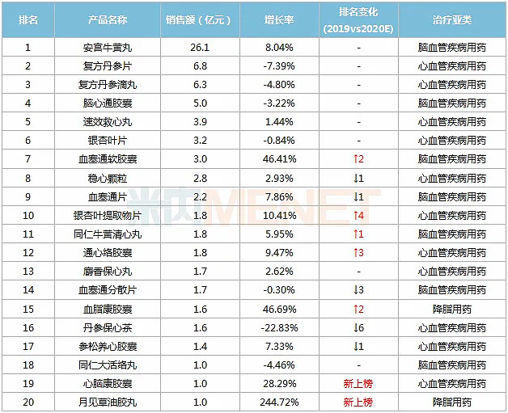
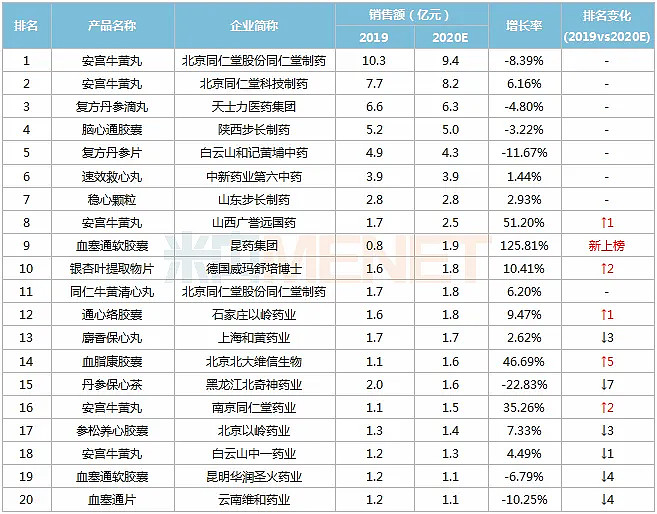

**[行业概况](https://www.sohu.com/a/435010033_120934816)**

表1：2020E中国城市零售药店终端心脑血管中成药TOP20产品

表2：2020E中国城市零售药店终端心脑血管中成药TOP20品牌

复方丹参滴丸销量2017-2020年1.47亿盒、1.38亿、1.2亿、1.08亿

**医药行业:**化学 生物 中药  医疗 检测 商业 大健康(保健) 医美

**中药标地:**片仔癀 云南白药 同仁堂 广誉远 寿仙谷  通化东宝 甘李药业 信立泰 天士力 步长以岭药业 江中药业 中新药业 葵花药业

[**转：药店心脑血管中成药TOP10，7个是独家！**](https://xueqiu.com/6815845163/90379633)

[**步长制药深度分析(步长制药深度分析雪球)**](https://www.ansbabe.com/chanye/301986.html)

[**林园重仓这五只中药股！**](https://zhuanlan.zhihu.com/p/450666207)

[**林园投资2021年持仓明细【最新】**](https://zhuanlan.zhihu.com/p/405691657?ivk_sa=1024320u)

[**人口1**](https://xueqiu.com/7142097454/204197221)

[**上市66家公司药企，8家毛利率超80%**](https://zhuanlan.zhihu.com/p/151349704)

[**2021最全医药13类细分龙头股（建议收藏）**](https://zhuanlan.zhihu.com/p/367639577)

**[中药股综合指标汇总](https://zhuanlan.zhihu.com/p/391519323)**

[**林园：未来三十年投资大方向，心脑血管用药及相关公司分析**](https://mp.weixin.qq.com/s?__biz=MzkzNjE1ODI2NA==&mid=2247497526&idx=1&sn=7cf6fca1baec281884bc2b2f8a00300c&chksm=c2a04261f5d7cb77aeaa32da8d8abe9f59be563902fc3175719f8105c02920aa4444f4c975db&mpshare=1&scene=1&srcid=0424SSTo72RE4rKwpn8lDZzO&sharer_sharetime=1650733952720&sharer_shareid=37265b34cd97ae33d9ab8b0a0d2b73e4&exportkey=ATAmrCuwk7ccQ1u0ran9FRg%3D&acctmode=0&pass_ticket=autizxlLNyPXiiIY2y5F3%2B4hlFuOUGwneiz0F%2FJJ%2B6tYM7EWEtgs%2F0P%2B2zg7Q5bN&wx_header=0#rd)
