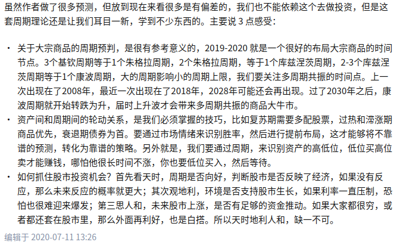

*5.**通过比较资源价格周期和经济周期发现，资源品价格的周期受制于世界经济增长的周期，随世界经济增长周期的繁荣而繁荣、衰退而衰退。***

感想：周天王比较了战后几个周期得出的结论，根据这个结论，推测新冠后这轮周期可得，伴随着经济的复苏，各国控制产能的情况下，[大宗商品](https://link.zhihu.com/?target=https%3A//xueqiu.com/S/SZ399979%3Ffrom%3Dstatus_stock_match)在未来一两年仍会有不错的表现。

*6.在（2006年）资源价格高度上涨的情况下，世界却没有像20世纪70年代那样产生恶性通胀的真正原因是什么，中国与此有何关系？我们认为，真正的中国因素在于，中国以丧失工业利润的方式，缓解了资源品高价格对北美和欧洲发达国家的通胀压力，从而增加了世界抗击高资源价格的韧性，推迟了发达国家采取紧缩政策的力度，延长了全球经济增长周期，也延长了资源品在高位的期限。*

感想：原来早在十几年前，包括周天王在内的专家和学者就看出了中国为融入苏联解体后美国主导的全球化而付出了多大的努力和牺牲。然后看今年这轮资源价格上涨，国家相应的把电价进行了调高，对资源价格更多的管控体现在民生领域（动力煤是最好的例子），说明政府不想让国内企业替世界（尤其是作为全球主要消费国的欧美）承担更多成本，包括环保方面的成本。

作者：Mego Jo
链接：https://www.zhihu.com/question/268372774/answer/2237178674
来源：知乎
著作权归作者所有。商业转载请联系作者获得授权，非商业转载请注明出处。

==M2包含 基础货币和衍生货币 gdp 信贷总额 社会融资规模   ???之间的关系及含义==

作者：appobs
链接：https://www.zhihu.com/question/412073195/answer/2343351280
来源：知乎
著作权归作者所有。商业转载请联系作者获得授权，非商业转载请注明出处。

说下自己的观点:

在过去的10年里，因为人在美国，刚下航母，我曾经是一个坚定的傻空。但回国这几年实地调研了市场和找相关的从业人员聊完之后，才发现自己有多蠢。现在屁股已经坚定的歪向了多方。

至少在目前的这个时间节点，@浪羁，@狂奔的蜗牛 的观点已经被现实推翻，2022年的风向是明显房价要涨。

其实房价大体上看只跟三个因素有关，这三个因素跟人口一点关系都没：

1. **dfzf；**
2. **[货币乘数](https://www.zhihu.com/search?q=货币乘数&search_source=Entity&hybrid_search_source=Entity&hybrid_search_extra={"sourceType"%3A"answer"%2C"sourceId"%3A2343351280})；**
3. **居民负债率；**

1.先说dfzf，这个我是赞同kk大神的。需求不是自然增长的，而是“拆”出来的。当棚改货币政策出来之后，意味着大量流动性的释放。房地产买卖中，dfzf才是最大的庄家，握有土地的绝对[议价权](https://www.zhihu.com/search?q=议价权&search_source=Entity&hybrid_search_source=Entity&hybrid_search_extra={"sourceType"%3A"answer"%2C"sourceId"%3A2343351280})。无论是zf的搬迁，还是新城的规划。这些都可以看做是为接下来卖出更多的土地而做准备。但这个问题被20，21年的[分税制](https://www.zhihu.com/search?q=分税制&search_source=Entity&hybrid_search_source=Entity&hybrid_search_extra={"sourceType"%3A"answer"%2C"sourceId"%3A2343351280})打破，换句话说，以前是赚了钱自己花，现在是赚了钱先收入国库，再由国家进行统一调配。所以这个政策造成的后果就是房价进一步两级分化：经济强市除了卖地还会有其他支柱产业，但明显收入手段单一的三四线城市就不一定了。同时城市之间的[马太效应](https://www.zhihu.com/search?q=马太效应&search_source=Entity&hybrid_search_source=Entity&hybrid_search_extra={"sourceType"%3A"answer"%2C"sourceId"%3A2343351280})也不断显现：3，4线流入1，2线已经是定势。理论上人口如果真的影响到了1线的城市，那么2，3，4线城市早就破产了。这个时候你也不需要买房了，run就行了。

所以1线城市，2线省会的房产价格还会有进一步的上探空间。但缺乏多元化产业的3，4线城市就倒霉了。

2.其次就是货币乘数，首先要明白的是我们是处于一个通胀型社会，在这个大前提下意味着货币是必须超发的，这个数字看CPI和PPI就行，2021年我朝cpi增加了不到1%，PPI可是大幅提升。这个绝对是有问题的，这意味着上游原材料价格飞涨，但底层购买却在萎缩。国际通论是成熟经济体是以2%的通胀是维持社会运转，不然经济无法增长。而不动产作为在天朝最优质的的资产，自然而然的承担了这个超发的主要承载体和印钞机功能。房地产不仅是居住载体，甚至可以说居住只是附加属性，印钞机和蓄水池才是他的真实身份，这点是需要分来开看的，对于央行而言，他是印钞机；但对于投资而言，他是蓄水池。@狂奔的蜗牛 的观点在这个节点上是正确的，人民币的确可以看做美元的衍生货币，这是我国的经济结构决定的。根据PPP原则，在纸币流通的情况下，如果商品[价值量](https://link.zhihu.com/?target=https%3A//baike.baidu.com/item/%E4%BB%B7%E5%80%BC%E9%87%8F)既定，则两国纸币购买力的差异实际上代表了两国货币所体现的价值量的差异。改革开放期间，我国出口大幅增加，由于不断流入美元，因此必须印出等价的人民币与之匹配。换句话说，假设流入了1000e美元，那么相应的就得印出6400e人民币。

但人民币的增加必须有相应的投放手段，否则就会在银行系统里空转。这个过程@浪羁部分正确，因为的确提供信贷是需要抵押物。要么在增加新的抵押物，要么原有的抵押物升值。放水的途径其实有很多，现在更多的是利用政策 工具以及宏观审慎原则去平衡水量，而不是搞大水漫溉。但由于房地产行业占国内经济比重太大（约34%左右），因此哪怕通过宏观审慎原则去调控，这多出的6400e怎么着也有2000e会流入房地产。

有人讲这个钱不流入房地产不行么？答案很直接，就像现在的美国一样，CPI直接崩盘。所以在保民生和推房价的选择题上，无疑推房价是最明智的选择。如果房价不涨，而涨的是柴米油盐。到那个时候，[大宗商品](https://www.zhihu.com/search?q=大宗商品&search_source=Entity&hybrid_search_source=Entity&hybrid_search_extra={"sourceType"%3A"answer"%2C"sourceId"%3A2343351280})上涨带来的绝不是知乎傻空小白领们的抱怨，而是整个社会的安稳，最坏的情况就是陷入滞胀。这个节点的判断上，@浪羁 无疑是错误的，因为房价未必会引起革命，物价才会。香港的K字形社会就是很好的例子，也是我们发展的目标。

3.居民负债率，这个我和@[叶泊枫](https://www.zhihu.com/search?q=叶泊枫&search_source=Entity&hybrid_search_source=Entity&hybrid_search_extra={"sourceType"%3A"answer"%2C"sourceId"%3A2343351280}) 的观点一致，但有一点不同：我国居民负债率绝不仅看平均，而是要看拆分开看。16年虽说拉爆居民杠杆，但目前的居民杠杆也就整体平均63%左右。而且这个是平均，如果你实地调研，就会发现其实还有很多人是有杠杆的空间的。比如互联网企业高管，小老板，甚至拥有宅基地的农民。。。所以这次放水直接把首付都砍到20%了，再损一点，货币棚改2.0，收了农民的宅基地，完成农村土改。让农民工冲进城市中买房。别说，这个我一开始是不敢相信的，但目前的走向明显有这方面的倾向，因为完全符合zy利益：

**1.进一步提升城镇化比率；**

**2.稳住房产基本盘，完成逆周期；**

**3.符合zyzc 的共同富裕口号，拉一波7亿民众的好感做宣传。**

**但重申一遍，债务减记只有俩种：要么违约，要么转移**。如果走的稍微平稳一点，让居民部门集体违约不大可能，社会要出问题。所以大概率找人接过居民杠杆同时以时间换空间，靠时间消化掉债务；其次让企业部门违约破产重组，最后完成债务减记。有人讲这次美元周期是资本市场的大考，的确没啥问题。

@浪羁和@狂奔的蜗牛的观点是基于我们是民主自由经济主义，完全以人民为单位。但这个恰好忽略了kk观点的本质核心：我们根本就不是一个mz的国家，而是zy集权的政策性体制。同时我朝成百上千年以来的一贯作风就是“百姓的钱3/7分账，地主的钱，如数奉还”，任何国家，zy都不需要为底层民众负责，就好像一个公司的决策难道需要和底层员工讨论么？？kk的言论引起极大的不舒适的点在于，他的屁股是歪向既得利益阶层的，而非普通民众。而这个社会大部分人是处于[金字塔](https://www.zhihu.com/search?q=金字塔&search_source=Entity&hybrid_search_source=Entity&hybrid_search_extra={"sourceType"%3A"answer"%2C"sourceId"%3A2343351280})的中低层，尤其是自命不凡的高学历知乎er，幻想自己博古通今，天命所归，不世之材。但却被现实打击到满地找牙，连一套房子都负担不起，自然会无限唱空。

狼羁大神甚至能得出限电和[内循环](https://www.zhihu.com/search?q=内循环&search_source=Entity&hybrid_search_source=Entity&hybrid_search_extra={"sourceType"%3A"answer"%2C"sourceId"%3A2343351280})这种风马牛不相及的故事也是真的可以。。房价砍30%也真敢说出口，我都怀疑跟pure日月这种是唱一个强调的了。

**最后阐述下我的观点：**

[鲍威尔](https://www.zhihu.com/search?q=鲍威尔&search_source=Entity&hybrid_search_source=Entity&hybrid_search_extra={"sourceType"%3A"answer"%2C"sourceId"%3A2343351280})是真有种，基本要鹰了。这种情况下，央行大概率开启[逆周期](https://www.zhihu.com/search?q=逆周期&search_source=Entity&hybrid_search_source=Entity&hybrid_search_extra={"sourceType"%3A"answer"%2C"sourceId"%3A2343351280})工具（实际上已经开启）。但目前在地方政府和普通居民杠杆都拉满的情况下，再来一次涨价去库存明显不合适（小周这事被骂了5年，但当时的确没办法）。

99年的[公转私](https://www.zhihu.com/search?q=公转私&search_source=Entity&hybrid_search_source=Entity&hybrid_search_extra={"sourceType"%3A"answer"%2C"sourceId"%3A2343351280})就是典型的让企业接盘政府债务，然后到15年再让居民接盘企业，背后都是美元周期的影子。所以接下来大概率会发生俩件事：

1. 企业方面，银行放贷让有实力的企业（国企）去重组&兼并濒临破产的企业，完成大鱼吃小鱼的过程。所以各赛道的龙头企业是这个过程的受益者。
2. 居民方面，以时间换空间。让时间和收入消化掉债务，同时让有实力的中高产去接盘没实力的居民债务。这个过程就会完成彻底的阶级固化，平民可能再也永远无法触碰到优质资产（楼盘），同时一二线的优质资产（房产）也会变成了富人之间接力的游戏。方向向着K字形社会发展，香港就是最好的例子。

根据上面的猜测，接下来要做事情就明确了：

1. **有能力+有资金+有精力的**，这俩年会有大量私营企业破产重组，其中不乏一些优质企业。要做的事情就是学99年国企私有化改革，照葫芦画瓢，接盘优质企业过来自己干。
2. **有能力+没资金+有精力的**，方向上死命往碳中和，元宇宙上去蹭。下个二十年的福布斯榜单大概率是这俩个行业的天下。
3. **有能力+有资金的+没精力的**，工欲善其事 必先利其器。这两年国家大力整顿金融业，规范监管，开创[科创板](https://www.zhihu.com/search?q=科创板&search_source=Entity&hybrid_search_source=Entity&hybrid_search_extra={"sourceType"%3A"answer"%2C"sourceId"%3A2343351280})北交所搞了这么半天就差拉着耳朵喊要换方西了。现在赛道已经明确，行业龙头也挑出来了，马太效应下龙头只会越来越强，要做的就是开个股票账户把钱放进去等个3-5年的事情。以中国的速度，美国的10年慢牛，中国怕不是5年就能走完。
4. **没能力+没资金+没精力的**，还是努力攒钱去一二线买个房子躺平吧。指望楼市再涨个十倍不大可能，但一二线城市的好地段房子保值跑个通胀，增值个1，2倍还是没啥问题。算是目前风险相对最小，也最稳妥的方案了。

------

顺便说一下，本人也是高房价的受害者，我是真的希望房价能如各路空头所说一般降下来，人们总是愿意相信符合自己利益的言论，而对现实嗤之以鼻。但现实总是残酷的：人总归是会回到现实当中，当不知道选哪条路最正确时，大概率选最难得那条就对了。

https://www.zhihu.com/question/412073195?ivk_sa=1024320u
