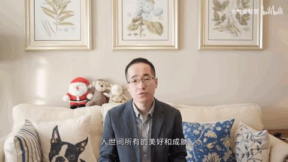

# 目标细化(2021)

> **世间所有的的美好和成就都是需要时间来沉淀的；**     **——大气哥**
>
> **在不定性中找确定性，做时间的朋友；       ——罗振宇**
>
> **当思想混沌时候，不知道干什么时候，去完成下面的任务清单吧；**

**==备注：欠缺能力是基于自我认知，需要改变方面是必须要改善的，任务清单是现阶段执行力==**

### 欠缺能力清单：

- [ ] 表达能力越来越欠缺了

  基础：按照面试那种状态保持，暂时不作其他要求；
  
  说话：少说，别张口就来，逻辑表述不清，本人还容易误解；

### 需改变方面：

- [ ] **英语阅读能力**

  - 解决问题： 1.学习专业知识，一些优质的资料、信息还是英文不容易混淆视听；

    ​				     2.如果想更客观全面的认识一个现象，还是要尽量脱离国内风气，多视角观察；

  - 可行性：利用零散时间专攻和平时学习工作注重阅读英文的习惯；

- [ ] **中国经济史案例**
  
  - 启发：《穷查理宝典》里面查理看商业失败案例
  
  - 解决问题：投资决策可以让自己大方向不出错；
  
  - 可行性：下班和地铁时间可以利用上
  
  - 方案：1.中国史：《激荡三十年》
  
    ​			2.美国史：《伟大的博弈》

### **任务清单：**

**未完成：**

- [ ] 深度学习系统（二）:《pytorch模型训练实用教程》--余霆嵩 待定...                                                   **（计划清除，三月份项目AI停了）**
- [ ] 深度学习系统（三）:视频   2.1-3.1                                                                                                          **（计划清除，三月份项目AI停了）**
- [ ] 费曼学习法：形成学习体系，加快学习效率，输出结构性框架及应用实际；待定...                           **（未系统学 实际往这方向做）**
- [ ] 《投资学课堂》:待定...                                                                                                                              **（计划清除，不重要）**

- [ ] 深蓝学院<<点云处理>>5.20—ing                                                                                                             **（半途放弃，abandon）**
- [ ] <<数学基础>>：6.9—7.1号                                                                                                                       **（半途放弃，abandon）**

**已完成：**

- [x] 深度学习（一）:网页版pytorch框架使用  12.20-1.10/手敲代码
- [x] 《做出好决定》: 1.23—2.6
- [x] 《金融学课程》: 1.8—3.24
- [x] <<致股东的信>>: 1.23—3.1
- [x] <<人类简史>>  ：2.14—
- [x] python学习(视频)--黑马程序员系统学习：1.25—2.28
- [x] <<潜规则>>  ：4.1—5.25 听书形式读完
- [x] <<经济学原理—宏观部分>>  ：4.6—ing

**八月更新：**

- [x] **《林园炒股秘籍》：**9.11-10.30
- [x] **慕课网《三维点云处理》：**9.13-11.30                                                                                                    **（完成传统算法部分，神经网络未开始）**
- [ ] 影响力：                                                                                                                                        
- [x] **B站课程《基于VSCode和CMake实现C/C++开发 | Linux篇》**：10.8-10:30
- [x] **B站课程《古月·ROS入门21讲》**：9.11-11.15
- [x] **《激荡30年》先音频**			
- [x] **《激荡30年》视频																										 			       	 **
- [ ] **线性代数官网：immersivemath：**                                                                                                       **（半途放弃，abandon，其他途径取代）**
- [x] **《伟大的博弈》**                                                                                                                                          **（开始ing）**                                        
- [x] **B站付费课程《跨学科工具箱(林超)》**
- [x] **喜马拉雅晓书童：《一课经济学》《疯狂人类进化史》《穷爸爸富爸爸》《查理芒格》《小岛经济学》**

>  ==备注：今年的阅读任务就这些了，不用再添加了...==

### 阶段性语录：

1.方法论：执行力模型 学习力模型 决策力模型；

2.无知和弱小并不是生存的障碍，傲慢才是；

3.细水流长，一天干十次不如十天干一次；

4.以大局观的思考问题才能解决问题；

5.我需要做的，并且贯穿一生需要做的事：用多元思维模型去理解、分析社会现象，逼近还原事物本身的原貌，无关情绪、偏见、意识形态；

