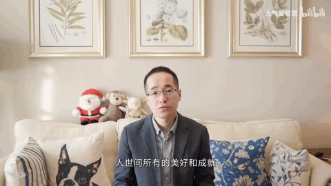

# 目标细化(2022)

> **世间所有的的美好和成就都是需要时间来沉淀的；**     **——大气哥**
>
> **在不定性中找确定性，做时间的朋友；       ——罗振宇**
>
> **当思想混沌时候，不知道干什么时候，去完成下面的任务清单吧；**

**==备注：欠缺能力是基于自我认知，需要改变方面是必须要改善的，任务清单是现阶段执行力==**

### 欠缺能力清单：

- [ ] 表达能力越来越欠缺了

  基础：按照面试那种状态保持，暂时不作其他要求；
  
  说话：少说，别张口就来，逻辑表述不清，本人还容易误解；

### 需改变方面：

- [ ] **英语阅读能力**

  - 解决问题： 1.学习专业知识，一些优质的资料、信息还是英文不容易混淆视听；

    ​				     2.如果想更客观全面的认识一个现象，还是要尽量脱离国内风气，多视角观察；

  - 可行性：利用零散时间专攻和平时学习工作注重阅读英文的习惯；

- [ ] **看懂财务报表**

  - 解决问题：；
- 可行性：
  - 方案：

- [ ] **编程基础**

  

### **任务清单：**

- [ ] 专业技能:

  - [x] **设计模式:**  1.10- 2.10   春节之前结束
    - **[博客+源码+冯Jungle](https://blog.csdn.net/sinat_21107433/article/details/103021839)**     
    - **黑马程序员 设计模式**   
  - [ ] **计算机组成原理:**  春节期间学完
  - [ ] **激光slam:**  春节期间初步接触Cartographer
  - [ ] **数据结构与算法**:待定...
  - [ ] **刷题+力扣**:  待定...
  - [ ]  
  
  

### 阶段性语录：

