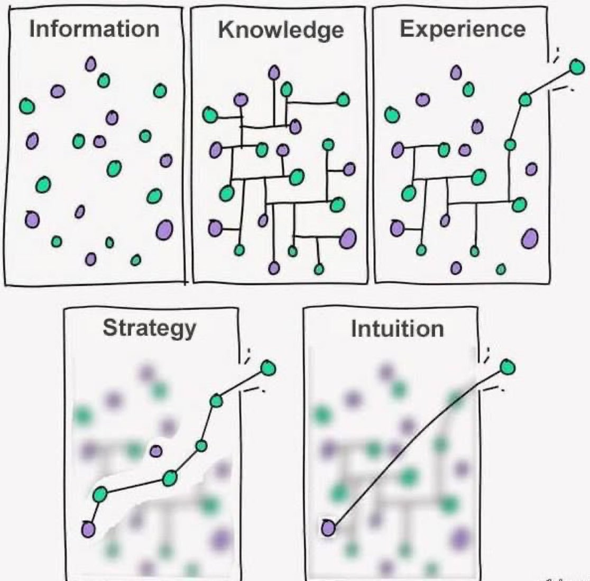

#    目标细化(2025)

> 

**label :**  **基本完成**      **部分完成**      **一点未做**

### **任务清单：**

- [ ] #### **`专业技能`:**

  - [x] 仿真相关 gazebo,了解isaac sim

  - [x] slam相关 rtab

  - [ ] 规划控制初步链接

  - [ ] ros2

    1. [系统升级（参数服务器、服务，感知相关包）](https://www.bilibili.com/video/BV1zH4y1C7uo?spm_id_from=333.788.videopod.sections&vd_source=7f98e46af73470a39ad6b1a64611b176)
    2. ROS 快速入门教程([机器人工匠阿杰](https://space.bilibili.com/411541289))
    3. [【鱼香ROS】动手学ROS2](https://www.bilibili.com/video/BV1gr4y1Q7j5/?spm_id_from=333.337.search-card.all.click&vd_source=7f98e46af73470a39ad6b1a64611b176)

    

- [ ] #### **`理财技能:`**

  - [x] **<<美国四百年>>**     **部分完成** 
  - [ ] 心脑血管投资框架

------

### 阶段性语录：

> #### 

