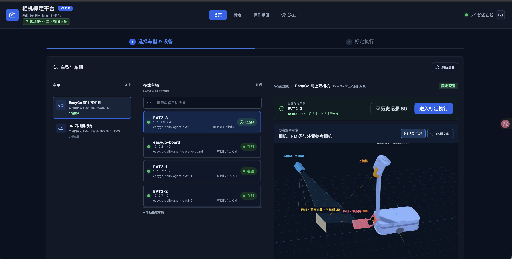
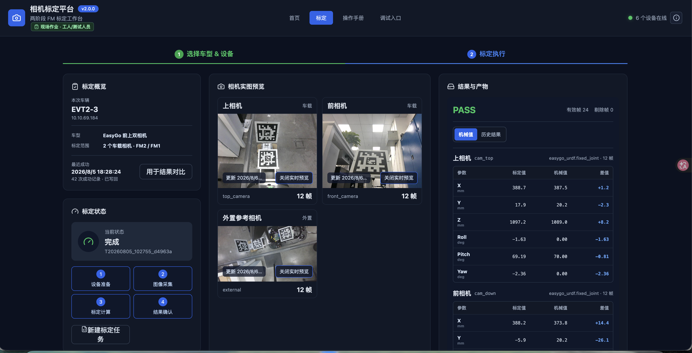
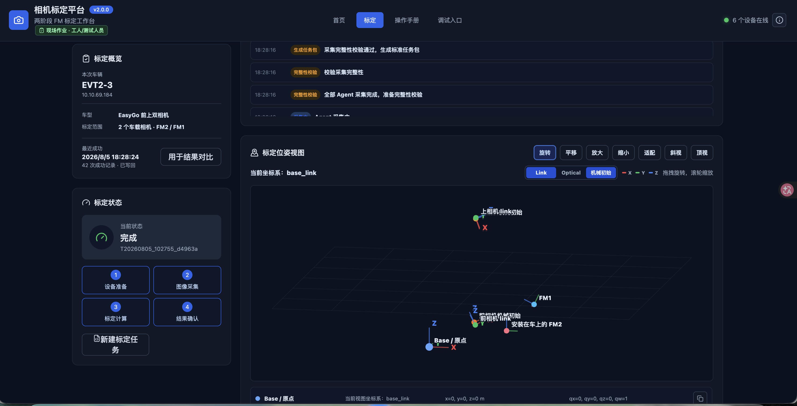
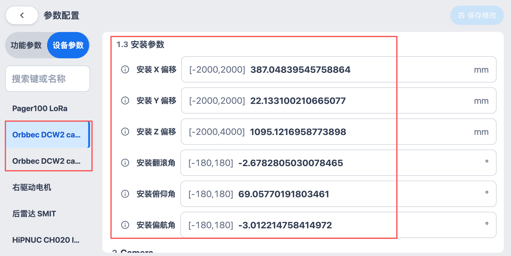
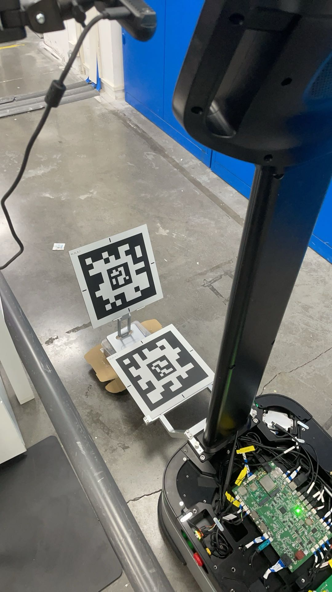
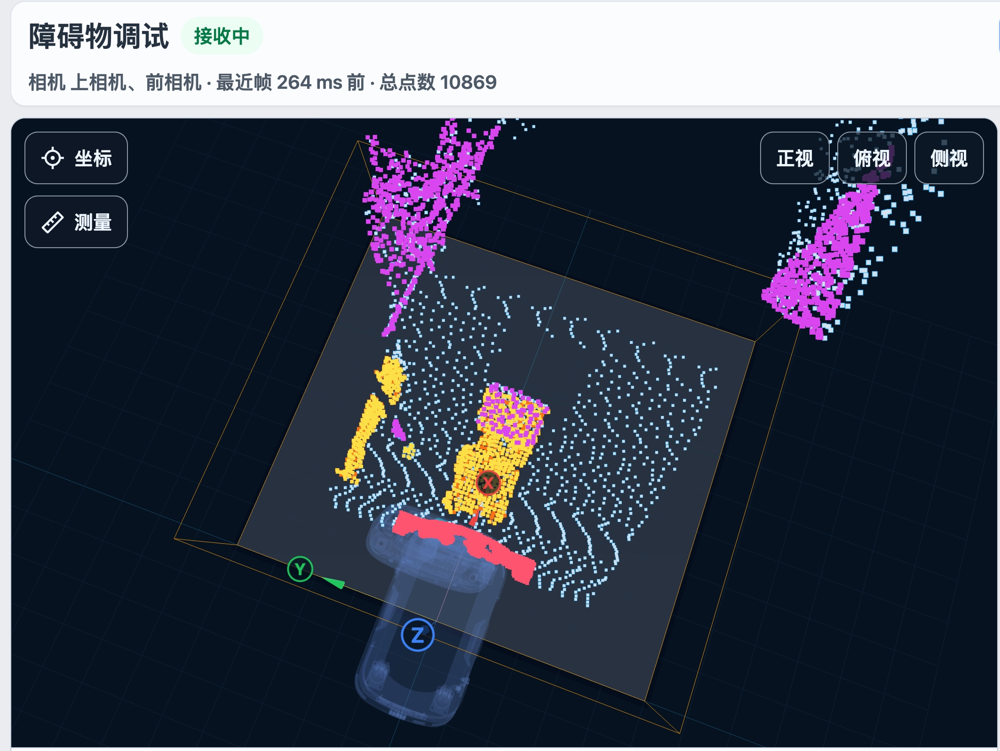
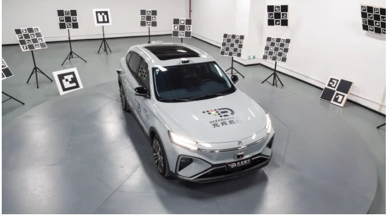
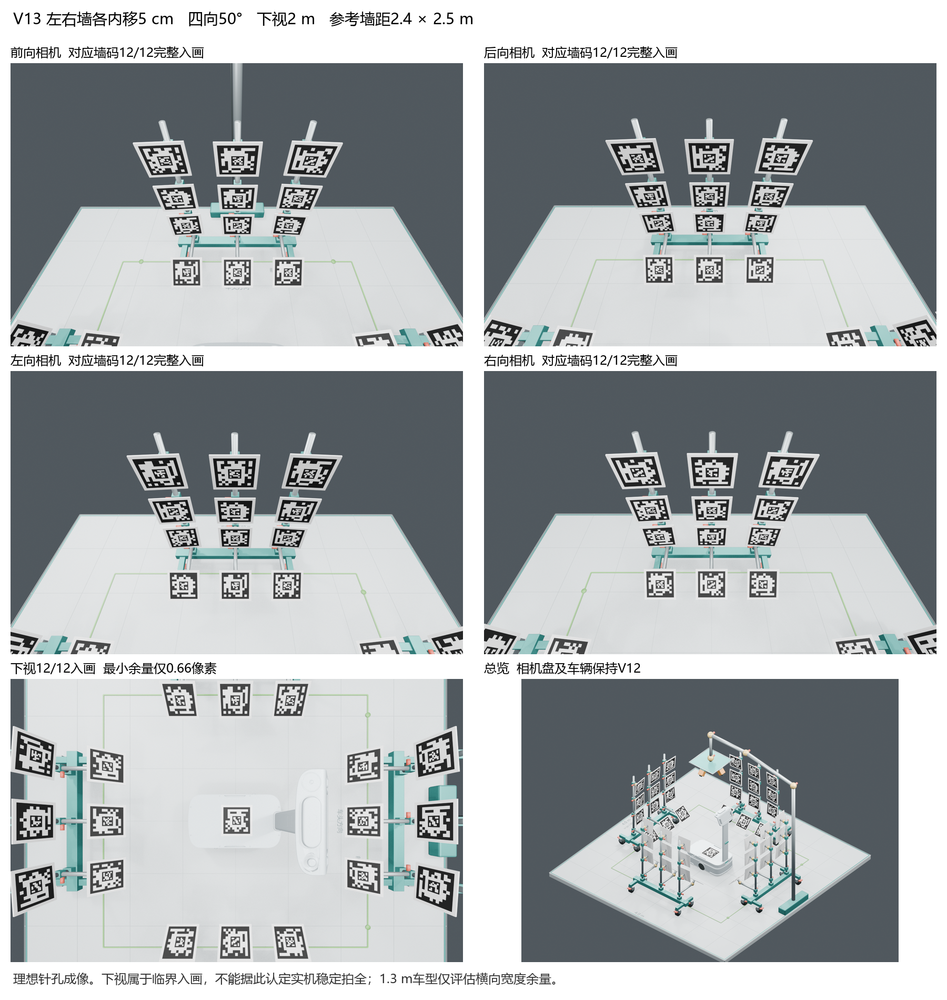
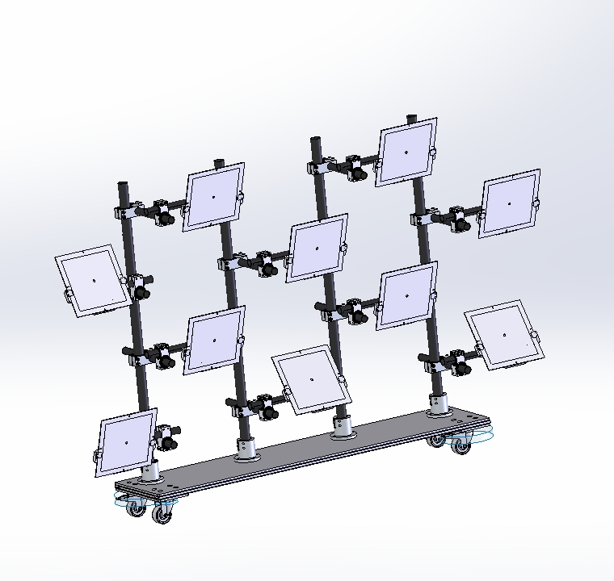

# 通用相机自动标定系统

面向不同车型相机安装位置和接口差异，建设从图像采集、位姿求解、精度评估到结果应用的自动标定闭环，支持 EasyGo、JN 等车型交付。

## 主要工作

- 设计统一的两阶段标定方案，建立车体二维码、参考二维码、相机 Link 和底盘坐标之间的几何关系。
- 完成采集姿态、观测约束、求解流程和平移/旋转/闭环误差评估。
- 建设前端、后端、算法 Worker、任务管理、报告生成和 RK3588 标定盒子运行环境。

## 标定素材

