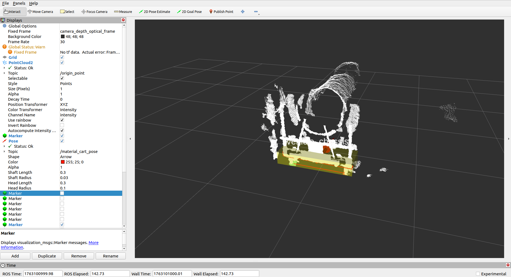
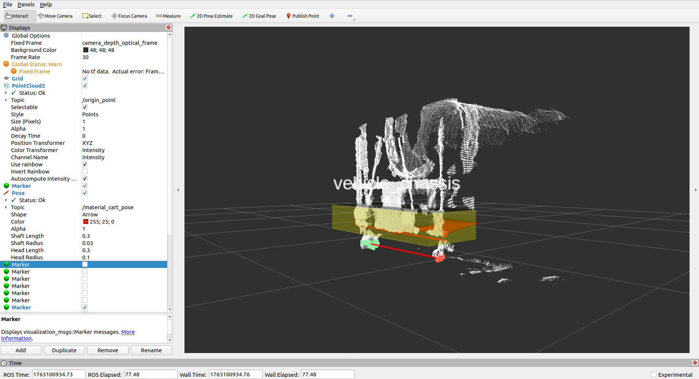
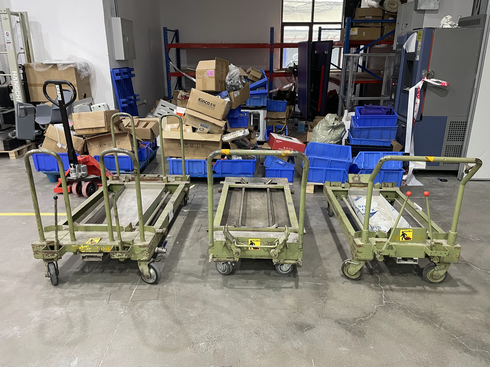
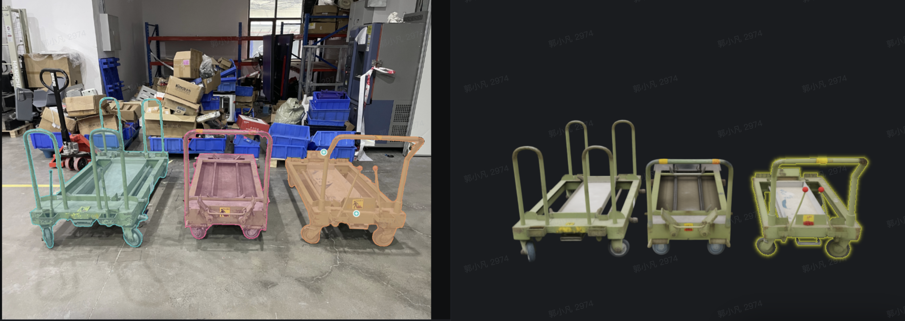

# 物流机器人感知对接系统

面向料车、栈板、充电桩等载具，开发可复用的目标识别算子和对接接口，为导航、运动控制和末端执行机构提供稳定的目标位姿与对接状态。

## 主要工作

- 根据载具结构、作业工况、机器人型号和传感器配置制定感知方案。
- 完成线激光、3D ToF、RGB-D 点云预处理、目标区域提取和位姿计算。
- 开发栈板、YKK 料车、充电桩等识别算子，统一接口和输出格式。
- 通过离线回放、仿真、现场测试和整机联调验证算法效果。

## 现场素材

<video controls preload="metadata" style="width: 100%; max-width: 960px;" src="../assets/projects/docking/docking-overview.mp4"></video>

<video controls preload="metadata" style="width: 100%; max-width: 960px;" src="../assets/projects/docking/pallet-demo-1.mp4"></video>

<video controls preload="metadata" style="width: 100%; max-width: 960px;" src="../assets/projects/docking/pallet-demo-2.mp4"></video>

<video controls preload="metadata" style="width: 100%; max-width: 960px;" src="../assets/projects/docking/pallet-demo-3.mp4"></video>

<video controls preload="metadata" style="width: 100%; max-width: 960px;" src="../assets/projects/docking/ykk-not-centered.mp4"></video>

<iframe src="../assets/projects/docking/complex-vehicles.pdf#toolbar=0" width="100%" height="720" style="border: 1px solid #ddd; border-radius: 8px;"></iframe>
