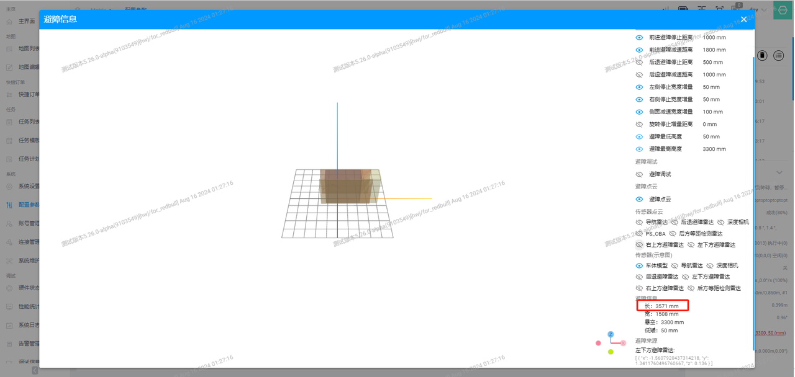
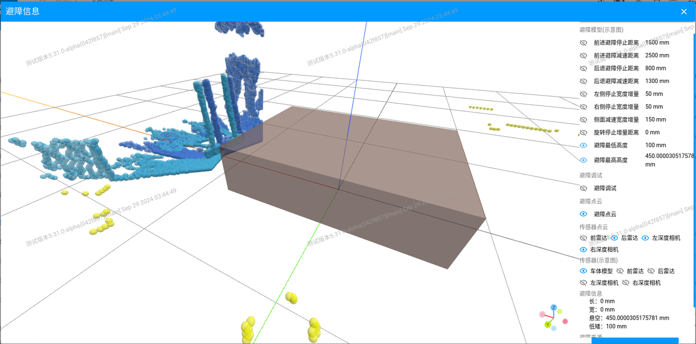
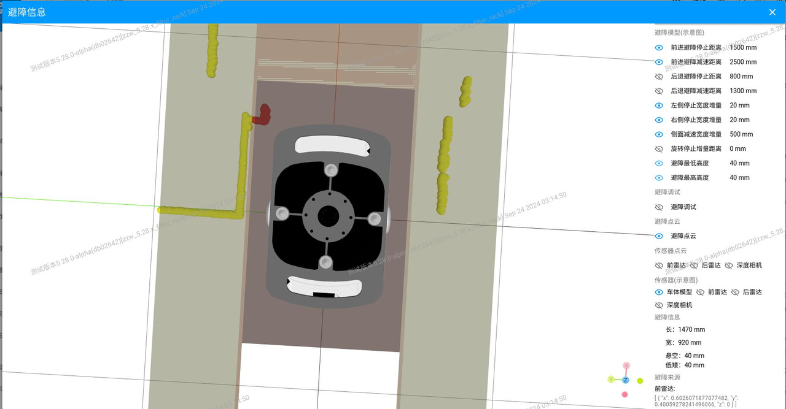
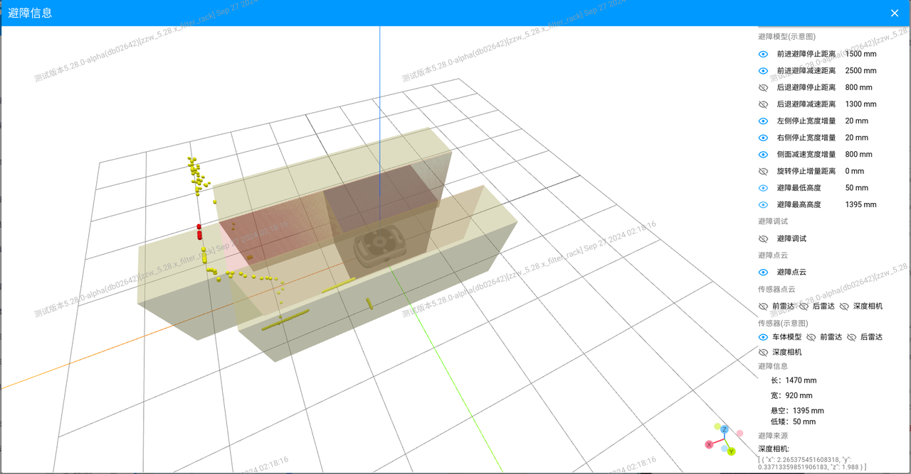
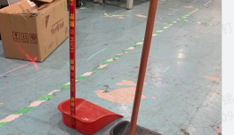
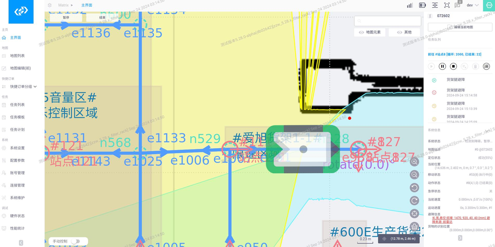

# 避障 2.0 系统重构

## 项目目标

- 让避障参数更容易理解和配置，降低现场部署和调试成本。
- 提供更清晰的避障调试信息，缩短问题定位时间。
- 提供避障参数的 3D 可视化交互设置方式，提高部署效率。
- 提供按避障场景复用的参数设置方式，支持不同车型快速落地。

<video controls preload="metadata" style="width: 100%; max-width: 960px; border-radius: 8px;" src="../assets/videos/obstacle-2.0/obstacle-2.0-demo.mov"></video>
<video controls preload="metadata" style="width: 100%; max-width: 960px; border-radius: 8px;" src="../assets/videos/obstacle-2.0/obstacle-2.0-demo.webm"></video>
