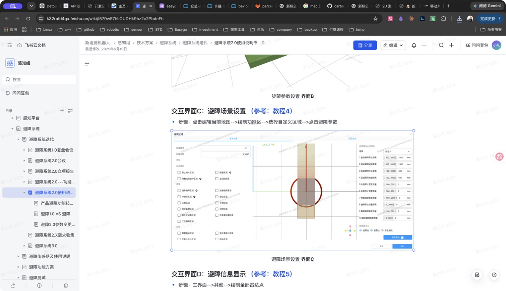

# 避障 2.0 系统重构

> 项目案例：面向 AMR 多车型交付的避障系统升级与重构。本文根据飞书《避障系统 2.0 使用说明书》整理，保留原始操作流程和现场配置要点。

原始文档：[飞书《避障系统 2.0 使用说明书》](https://k32rofd4qx.feishu.cn/wiki/I579wE7hliOUDHk9hz2c2PbdnFh)

## 项目目标

- 让避障参数更容易理解和配置，降低现场部署和调试成本。
- 提供更清晰的避障调试信息，缩短问题定位时间。
- 提供避障参数的 3D 可视化交互设置方式，提高部署效率。
- 提供按避障场景复用的参数设置方式，支持不同车型快速落地。

## 适用范围

项目分阶段覆盖车型：

- 第一阶段：300E、600E、1200E、MSL-14。
- 第二阶段：全系车型。

## 系统组成

避障 2.0 的用户操作主要围绕以下模块展开：

- **交互界面 A：避障参数配置及模型显示**：配置标准避障距离、查看车体和传感器模型、确认避障区域。
- **场景参数配置**：针对不同现场场景复用避障参数，减少重复调试。
- **调试与诊断信息**：辅助确认参数是否生效，并支持现场问题排查。

## 使用流程

### Step 1：准备升级文件

Oasis 车型联系李勇，叉车车型联系沈奇奇。旧版文档中提供的部分模型文件已经过时，升级时不要继续使用旧模型。

### Step 2：导入参数包

先导出当前版本参数包作为备份，再导入包含避障 2.0 的 SRP 5.23 参数包。Oasis 车型可以不导入参数包直接使用避障 2.0，具体以现场版本和车型配置为准。

### Step 3：重启机器人

参数包导入完成后重启机器人，使新的避障配置和模型加载生效。

### Step 4：选择避障等级

进入“界面 A”，选择标准避障距离并保存。保存后继续检查避障相关通用参数。

## 参数检验清单

该部分参数是避障运行所需的通用参数，现场部署后应逐项确认：

### 车体参数

路径：**硬件状态 → 对应底盘 → 设置参数**。

标准底盘车的车体定义位于顶板以下，因此标准车也需要配置上装参数。检查车体长宽高、传感器安装位置和车体模型是否与实车一致。

### 避障距离参数

在界面 A 中确认各等级的标准避障距离、停止距离和恢复距离，保存后重新打开页面确认参数没有回退。

### 模型与区域

确认 3D 模型、车体包络、传感器视场和避障区域与车型一致；如果模型文件过期，应使用当前版本随包提供的模型。

## 重构价值

避障 2.0 将传感器、车体模型、避障距离和场景参数从分散配置收敛到统一的交互界面，形成“参数导入 → 机器人重启 → 等级选择 → 通用参数检验 → 现场验证”的标准流程。这样可以减少车型切换时的重复配置，也让现场问题更容易通过参数和模型复现。

## 现场交付建议

1. 升级前保留当前参数包和版本信息，确保可以回滚。
2. 导入参数包后先检查车体和传感器模型，再进行避障等级选择。
3. 每次修改参数后重新打开页面确认保存结果，并通过录包或现场测试验证实际输出。
4. 发现模型或参数异常时，优先记录车型、软件版本、参数包和现场截图，再进入算法问题定位。
