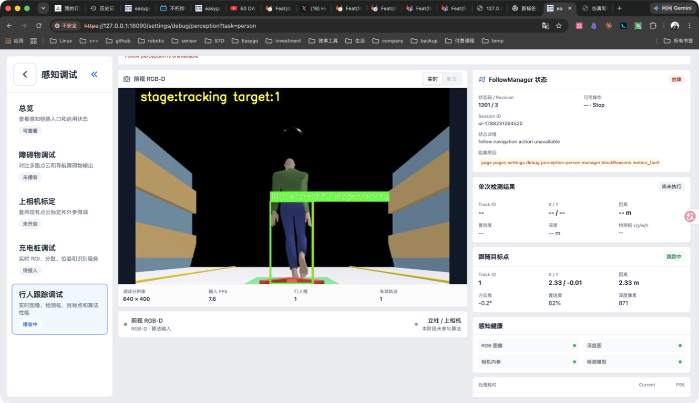
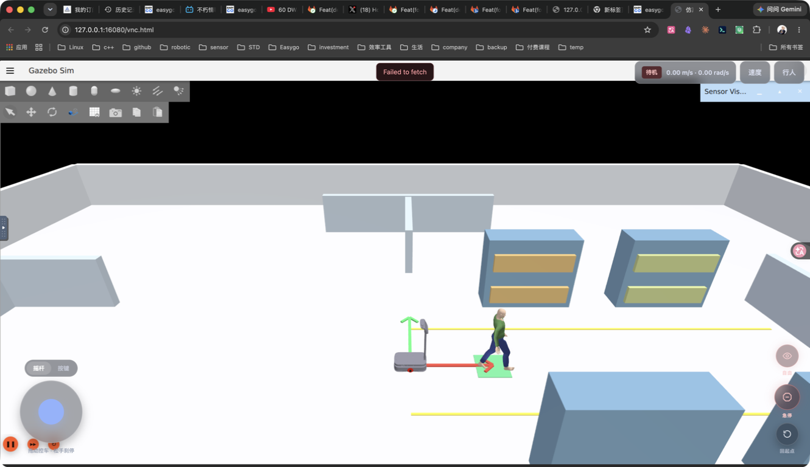
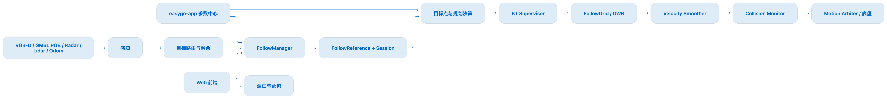

# EasyGo 行人跟随系统

负责移动机器人行人跟随系统的需求分析、系统架构、感知算法、跟随决策、规划控制、仿真验证和整车交付，打通“目标感知—目标绑定—持续跟踪—跟随决策—路径规划—底盘控制—状态恢复”链路。

## 主要工作

- 基于 RGB-D、YOLOv8、ByteTrack 和三维目标估计实现行人检测与持续跟踪。
- 设计双相机和多目标来源模式，提升远距离、小目标场景下的重捕获能力。
- 基于 Nav2 和 BehaviorTree.CPP 实现直线、拐角、绕障、近距对正、重捕获和故障停止等行为。
- 建立 Gazebo 仿真、录包分析、双架构构建、样车部署和现场交付闭环。

## 项目素材

<video controls preload="metadata" style="width: 100%; max-width: 960px;" src="../assets/projects/following/following-demo.mp4"></video>

<video controls preload="metadata" style="width: 100%; max-width: 960px;" src="../assets/projects/following/following-test-video.mp4"></video>
