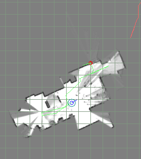

## 问题点及测试情况:

**配置文件问题:**

- [ ] /usr/akb/cfg/slam.cfg/.... 和/usr/akb/config/slam.cfg/....     两个配置文件
- [ ] sensor.lua文件
- [ ] 过一下参数配置 经验性操作 那些是调的比较多的?


**传感器问题:**

- [ ] 坐标系转换方向不一致导致报错?

  ==:W0805 18:11:32.829422  1061 local_trajectory_builder_2d.cc:223] Dropped empty horizontal range data.==


**打滑检测问题:**

- [ ] 重定位后大量检测到打滑


**关于优化问题:**

- [ ] 优化流程(概念性的)

- [ ] 重定位操过耗时以及重定位成功都需要优化  那之前没有优化么?

  ```c++
  auto optimizer = slam_core_->GetOptimizer();
  ```

- [ ] 回环是一直在检测?怎么判断回环结果,比较前后轨迹?


**业务逻辑问题:**

- [ ] 抱起后,在重新启动时是佛需要重定位?爬坡或者过门槛时候的处理逻辑呢?


**测试情况:**

- [ ] 叠图产生的原因?
- [ ] odom数据和lidar数据轨迹不一致
- [ ] 


<font color=red>**未归类问题**</font>

- [ ] 启动slam位姿漂移

  

