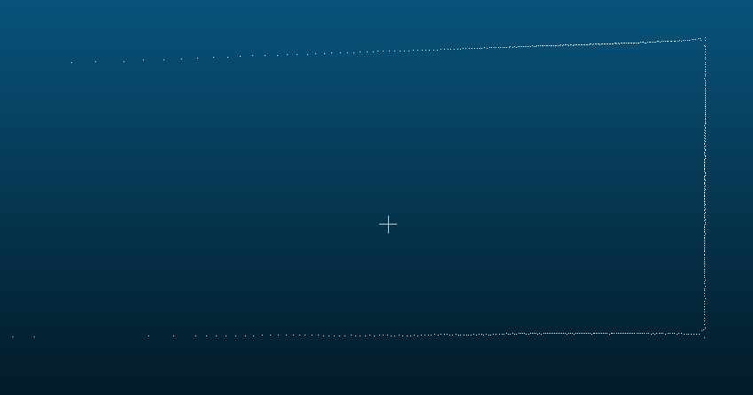

# EAI激光雷达装机结构测试

### **1.近距离盲区测试**

- **离光心6cm vs 12cm 遮挡测试**

==平面纸板最近6cm处,点云部分丢失,排列呈凸型分布,且点云不稳定;==

==平面纸板最近12cm处(机身最前沿),点云呈线性分布,无缺失现象;==

- **遮挡环绕测试**

  

==方型纸箱尺寸接近机身,360度障碍物能感知;==

### 2.激光雷达最远工作距离测试

根据实际测量,左图红框为在极限7m左右处墙体点云图,超过7m,如右图所示点云基本消失;

==**综上测试,再此结构参数下,机器能在距离0.12~7m工作范围内,点云整体可靠稳定可靠, 和规格书给出指标一致;**==

==**注:雷达罩碰触开关未安装情况下测试**==

### 

激光雷达安装激光罩后这种断口处数据有好的办法处理吗? 激光延墙有接近1cm的误差

