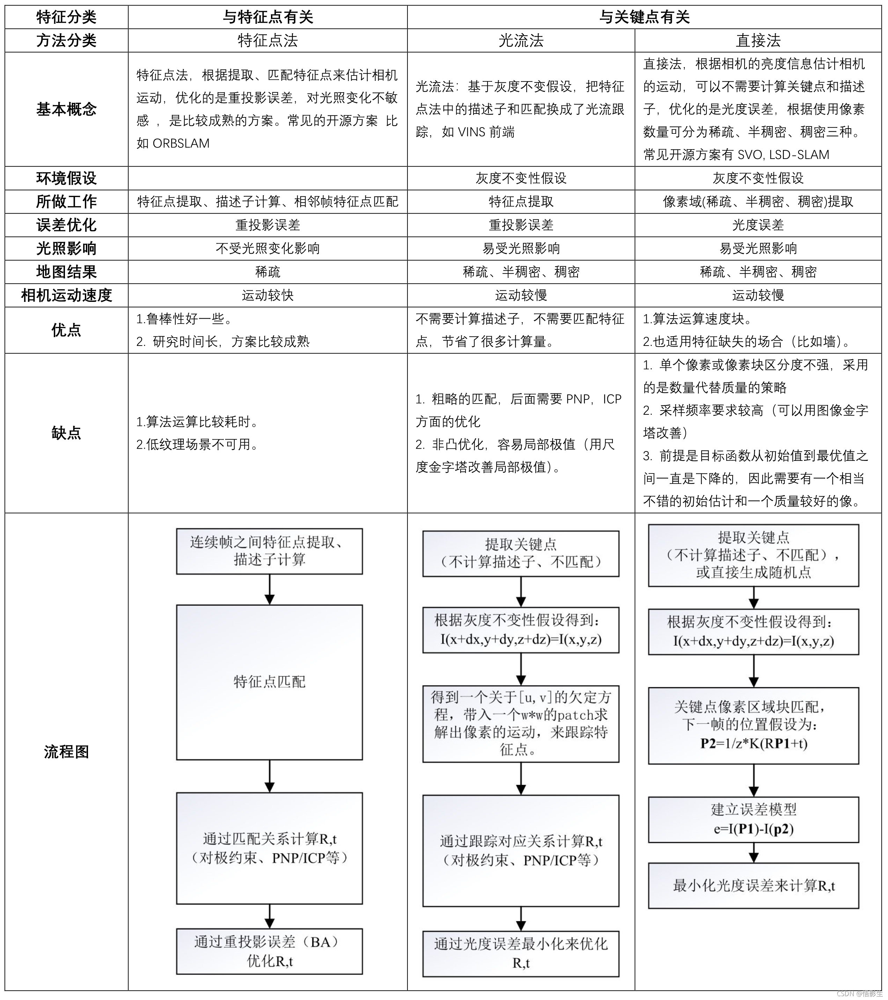

# 光流：

### 1.前置问题：

​	1.卡死,悬空;                                                                                     ==视觉丢失的场景下，前撞没触发，导致地图外延出错；== 

​	2.延墙频繁碰撞,地图走斜;                                                              ==延边频繁碰撞,视觉丢失,纯依靠imu走歪;==

问题：地图不准 1.地图外延 2.地图倾斜（纯惯导下碰撞导yaw角误差变大，延墙）

**光流计模块:**

.assets/image-20220119141413764.png)

.assets/image-20220119141155191.png)1.

