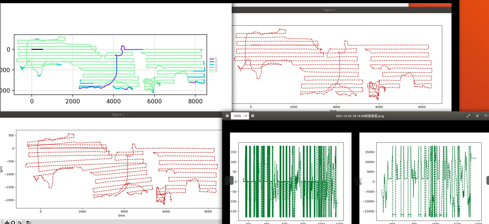
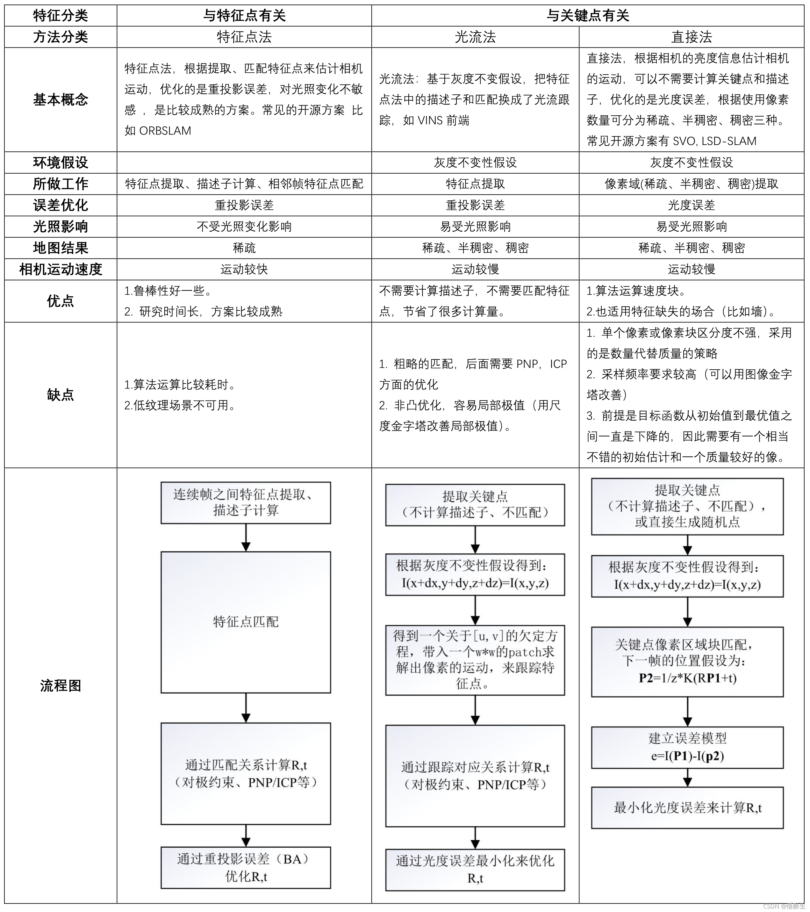

# 光流：

### 1.前置问题：

​	1.解决什么问题？                                                                                        ==视觉丢失的场景下，前撞没触发，导致地图外延出错；== 

​	2.有必要做吗？                                                                                            ==（可行性分析）有没有必要做or有没有能力做==

​	~~3.执行力模型：总分 内容模块    数据  算法  测试验证   打包接口融合~~



问题：地图不准 1.地图外延 2.地图倾斜（纯惯导下碰撞导yaw角误差变大，延墙做的不好）

### 光流打滑检测进程：

- [ ] 采集多种场景的打滑数据，光流初步验证；                                                **11.22 -11.23**  

- [ ] 获取外部接口，获取数据包；                                                                       **11.24 -11.25**    

- [ ] 开发光流打滑检测模块；                                                                               **11.27 -11.29**    

- [ ] 实时跑机，测试调优；                                                                                   **11.30 -11.31**    

- [ ] 输出：打滑检测接口和检测效果报告；                                                        **11.30 -11.31**    

- [ ] 输出orb和光流特征点提取对比分析;                                                             **1.17**

  

### 3.可能遇到的问题：

- 光流输出是什么？T or △X？
- 稠密很耗时？
- 能提取到特征点？视觉里程计不就没提取到导致视觉丢失的吗？要是能提取到为毛还要用光流，定位信息直接解决。

  


### 4.测试遇到的问题：

- 需求确定：打滑 悬空和硬怼  悬空图像基本禁止  硬怼图像图像也会变化

- 接口确定


```shell
ssh  root@192.168.5.48   rockchip           192.168.50.55
scp -r root@192.168.5.48:/usr/akb/slam_data/frame /home/admins/opticl
scp -r root@192.168.5.48:/tmp/data/slam/pose_fusion /home/admins/opticl
rm -rf  /usr/akb/slam_data/frame

sshpass -p rockchip scp /home/admins/桌面/3Dtof/glider_project/bms/Release/aarch64/bin/bms_svc root@192.168.50.56:/usr/akb/bin
scp -r /tmp/glider /home/admins/opticl
```


### 6.开发疑问？

- [ ] 怎么去实时测试开展？代码框架怎么写？在那个地方调用？怎么获取和别人沟通接口来交互所需数据？
- [ ] 底层一个so 被上层同时调用可以吗？
- [ ] 前一帧图片怎么保存；
- [ ] 握住后轮，里程计是否为0?
- [ ] 光流计是否在vslam丢失场景下还依旧有数据输出? 待测试
- [ ] 轮子一直在转,而pose出来的数据基本为0;


### 7.杂记

定义：光流法利用图像序列中像素在时间域上的变化以及相邻帧之间的相关性，根据上一帧与当前帧之间的对应关系，计算得到相邻帧之间物体的运动信息。

1.解决什么问题？

2.需要解决扫地机什么样的问题？场景？打滑场景：1.撞墙，前撞未触发     2.地上有水打滑  角落边上打滑比较常见   架空 卡着不报悬崖检测

出现问题：视觉丢失同时打滑？

3.光流的应用场景：目标检测  车流 碰撞检测

4.硬件光流设备 也可以用视觉的检测

问题点：光流能解决打滑？打滑本质是码盘里程计不一致导致

5.光流计再无人机上面用的比较多:悬停定位 可以得到实际位移 测速;


#### **参考资料:**

- **[电流打滑检测](http://www.xjishu.com/zhuanli/11/202011066066_2.html)**
- **[从动轮黑白检测](http://www.xjishu.com/zhuanli/11/201821991622.html)**
- [**光流测速和视觉里程计**](https://blog.csdn.net/qq_25544855/article/details/79335713)(弱化版的视觉里程计)
- **[SLAM | 视觉SLAM中的前端：视觉里程计与回环检测](https://blog.csdn.net/sinat_17456165/article/details/106760600?spm=1001.2101.3001.6650.3&utm_medium=distribute.pc_relevant.none-task-blog-2%7Edefault%7ECTRLIST%7Edefault-3.pc_relevant_paycolumn_v2&depth_1-utm_source=distribute.pc_relevant.none-task-blog-2%7Edefault%7ECTRLIST%7Edefault-3.pc_relevant_paycolumn_v2&utm_relevant_index=6)**
- **[VIO（1）—— 概述与基础知识](https://www.guyuehome.com/28260)**

