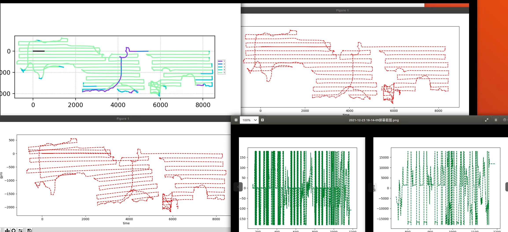

# 光流：

### 1.前置问题：

​	1.解决什么问题？                                                                                        ==视觉丢失的场景下，前撞没触发，导致地图外延出错；== 

​	2.有必要做吗？                                                                                            ==（可行性分析）有没有必要做or有没有能力做==

​	~~3.执行力模型：总分 内容模块    数据  算法  测试验证   打包接口融合~~



问题：地图不准 1.地图外延 2.地图倾斜（纯惯导下碰撞导yaw角误差变大，延墙做的不好）

### 光流打滑检测进程：

- [ ] 采集多种场景的打滑数据，光流初步验证；                                                **11.22 -11.23**  
- [ ] 获取外部接口，获取数据包；                                                                       **11.24 -11.25**    
- [ ] 开发光流打滑检测模块；                                                                               **11.27 -11.29**    
- [ ] 实时跑机，测试调优；                                                                                   **11.30 -11.31**    
- [ ] 输出：打滑检测接口和检测效果报告；                                                        **11.30 -11.31**    

  **==需要协助：开一个接口给我，数据包括（1.图像序列image 2.时间戳timestamp 3.融合位姿pose 4.融合状态flag）==**


### 3.可能遇到的问题：

- 光流输出是什么？T or △X？
- 稠密很耗时？
- 能提取到特征点？视觉里程计不就没提取到导致视觉丢失的吗？要是能提取到为毛还要用光流，定位信息直接解决。

  


### 4.测试遇到的问题：

- 需求确定：打滑 悬空和硬怼  悬空图像基本禁止  硬怼图像图像也会变化

- 接口确定

  

```shell
ssh  root@192.168.5.48   rockchip
scp -r root@192.168.5.48:/usr/akb/slam_data/frame /home/admins/opticl
scp -r root@192.168.5.48:/tmp/data/slam/pose_fusion /home/admins/opticl
rm -rf  /usr/akb/slam_data/frame
```


### 5.锻炼能力

- 独立开发标准功能接口
- 小项目主动思考 分析 执行 交互 测试


### 6.开发疑问？

- [ ] 怎么去实时测试开展？代码框架怎么写？在那个地方调用？怎么获取和别人沟通接口来交互所需数据？
- [ ] 底层一个so 被上层同时调用可以吗？
- [ ] 前一帧图片怎么保存；
- [ ] 握住后轮，里程计是否为0?


**[电流打滑检测](http://www.xjishu.com/zhuanli/11/202011066066_2.html)**

**[从动轮黑白检测](http://www.xjishu.com/zhuanli/11/201821991622.html)**

