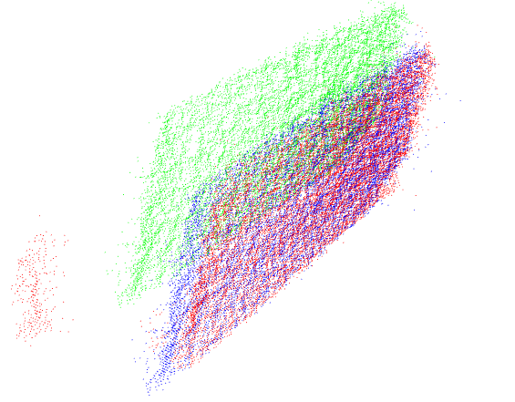
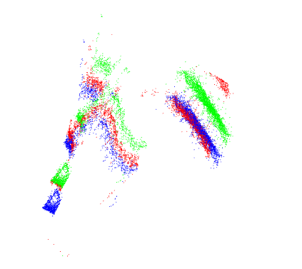

# 待开发功能

- [ ] 墙体检测：解决边界不准问题；
- [ ] 打滑检测：解决边界外延问题；
- [ ] tof定位：解决vslam视觉丢失现象；

## ICP：

#### 1.进度安排：

- [x] 接口框架开发；
- [x] 离线数据流测试；
- [x] 配准可视化
- [ ] 多种匹配算法对比开发测试
- [ ] 精度测试（物理度量+IMU对比+Vslam？）
- [ ] 耗时测试
- [ ] 定位轨迹生成

#### 2.tof定位弊端(基于目前3Dtof)

- 朝前看地话 平坦地面基本没有特征数据；
- 有尺度信息（电云密度/精度）越远越不可靠，且结合避障，标定的精度控制在静距离
- 不向vslam朝天  tof考虑到视野和精度 一个转身就丢失共有区域

### 3.初步测试：

测试一：

#### 

