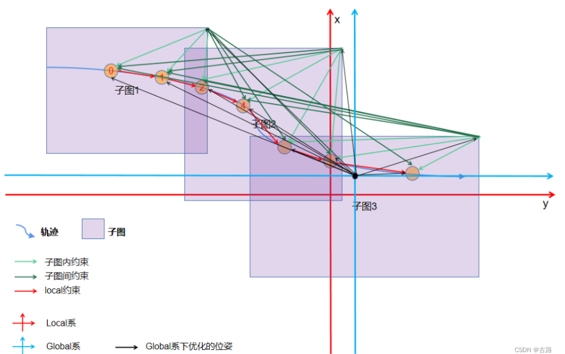
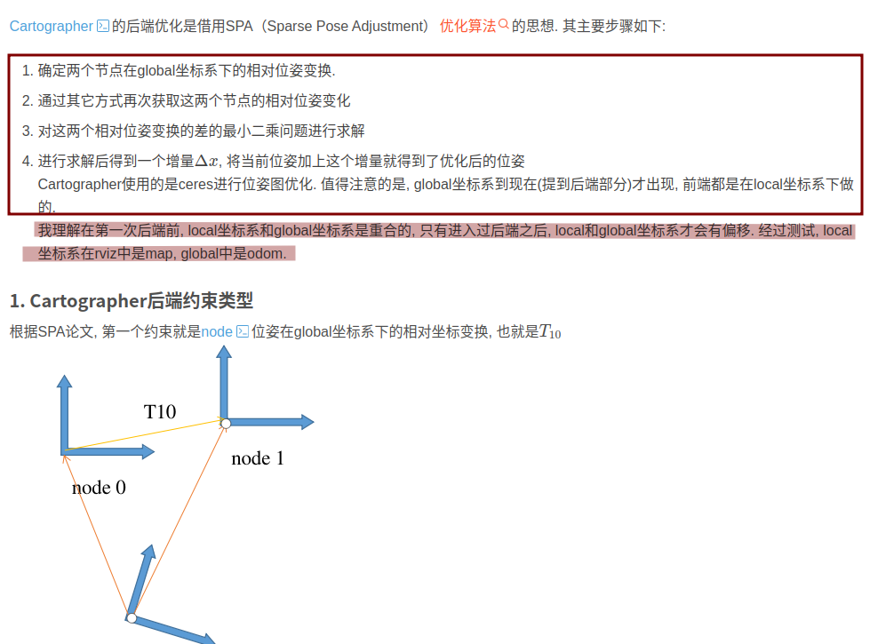

## 	cartographer理解

> **好课程 好资料 好导师 就是领路人 走出复杂系统迷宫的领路人;**

[**cartographer_backend_constraint**](https://blog.csdn.net/fb_941219/article/details/125408495?spm=1001.2101.3001.6650.2&utm_medium=distribute.pc_relevant.none-task-blog-2%7Edefault%7EBlogCommendFromBaidu%7ERate-2-125408495-blog-97759161.235%5Ev43%5Epc_blog_bottom_relevance_base1&depth_1-utm_source=distribute.pc_relevant.none-task-blog-2%7Edefault%7EBlogCommendFromBaidu%7ERate-2-125408495-blog-97759161.235%5Ev43%5Epc_blog_bottom_relevance_base1&utm_relevant_index=5)

#### [cartographer 代码分析](https://blog.csdn.net/RoboChengzi/article/details/114499269)

