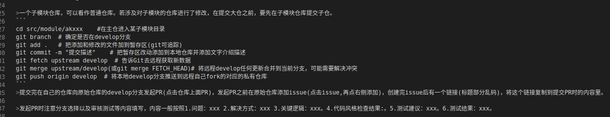

#### 简易的命令行入门教程:

Git 全局设置:

```
git config --global user.name "郭小凡"
git config --global user.email "glider.guo@ankobot.com"
```

生成秘钥放在远程服务器 免密登录：
```
ssh-keygen -t rsa -C "glider.guo@ankobot.com"
cat id_rsa.pub 
```


创建 git 仓库:

```
mkdir pcl_library
cd pcl_library
git init
touch README.md
git add README.md
git commit -m "first commit"
git remote add origin git@gitee.com:aktof/pcl_library.git
git push -u origin master
```

已有仓库?

```
cd existing_git_repo
git remote add origin git@gitee.com:aktof/pcl_library.git
git push -u origin master
```


