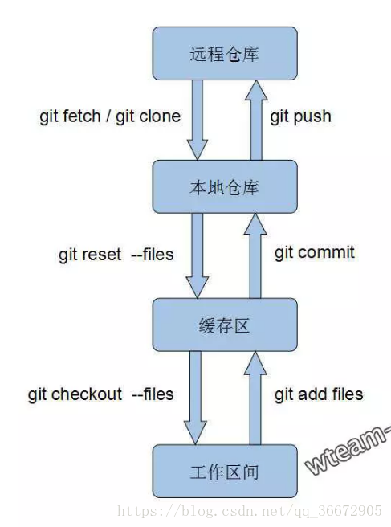
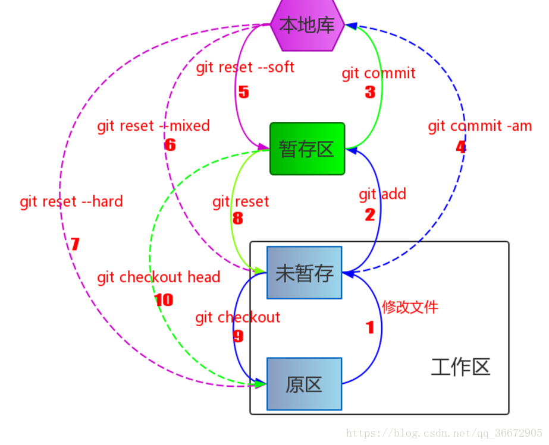

### git组织结构图（系统）

**[git所划分成几个区域，各区域的作用以及各区域之间的联系](https://blog.csdn.net/qq_36672905/article/details/82776283)**



### 简易的命令行入门教程(案例):

Git 全局设置:

```
git config --global user.name "郭小凡"
git config --global user.email "glider.guo@ankobot.com"
```

生成秘钥放在远程服务器 免密登录：
```
ssh-keygen -t rsa -C "glider.guo@ankobot.com"
cat id_rsa.pub 
```


创建 git 仓库:

```
mkdir pcl_library
cd pcl_library
git init
touch README.md
git add README.md
git commit -m "first commit"
git remote add origin git@gitee.com:aktof/pcl_library.git
git push -u origin master
```

已有仓库

```
cd existing_git_repo
git remote add origin git@gitee.com:aktof/pcl_library.git
git push -u origin master
```


一些命令：

#### [Git回滚代码到某个commit](https://www.cnblogs.com/hukuangjie/p/11369434.html)

```shell
回退命令：

$ git reset --hard HEAD^ 回退到上个版本
$ git reset --hard HEAD~3 回退到前3次提交之前，以此类推，回退到n次提交之前
$ git reset --hard commit_id 退到/进到 指定commit的sha码
$ git checkout commit_然后在git checkout -b 新分支
执行如下命令即可修改(注意，仅仅只能针对最后一次提交):
git commit --amend -m "新的修改提交信息"
```

#### [查看log](https://blog.csdn.net/chenpuzhen/article/details/92084229?utm_medium=distribute.pc_relevant.none-task-blog-2%7Edefault%7ECTRLIST%7Edefault-2.no_search_link&depth_1-utm_source=distribute.pc_relevant.none-task-blog-2%7Edefault%7ECTRLIST%7Edefault-2.no_search_link)

```shell
$ git log
$ git reflog
$ git diff   查看修改但没有commit的内容  详细
$ git  status    查看修改但没有commit的内容    简单
$ git branch -a   查看本地和远程仓库的所有分支
$ git remote -v     查看远程git地址
git config --system --list       config 配置有system级别 global（用户级别） 和local（当前仓库）三个
git config --global  --list
git config --local  --list
```


### 难点：

- merge  rebase 区别

- pull fetch  区别

- reset revert 区别

- 冲突问题

  


### 问题：

- 用ssh 尽量不要用https      包括git clone 和配远程仓库时候

- 撤销某次commit

  

### 实战场景：

1.等别人代码和合在自己分支上；

2.不需要修改了很多代码发现不对又删除了；有些代码片段又舍不得扔

3.各种文件夹备份；

4.重做某一个commit，之后的代码又不想重新写；


==**思想：你平常开发过程中能想到的和想不到的，git已经给你弄好了，只是你自己没意识到；**==


