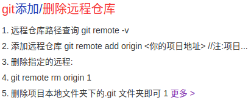

### git组织结构图（系统）

**[git所划分成几个区域，各区域的作用以及各区域之间的联系](https://blog.csdn.net/qq_36672905/article/details/82776283)**


### 简易的命令行入门教程(案例):

Git 全局设置:

```
git config --global user.name "郭小凡"
git config --global user.email "glider.guo@ankobot.com"
git config core.fileMode false
```

生成秘钥放在远程服务器 免密登录：

```
ssh-keygen -t rsa -C "glider.guo@ankobot.com"
cat id_rsa.pub 
```

创建 git 仓库:

```
mkdir pcl_library
cd pcl_library
git init
touch README.md
git add README.md
git commit -m "first commit"
git remote add origin git@gitee.com:aktof/pcl_library.git
git push -u origin master
```

已有仓库

```
cd existing_git_repo
git remote add origin git@gitee.com:aktof/pcl_library.git
git push -u origin master
```

一些命令：

#### [Git回滚代码到某个commit](https://www.cnblogs.com/hukuangjie/p/11369434.html)

```shell
回退命令：

$ git reset --hard HEAD^ 回退到上个版本
$ git reset --hard HEAD~3 回退到前3次提交之前，以此类推，回退到n次提交之前
$ git reset --hard commit_id 退到/进到 指定commit的sha码
$ git checkout commit_然后在git checkout -b 新分支
执行如下命令即可修改(注意，仅仅只能针对最后一次提交):
git commit --amend -m "新的修改提交信息"
```

#### [查看log](https://blog.csdn.net/chenpuzhen/article/details/92084229?utm_medium=distribute.pc_relevant.none-task-blog-2%7Edefault%7ECTRLIST%7Edefault-2.no_search_link&depth_1-utm_source=distribute.pc_relevant.none-task-blog-2%7Edefault%7ECTRLIST%7Edefault-2.no_search_link)

```shell
$ git log
$ git reflog
$ git diff   查看修改但没有commit的内容  详细
$ git  status    查看修改但没有commit的内容    简单
$ git branch -a   查看本地和远程仓库的所有分支
$ git remote -v     查看远程git地址
git config --system --list       config 配置有system级别 global（用户级别） 和local（当前仓库）三个
git config --global  --list
git config --local  --list
```

#### [**远程获取仓库到一个新branch上(详解git fetch和git pull区别)**](https://blog.csdn.net/Javammf/article/details/125539790)


```shell
 //在本地新建一个tmp分支，并将远程origin仓库的master分支代码下载到本地temp分支
git fetch origin master:tmp 
//来比较本地代码与刚刚从远程下载下来的代码的区别

git checkout -b develop origin/develop

git diff tmp 
//合并temp分支到本地的master分支
git merge tmp
//如果不想保留tmp分支 可以用这步删除
git branch -d tmp
```

#### 秋林network_clinet上传新开的gitlab仓库

```shell
1961  git diff --cached 
 1962  git commit -m "updata"
 1963  git remote add origin git@gitee.com:ak_lidar_project/network_client.git
 1964  git remote add upstream git@gitee.com:ak_lidar_project/network_client.git
 1965  git push upstream master
 git submodule add git@github.com:glider110/lidar_undistortion_2d.git modules3rd/
 git checkout .  及放弃修改 
 git pull  和  git fetch origin    区别
 

```



**将当前分支修改暂存**

　　在任务推进过程中，可能遇到需要切换到其他分支进行处理的情况。但是对应的，对于当前分支的修改可能并不足以达到需要进行一次提交的程度，此时更合适的方案是将本分支修改暂存，然后切换到其他分支进行工作，待其他分支的任务完成后，再切换回本分支，并将暂存的方案恢复，进而继续本分支的修改。

```
    git stash              //暂存本分支的修改
    git stash list         //显示所有 stash 的数
    git stash apply        //恢复最近一次暂存的修改
```

### 难点：

- merge  rebase 区别
- pull fetch  区别
- reset revert 区别
- 冲突问题

### 问题：

- 用ssh 尽量不要用https      包括git clone 和配远程仓库时候
- 撤销某次commit

### 实战场景：

1.等别人代码和合在自己分支上；

2.不需要修改了很多代码发现不对又删除了；有些代码片段又舍不得扔

3.各种文件夹备份；

4.重做某一个commit，之后的代码又不想重新写；

==**思想：你平常开发过程中能想到的和想不到的，git已经给你弄好了，只是你自己没意识到；**==

 git log
  431  gitg
  432  git status
  433  git diff
  434  git stash
  435  git log
  436  gitg
  437  git checkout a844f33d4e9aaba792954ed743d2ad4601cc6d42
  438  git log
  439* gitg
  440  git cherry-pick 399c6190c6315df6bfbcb8aaed52d006e096f2f9
  441  gitg
  442  git checkout -b feature/modify_obstacle_mid70
  443  gitg
  444  git stash pop
  445  gitg
