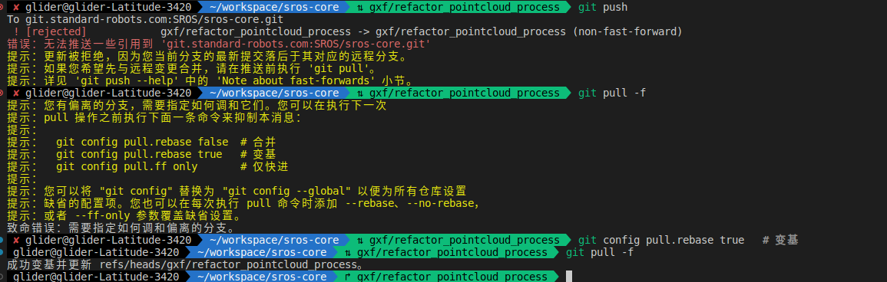

### git组织结构图（系统）

[git所划分成几个区域，各区域的作用以及各区域之间的联系](https://blog.csdn.net/qq_36672905/article/details/82776283)

#### [远程获取仓库到一个新branch上(详解git fetch和git pull区别)](https://blog.csdn.net/Javammf/article/details/125539790)


### 简易的命令行入门教程(案例):

Git 全局设置:

```
git config --global user.name "郭小凡"
git config --global user.email "guoxiaofan@standard-robots.com"
```

生成秘钥放在远程服务器 免密登录：

```
ssh-keygen -t rsa -C "guoxiaofan@standard-robots.com"
cat id_rsa.pub 
```

创建 git 仓库:

```
mkdir pcl_library
cd pcl_library
git init
touch README.md
git add README.md
git commit -m "first commit"
git remote add origin git@gitee.com:aktof/pcl_library.git
git push -u origin master
```

已有仓库

```
cd existing_git_repo
git remote add origin git@gitee.com:aktof/pcl_library.git
git push -u origin master
```


一些命令：

#### [查看log](https://blog.csdn.net/chenpuzhen/article/details/92084229?utm_medium=distribute.pc_relevant.none-task-blog-2%7Edefault%7ECTRLIST%7Edefault-2.no_search_link\&depth_1-utm_source=distribute.pc_relevant.none-task-blog-2%7Edefault%7ECTRLIST%7Edefault-2.no_search_link)

```shell
$ git log
$ git reflog
$ git diff   查看修改但没有commit的内容  详细
$ git  status    查看修改但没有commit的内容    简单
$ git branch -a   查看本地和远程仓库的所有分支
$ git remote -v     查看远程git地址
git config --system --list       config 配置有system级别 global（用户级别） 和local（当前仓库）三个
git config --global  --list 
git config --local  --list
git stash list
git stash show
```

#### [Git回滚代码到某个commit](https://www.cnblogs.com/hukuangjie/p/11369434.html)

```shell
回退命令：

$ git reset --hard HEAD^ 回退到上个版本
$ git reset --hard HEAD~3 回退到前3次提交之前，以此类推，回退到n次提交之前
$ git reset --hard commit_id 退到/进到 指定commit的sha码
$ git checkout commit_然后在git checkout -b 新分支
执行如下命令即可修改(注意，仅仅只能针对最后一次提交):
git commit --amend -m "新的修改提交信息"
```

#### 切换问题，stash解决

```shell
git stash
git stash save "储藏代码"    临时需要切换而又达不到一次commit要求的情况
git stash list
git stash show -p
git stash pop 
git stash apply
git stsh drop/clear


```

```shell
 //在本地新建一个tmp分支，并将远程origin仓库的master分支代码下载到本地temp分支
git fetch origin master:tmp 
//来比较本地代码与刚刚从远程下载下来的代码的区别

git checkout -b develop origin/develop

git diff tmp 
//合并temp分支到本地的master分支
git merge tmp
//如果不想保留tmp分支 可以用这步删除
git branch -d tmp


//远程操作
git push origin --delete gxf/refactor_pointcloud_process
git remote update origin --prune
```

#### 秋林network\_clinet上传新开的gitlab仓库

```shell
1961  git diff --cached 
 1962  git commit -m "updata"
 1963  git remote add origin git@gitee.com:ak_lidar_project/network_client.git
 1964  git remote add upstream git@gitee.com:ak_lidar_project/network_client.git
 1965  git push upstream master
 git submodule add git@github.com:glider110/lidar_undistortion_2d.git modules3rd/
 git checkout .  及放弃修改 
 git pull  和  git fetch origin    区别
 

```

#### 双远程操作

```
git remote -v 
git remote add backup https://gitlab.com/user/repo2.git
git push backup main
git push backup --all
```


### 

### 难点：

* merge  rebase 区别 以及和cherry pick

* pull fetch  区别

* reset revert 区别

* checkout 多功能用法

  * 切换分支

  * 清除本地修改

  * 指定commit文件修改到工作区  sudo git checkout origin/main .ci-server/gitlab/install\_runner.sh

### 问题：

* 用ssh 尽量不要用https      包括git clone 和配远程仓库时候

* 撤销某次commit  git commit --amend -m "新的修改提交信息"  执行如下命令即可修改(注意，仅仅只能针对最后一次提交):

* 有时会遇到git branch -a时总是不出现新的分支或者远程已经没有的分支在本地还有，这时就需要更新下本地的[git分支](https://so.csdn.net/so/search?q=git分支\&spm=1001.2101.3001.7020)保持和远程分支一致，使用下面命令即可：

  git branch -a |grep ehl

  git remote update origin --prune
  
* 如何把分支A某几次提交的commit合并为一次提交到B

  选择最近的几次提交 git reset --soft cimmit_id 

  然后切换到B分子,提交新的commit

### Git Commit 规范

* feat： 新增 feature
* fix: 修复 bug
* docs: 仅仅修改了文档，比如 README, CHANGELOG, CONTRIBUTE等等
* style: 仅仅修改了空格、格式缩进、逗号等等，不改变代码逻辑
* refactor: 代码重构，没有加新功能或者修复 bug
* perf: 优化相关，比如提升性能、体验
* test: 测试用例，包括单元测试、集成测试等
* chore: 改变构建流程、或者增加依赖库、工具等
* revert: 回滚到上一个版本
* Modify:
* Delete:

### 实战场景：

1.等别人代码和合在自己分支上；

2.不需要修改了很多代码发现不对又删除了；有些代码片段又舍不得扔

3.各种文件夹备份；

4.重做某一个commit，之后的代码又不想重新写；

5.双远程怎么push

\==**思想：你平常开发过程中能想到的和想不到的，git已经给你弄好了，只是你自己没意识到**；==
