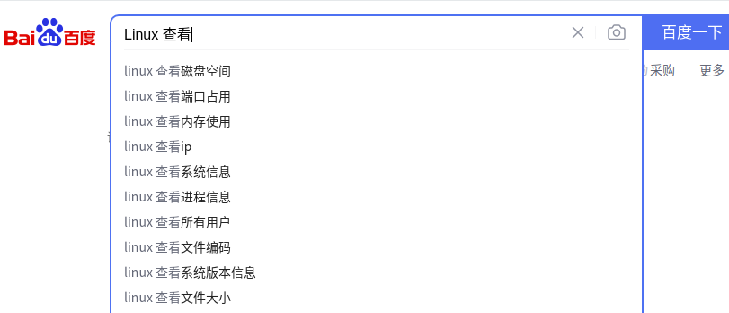

## LINUX效率工具：

### **linux相关命令**：

* 查看编译库是否存在某个函数 objdump  -tT libakWireDetector.so | grep detectCarpetFromPairLine

* 查看动态库是否更新：md5sum libakWireDetector.so   查看库的唯一编号

* 查看代码行数： wc -l

  vi的基本操作：命令模式 Esc 编辑模式 i 保存退出：wq 不保存退出 ：q！

* 查看行数：find \* | wc -l

* [查看文件包含那些库](https://blog.csdn.net/mayue_web/article/details/104019036) ldd

* 关于配置文件：
  * `gedit ~/.bashrc`    export LD\_LIBRARY\_PATH=/home/guo/桌面/3D\_tof/glider\_project/akTofInterface/lib/x86\_64:/home/guo/

  * `sudo gedit /etc/ld.so.conf`

  * 下载的软件一般配置在主目录下 `~/.config`

    ```shell
    gedit ~/.bashrc   配置环境变量
    alias fff='sudo sh /home/guoxiaofan/Desktop/pycharm_g'
    export PATH=/home/guoxiaofan/node-v14.16.1-linux-x64/bin:$PATH
    sudo ln -s ./node /usr/local/bin/     软连接
    ```

* 查看生效 echo $PATH      $ LD\_LIBRARY\_PATH

* export LD\_LIBRARY\_PATH=$PWD/../lib

* printenv |grep ros

* chmod 777 \*

* 查看依赖：readelf -d libakWireDetector.so

* ls -rt 安装时间排序

* 条件查找：egrep “啊|呕”

* Linux三剑客： grep sed awk

* 文件处理：

  当前目录下特定子目录下特定名字的文件追加到新建文件下：

  ```shell
  find . -path "*900*" -name "*.txt" |xargs echo -n >>aa.txt
  ```

  控制文件的几种维度：目录层级 类型  大小 时间

  ```shell
  find  -maxdepth 3   -size +1M  -ctime -100|wc -l
   find -maxdepth 1  -name  "*.py"|xargs  mv -t  1111/
  ```

  拆封文件名或者字符串：

  ```shell
  ls -lh |awk -F " " "{print 
  ```

  怎样把找出来的一些列文件移动或复制到指定文件夹？

* 文字处理：

  文件第几行 提取字段

  竖列文字转换为行：

  ```shell
  ls -lh |awk -F ' ' '{print $7}'|xargs echo -n >>bbs.txt
  ```

* [批量处理：](https://www.cnblogs.com/xusx/p/6041089.html)

  xargs

  exec

其他命令:

```shell
find  -mmin -2
md5sum
start.sh |grep "isStaticStateForOpticalFlow\|xxxxxxoo==="
start.sh | grep "xoo=\|OpticalFl\|tensit\|encode\|distanc"
slam | grep " xxx" |tee -a 2.txt
 tail -f 1.txt
 start.sh  | grep " xxx" |tee -a 1.csv

```

小工具 传输局域网

` sudo ./dufs -p 80 . --allow-upload`

docker操作

```
groups 
 1969  docker exec -it ak_sdk /bin/bash
 1970  exit
 1971  docker compose up -d 
 1972  docker container ls -a
 1973  docker rm epic_bhabha quirky_burnell 
 1974  docker compose up -d 
 1975  docker container ls -a
 1976  docker exec -it ak_sdk /bin/bash
```

### vscode技巧:

* 快捷键：
  * ctrl+shif+P .vscode/c\_cpp\_properties.json//配置编辑器能获取的路径

  * /home/admins/.config/Code/User/settings.json 为默认配置参数

  * ctrl+\` 装换后退效率  11 前进

  * 折叠：要操作光标所在文件中的所有代码块：

    折叠所有 Ctrl+K+0
    展开所有 Ctrl+K+J
    仅仅操作光标所处代码块内的代码：

    折叠 Ctrl+Shift+\[
    展开 Ctrl+Shift+]

* 安装插件 bookmark、git history diff 、git history、typora、cmake  clang-Format

* **CodeGeeX**：基于人工智能驱动的，快速编写代码的代码生成工具。在插件市场就可以免费下载使用！

* vscode快捷键问题 远点.号打不出来：sudo apt-get --purge remove code   还要删除主目录.congfig/.vscode才能彻底清除；

* 调到定义F12

* 整行复制：

  1）如果你想复制一整行代码，只需将光标移至该行，再使用组合键“Ctrl+C”来完成复制操作，而无需选择整行。
  2）如果你想剪切一整行代码，只需将光标移至该行，再使用组合键“Ctrl+X”来完成剪切操作，而无需选择整行。

  如果要实现复制当前行,并且粘贴到下一行.就用组合键ctrl c + ctrl v
  如果你想删除一整行代码，只需将光标移至该行，再使用组合键“Ctrl+L”来完成剪切操作，而无需选择整行。
  组合键“Ctrl+Enter”：在当前行的上面插入一个空行；

### **系统监控**:



查看内存：free -h

硬盘查看：df -h

进程查看：vi /akb/config/apps\_launcher.acs   top/htop 动态  ps -aux 快照 	  ps -elf   [进程](https://www.jianshu.com/p/002efd45ea46)

查看依赖：readelf -d libakWireDetector.so

查看函数：nm  libakPerceptionInterface.so  -D |awk '{if($2 == "T"){print $3}}'

### **快捷键**：

```shell
应用场景：gedit typora vscde terminate 软件开发基本会安装这种约定俗成的规则
*******************************************************************
 O	N  T //  开启  窗口 标签栏
A	Z  X  C  V  S   P//本编辑                        
D  C  W    //关闭                                     
 *******************************************************************
Ctr       //控制 有作用域
Shift  /级别
Alt       //切换
Win //
*******************************************************************
Ctrl+Alt+D  =Win+D   //
Alt+Ctrl+T=Ctrl+Shift+C
ctrl+win +D
Alt + F4      
Win+→    Win 1
最大窗口 win + ↑
最小化窗口 win + ↓
隐藏窗口 win + H
窗口放左边 win + ←
窗口放右边 win + →


Tab shift+Tab
ctrl+D 收藏 exp:文件+360浏览器
ctrl+L terminate 清屏
ctrl+w 关闭窗口
F2重命名    F5调试    F11全屏     F12跳转定义 
CTRL+H 打开隐藏文件

```

^
