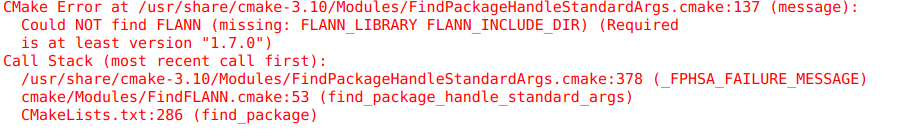

PCL交叉编译文档

> 引言：本文档是主要针对实现分割算法及其依赖库进行交叉编译，未涵盖所有模块的编译。

#### 编译环境：

1. 编译平台：Ubuntu18.04
2. 目标平台：瑞芯微rk3399
3. 编译工具：交叉工具链 rockchip-cc-tools
4. 编译软件：cmake-gui
5. 源代码：

   - [**pcl-1.9.1**](https://github.com/PointCloudLibrary/pcl.git)
   - [**boost**](https://sourceforge.net/projects/boost/)
   - [**flann**](https://github.com/euwen/flann.git)
   - [**Lz4**](https://github.com/lz4/lz4)

     **==说明：pcl依赖boost、flann、eigen          flann依赖lz4==**

#### **编译步骤：**

1. **按照一下形式构建目录**

   ├── extern_libs
   │   ├── boost_1_66_0
   │   ├── boot_install
   │   ├── flann
   │   ├── flann_install
   │   ├── lz4
   │   ├── lz4_install
   ├── install_pcl
   └── pcl-pcl-1.9.1
2. **先编译PCL**

   - cd pcl-pcl-1.9.1&&mkdir build
   - configure弹出以下窗口

   

   - 配置工具链信息

     
   - 缺少CMAKE_MAKE_PROGRAM的值 Search搜索 填加值/usr/bin/make

     

     
   - 缺少eigen库 交叉编译链工具有 就不用编译 直接链接到目录即可

         	
   - 缺少flann 先编译flann再处理pcl

     pcl
3. **编译flann**

   - 和前面一样 进入flann源码 mkdir build 配置工具链
   
   - missing: PKG_CONFIG_EXECUTABLE （再工具链里面找）
   
     
   
     
     
   - 如过缺少liblz4库 编译后放在工具链对应的include和lib文件夹里
   
     ./rk3326-cross-compile-toolchain/host/aarch64-buildroot-linux-gnu/sysroot/usr/include/lz4hc.h
     ./rk3326-cross-compile-toolchain/host/aarch64-buildroot-linux-gnu/sysroot/usr/include/lz4.h
   
   - 把liblz4.pc   /opt/rockchip-cc-tools/host/aarch64-buildroot-linux-gnu/sysroot/usr/lib/pkgconfig/liblz4.pc
   
   - 需要cmake_ar 不然静态库不能编译；
   
   - 修改安装路径为源码同级的文件夹：flann_install
   
   - make -j8 && make install
4. **编译boost**

   - cd到boost 源目录
   
   - 按照缺少的库编译（选择性编译）
   

  

   - 编译配置，运行下面代码
   
     `./bootstrap.sh --without-libraries=atomic,chrono,context,coroutine,exception,graph,graph_parallel,mpi,python,wave --prefix=/home/admins/akblib/extern_libs/boot_install`
     
   - 更改生成的project-config.jam 文件，修改该文件的一行(指定自己的编译器)：
   
     `if ! gcc in [ feature.values <toolset> ] { using gcc : : /opt/rockchip-cc-tools/host/usr/bin/aarch64-linux-gcc ;  }`
     
   - 执行 ./bjam 即可，这是编译，创建的 lib 文件默认在 stage 文件夹
   
   - 编译完后，执行 ./bjam install 即进行安装，我的上面 --prefix=/.../ 指定的目录就是安装目录
5. **接着编译PCL**

   - 配置好上述boost和flann的路径 with里面 勾pcap
   
   - 关掉gl、vtk、cuda无关模块；
   
   - build对象勾选如下图：
   
     
   

​                                                           
   - 
   - CMAKE-BUILD-TYPE设置为release    减少耗时
   - 修改安装路径为源码同级的文件夹：pcl_install
   - make -j8 && make install

#### 参考链接：

[**交叉编译流程**](https://www.cnblogs.com/shadowfax/articles/2336770.html)

[**基于cmake的交叉编译工具链**](https://www.cnblogs.com/alix-1988/p/12173367.html)

[**boost库交叉编译**](https://blog.csdn.net/lc250123/article/details/52468121)

#### **附：PCL模块关系图**

PCL必须依赖的库：Boost, Eigen, FLANN   可选：OpenNI2, Qhull,

​												

