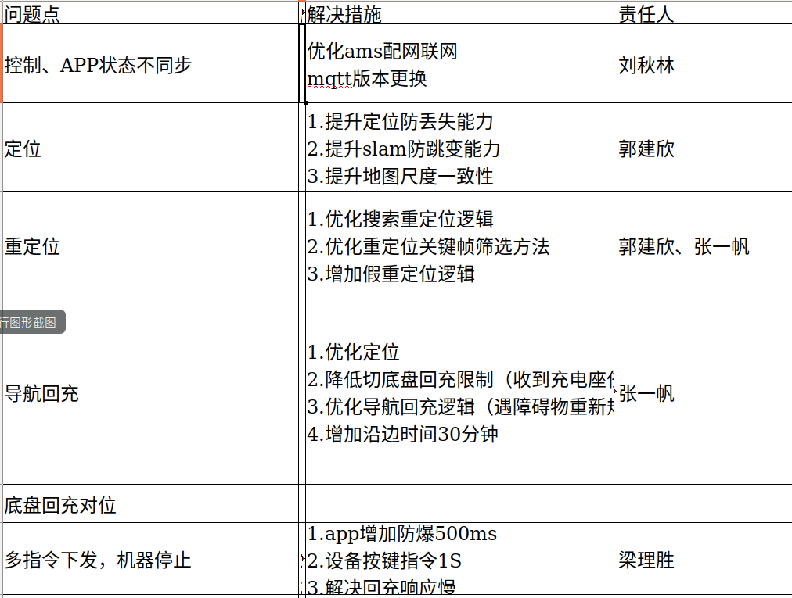

# 扫地机器人行业调研

**搭载3D相机**

https://list.jd.com/list.html?cat=737,738,12394


**对标产品**

**石头T7pro**  https://item.jd.com/100013131504.html

**米家1T**		https://item.jd.com/100015969312.html

**科沃斯T9** 	https://item.jd.com/41403493269.html

**科沃斯X1** 	https://mall.ecovacs.cn/product-4470.html


地毯检测：光流、电流脉冲、视觉


毛利率：龙头50% ak 20% sliver：3000w(政府补贴1000w)/10亿   品牌商很大的费用用在推广 ODM模式销售费用很低

传感器：线激光避障、线激光延墙、超声波地检、红外回充、tof、vslam、imu


### 供应商:

超节点: 双目避障+识别 板子集成打包卖

神顶: 双目+ai rk3566

舜宇:

荆虹:

thuder:AI 高通

EAI:线激光 线激光雷达

小瞳:


### 通病:


客户反馈问题：




- [ ] 打滑检测：解决边界外延问题；    ====>>>>>>视觉丢失的场景下，前撞没触发，导致地图外延出错；==                                                                墙边
- [ ] tof定位：   解决地图不准问题；    ====>>>>>>视觉丢失的场景下，依赖惯导，导致地图倾斜；==                                                                           桌底
- [ ] 墙体检测：解决边界不准问题；    ====>>>>>>定位不准确，导致延边碰撞，每次碰撞加大了惯导yaw误差，视觉丢失都得玩完；==                  墙边


#### 扫地机器传感器:

[**IMU:**](https://blog.csdn.net/donnieliu/article/details/106555390?spm=1001.2101.3001.6650.2&utm_medium=distribute.pc_relevant.none-task-blog-2%7Edefault%7ECTRLIST%7Edefault-2.no_search_link&depth_1-utm_source=distribute.pc_relevant.none-task-blog-2%7Edefault%7ECTRLIST%7Edefault-2.no_search_link&utm_relevant_index=5)定位  包含陀螺仪和加速度计 有些有磁力计和气压计

[**惯性导航原理**](https://blog.csdn.net/zhouyy858/article/details/103270157?spm=1001.2101.3001.6650.9&utm_medium=distribute.pc_relevant.none-task-blog-2%7Edefault%7EBlogCommendFromBaidu%7Edefault-9.pc_relevant_default&depth_1-utm_source=distribute.pc_relevant.none-task-blog-2%7Edefault%7EBlogCommendFromBaidu%7Edefault-9.pc_relevant_default&utm_relevant_index=16)

[**一种基于IMU和码盘融合的车辆定位方法与流程**](http://www.xjishu.com/zhuanli/52/201911356214.html)

**[如何用用陀螺仪+码盘实现机器人的全场定位?](https://www.zhihu.com/question/355374240)**

- **角速度计(陀螺仪)**             工作原理主要是利用角动量守恒，它是一个不停转动的物体，转轴指向不随承载它的支架的旋转而变化

- **加速度计**

  距离=速度×时间  速度=加速度×时间    角度=角速度×时间　

初始信息，包括初始位置、初始朝向、初始姿态等。 

```
陀螺仪是一种物体角运动测量装置。通过对陀螺仪双轴基点在不同运动状态下偏移量的测量，可以标定出物体水平、垂直、俯仰、加速度、航向方位。
IMU是惯性测量单位。在IMU中包含陀螺仪。
```


红外传感器:回充

相机:定位

3D相机:避障/识别

超声波传感器:地毯检测

光流传感器:打滑

线激光:延边/避障

GPS:定位


