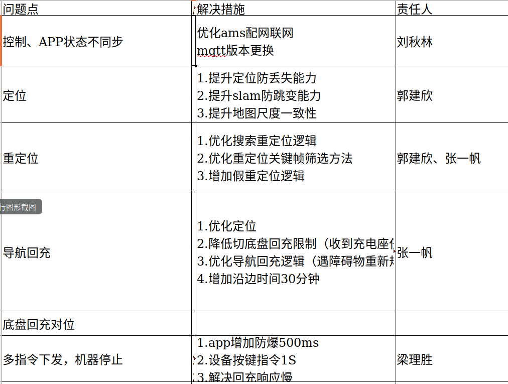

# 扫地机器人行业调研

**搭载3D相机**

https://list.jd.com/list.html?cat=737,738,12394

**对标产品**

**石头T7pro**  https://item.jd.com/100013131504.html

**米家1T**		https://item.jd.com/100015969312.html

**科沃斯T9** 	https://item.jd.com/41403493269.html

**科沃斯X1** 	https://mall.ecovacs.cn/product-4470.html

地毯检测：光流、电流脉冲、视觉

毛利率：龙头50% ak 20% sliver：3000w(政府补贴1000w)/10亿   品牌商很大的费用用在推广 ODM模式销售费用很低

传感器：线激光避障、线激光延墙、超声波地检、红外回充、tof、vslam、imu

### 供应商:

超节点: 双目避障+识别 板子集成打包卖

神顶: 双目+ai rk3566

舜宇:

荆虹:

thuder:AI 高通

### 通病:

客户反馈问题：

- [ ] 打滑检测：解决边界外延问题；    ====>>>>>>视觉丢失的场景下，前撞没触发，导致地图外延出错；==                                                                墙边
- [ ] tof定位：   解决地图不准问题；    ====>>>>>>视觉丢失的场景下，依赖惯导，导致地图倾斜；==                                                                            桌底
- [ ] 墙体检测：解决边界不准问题；    ====>>>>>>定位不准确，导致延边碰撞，每次碰撞加大了惯导yaw误差，视觉丢失都得玩完；==                  墙边
