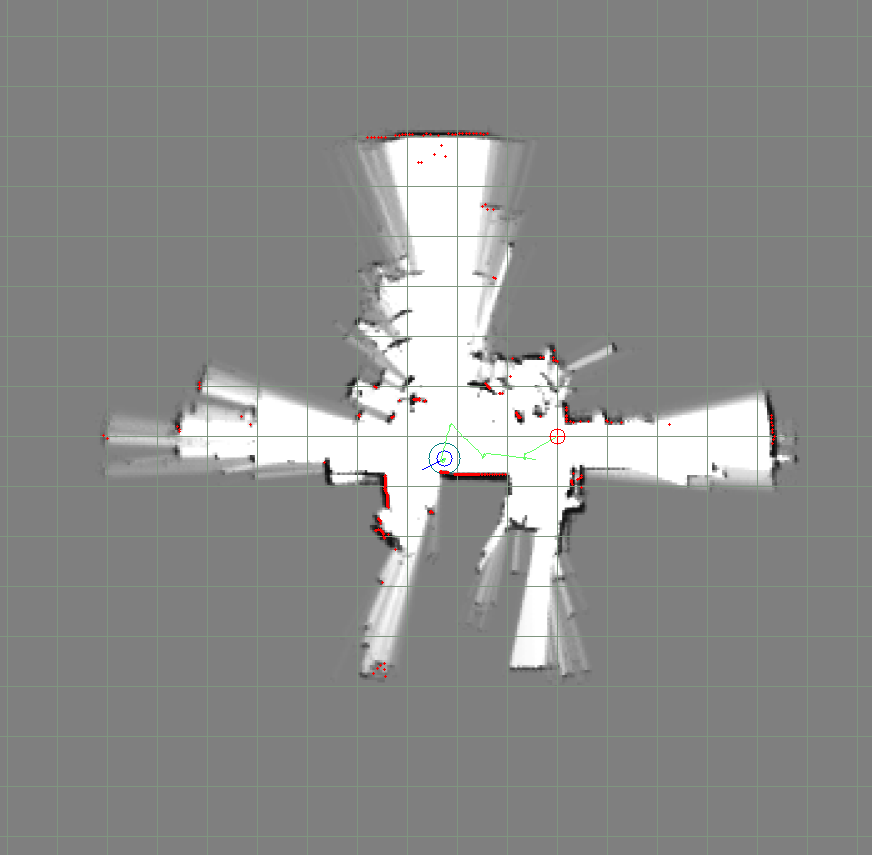
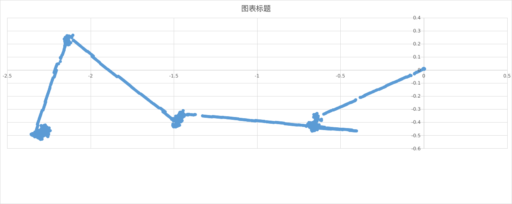
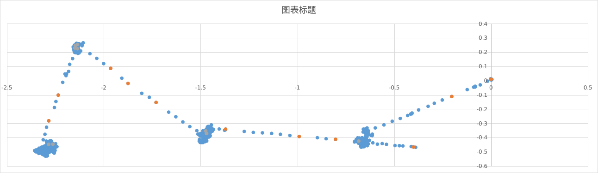
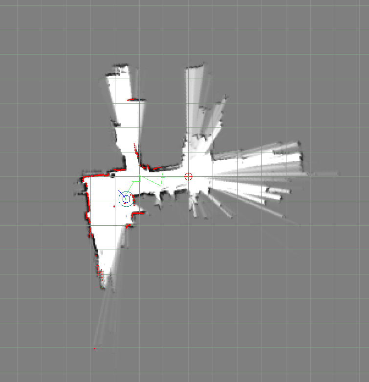
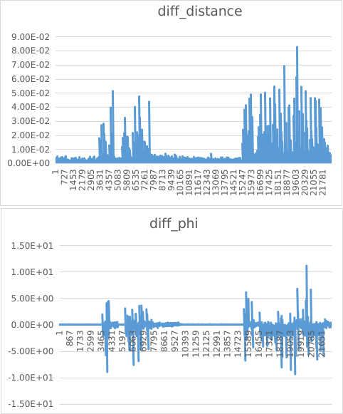
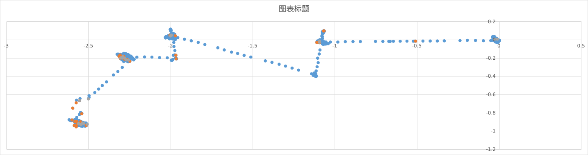
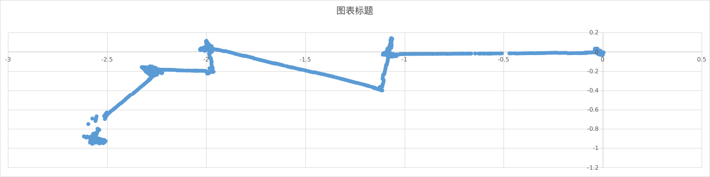

### case3:关闭imu, 旋转50rad/s


.assets/image-20221207170446535.png)


case4:

.assets/image-20221213143125399.png)

.assets/image-20221214103619929.png)

.assets/image-20221214103707608.png)

```c++
void Update(data_type::Pose &slam_pose,
    std::unordered_map<std::string,std::shared_ptr<data_processor::Odom>> &odom_map) {
      if(odom_map.empty() || !odom_map.count("odom")) {
        output_pose = slam_pose;
        return;
      }
      if(slam_pose.time != last_pose.time && slam_pose.time > last_pose.time) {
        slam_pose_update_ = true;
      }
      if(slam_pose_update_ || sync_ok) {
        data_type::OdometryData sync_odom;
        bool ret = odom_map.at("odom")->SyncData(odom_map.at("odom")->GetData(),sync_odom,slam_pose.time);// 获取插值里程计位姿
        if((skidding_multiple*(slam_pose.position - last_pose.position).norm()) 
        < (sync_odom.position -last_odom.position).norm()) {
          LOG(WARNING) <<"Skidding!!!!!" << " 2*pose_: " <<2*(slam_pose.position - last_pose.position).norm() 
                      <<" odom_delta: " <<(sync_odom.position -last_odom.position).norm();
          isSkidding_ = true;
          interp_ratio = 0.2;
        }
        else {
          isSkidding_ =false;
          interp_ratio=raw_interp_ratio;
        }
        if(!ret) {
          DLOG_EVERY_N(WARNING,3) << "Failed to synchronize data.";
          sync_ok = false;
        }
        else {
          // LOG(INFO) << "数据时间： " <<sync_odom_Data.time <<" 同步时间：" <<pose.time;
          // ((同步里程计数据 - 以前里程计)+之前pose)*K + (1-K)pose
          output_pose.time = slam_pose.time;
          output_pose.position = ((sync_odom.position - last_odom.position) + last_pose.position)*interp_ratio + slam_pose.position*(1-interp_ratio);
          output_pose.orientation = ((sync_odom.orientation.toRotationMatrix() - last_odom.orientation.toRotationMatrix()) + last_pose.orientation.toRotationMatrix())*interp_ratio + slam_pose.orientation.toRotationMatrix()*(1-interp_ratio);
          // data.at("odom")->ClearData();
          last_time = common::ToUniversal(sync_odom.time);
          last_pose = slam_pose;
          last_odom = sync_odom;
          sync_ok = true;
        }
      }
      if(!odom_map.at("odom")->GetData().empty()) {
        uint64 latest_time = common::ToUniversal(odom_map.at("odom")->GetData().back().time);
        if(last_time!=latest_time && latest_time > last_time) {/* 是否有更新 */
          Interpolation(last_odom, odom_map.at("odom")->GetData().back(),last_pose,output_pose);
          last_time = latest_time;
          DLOG(INFO)<< "start_time： "<< last_odom.time << " end_time: " <<output_pose.time 
                    <<" output x: "<< output_pose.position.x() << " output y: "<< output_pose.position.y() << std::endl;
        }
      }
    }
```


.assets/image-20230104174126882.png)


加入odom地图容易叠图,表现轻微叠,地图边界残影,墙体变厚;


.assets/image-20230104172224104.png)


如上图 加了odom容易叠图,左边界不重合,后端优化矫正回来了,但轨迹已经很靠近左边了


