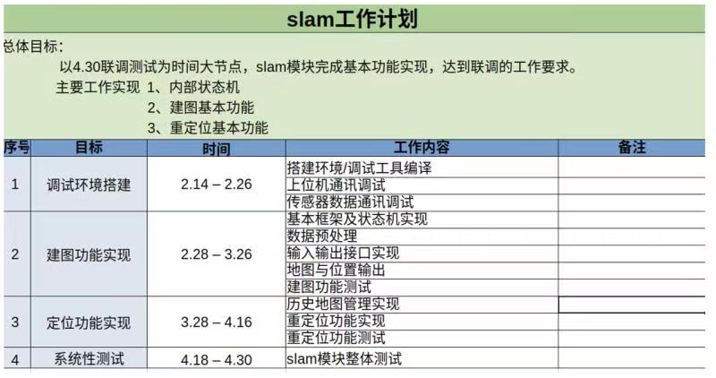
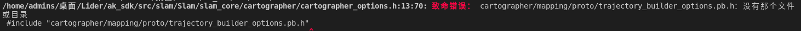
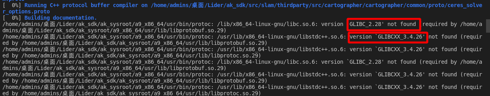
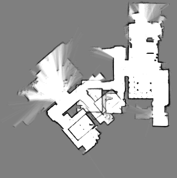
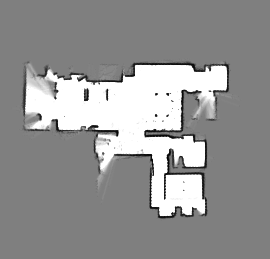

#  激光slam

> **人们倾向于做计划列安排,因为这有种快感;**


#### 前置:决策力模型

- 市场:易
- 研究方向:AI
- 现状:光流
- 可行性:基础具备 有经验的项目


#### 规划:执行力模型

- 项目要求时间节点



- 补习内容:
  - 资料?
  - 课程?
- 一个项目构成: 1.软件架构 2.核心算法 3.分析调试

**进度表:**

- [x] 环境搭建,编译工具;
- [x] 熟悉激光slam架构,解读代码;
- [x] 计算机视觉cartographer一期视频课程;
- [x] 看明白建图逻辑;
- [x] 测试回环之前的和字后 地图变化对比;
- [x] odom和pose轨迹对比;
- [x] 重定位源码解读;
- [x] 分析传感器的使用情况;
- [x] 配置文件读取

#### 实施:学习力模型

**开发疑问:**

**总结:**

源码编译调试:

- 编译第三方库



- 库文件glib

  

  ```shell
  strings /lib/x86_64-linux-gnu/libc.so.6 | grep GLIBC 
  strings /usr/lib/x86_64-linux-gnu/libstdc++.so.6|grep GLIBCXX
  可看到你当前系统中支持的 GLIBC 版本列表
  ldd ak_sysroot/a9_x86_64/usr/bin/protoc
  LD_LIBRARY_PATH=${PWD}/ak_sysroot/a9_x86_64/usr/lib/ ./ak_sysroot/a9_x86_64/usr/bin/protoc --help LD_LIBRARY_PATH=$(pwd)/ak_sysroot/a9_x86_64/usr/lib/ ./ak_sysroot/a9_x86_64/usr/bin/protoc --help
  ```

- 上位机client系统版本不匹配;




W0805 18:11:32.829422  1061 local_trajectory_builder_2d.cc:223] Dropped empty horizontal range data.


- [ ] /usr/akb/cfg/slam.cfg/.... 和/usr/akb/config/slam.cfg/....     两个配置文件

- [ ] 重定位操过耗时以及重定位成功都需要优化  那之前没有优化么?

- [ ] 叠图产生的原因?

  

### 离线仿真操作:

**1.打开docker环境进入**

  cd到docker配置好的目录  cd /home/admins/桌面/Lidar/ak_sdk

  docker compose up -d 

  docker exec -it ak_sdk /bin/bash

**2.跑机发布话题**

cd ak_sdk/ak_sysroot/l9_x86_64/usr/bin/ &./network_client_ros 

**3.录包**

 cd ak_sdk & ros2 bag record  /imu_src /odom_src /point_cloud_src -o bag/sensor_20

**4.播放录制的包**

 ros2 bag play bag/sensor_data_12.15.4

**5.启动仿真sensor**

cd ak_sdk/ak_sysroot/l9_x86_64/usr/bin/ &./offline_sensor

**6.启动slam**

cd ak_sdk/ak_sysroot/l9_x86_64/usr/bin/ &./slam

**7.启动上位机**

cd ak_sdk/ak_sysroot/l9_x86_64/usr/bin/ & ./network_client_slam --ip 127.0.0.1

