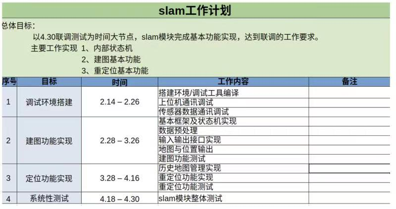
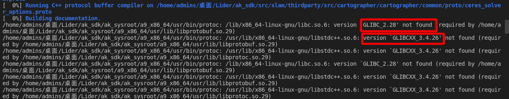
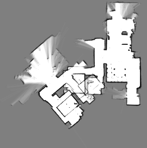
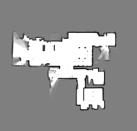

#  激光slam

> **人们倾向于做计划列安排,因为这有种快感;**


#### 前置:决策力模型

- 市场:易
- 研究方向:AI
- 现状:光流
- 可行性:基础具备 有经验的项目


#### 规划:执行力模型

- 项目要求时间节点



- 补习内容:
  - 资料?
  - 课程?
- 一个项目构成: 1.软件架构 2.核心算法 3.分析调试


**进度表:**

- [ ] 环境搭建,编译工具;
- [ ] 熟悉激光slam架构,解读代码;
- [ ] 计算机视觉cartographer一期视频课程;
- [ ] 看明白建图逻辑;
- [ ] 测试回环之前的和字后 地图变化对比;


**开发疑问:**

**总结:**


源码编译调试:

- 编译第三方库


- 库文件glib

  

  ```shell
  strings /lib/x86_64-linux-gnu/libc.so.6 | grep GLIBC 
  strings /usr/lib/x86_64-linux-gnu/libstdc++.so.6|grep GLIBCXX
  可看到你当前系统中支持的 GLIBC 版本列表
  ldd ak_sysroot/a9_x86_64/usr/bin/protoc
  LD_LIBRARY_PATH=${PWD}/ak_sysroot/a9_x86_64/usr/lib/ ./ak_sysroot/a9_x86_64/usr/bin/protoc --help LD_LIBRARY_PATH=$(pwd)/ak_sysroot/a9_x86_64/usr/lib/ ./ak_sysroot/a9_x86_64/usr/bin/protoc --help
  ```

- 上位机client系统版本不匹配;


lidar







W0805 18:11:32.829422  1061 local_trajectory_builder_2d.cc:223] Dropped empty horizontal range data.

