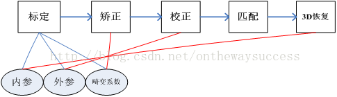
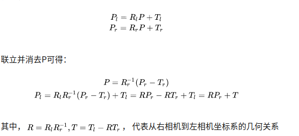
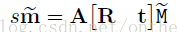
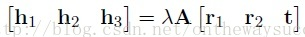
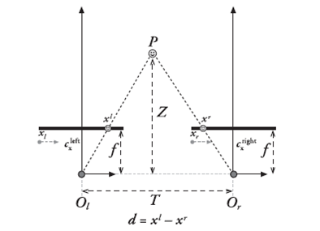
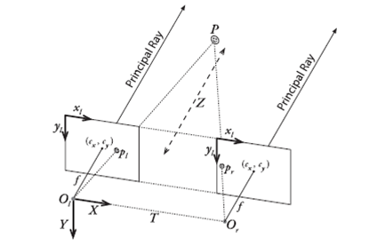
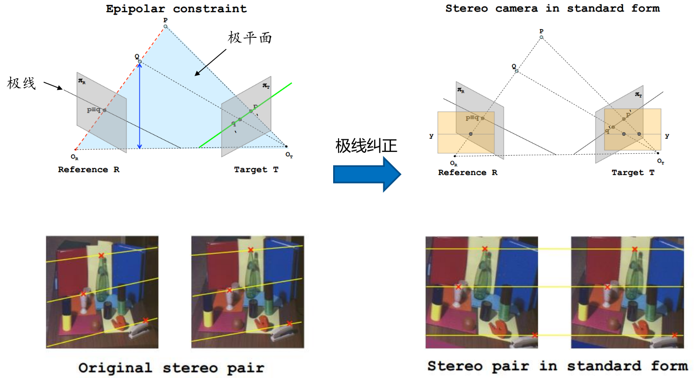
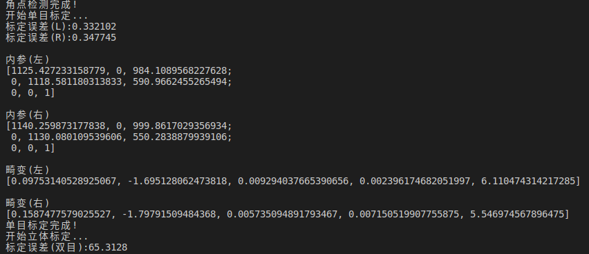
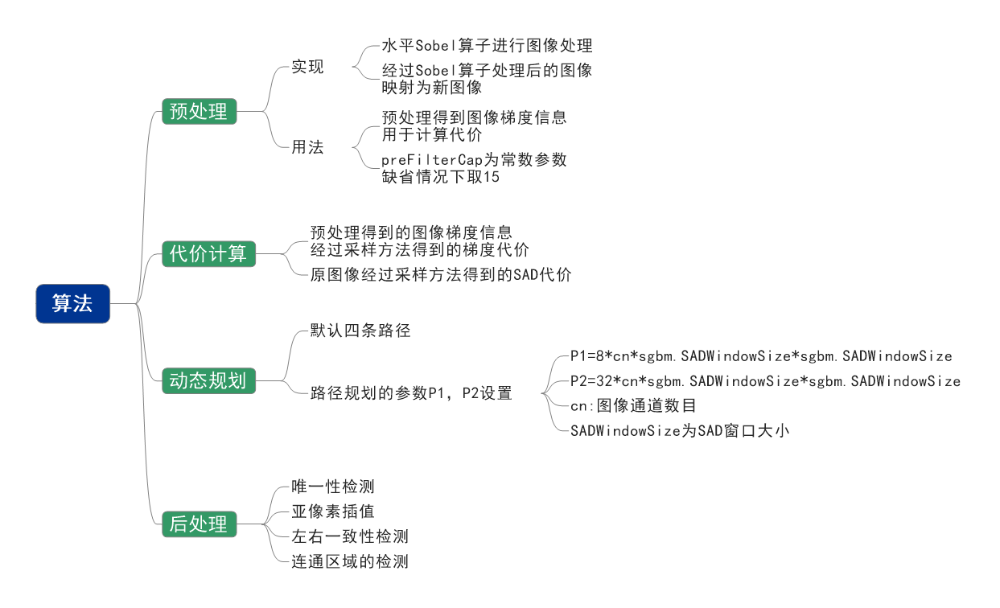
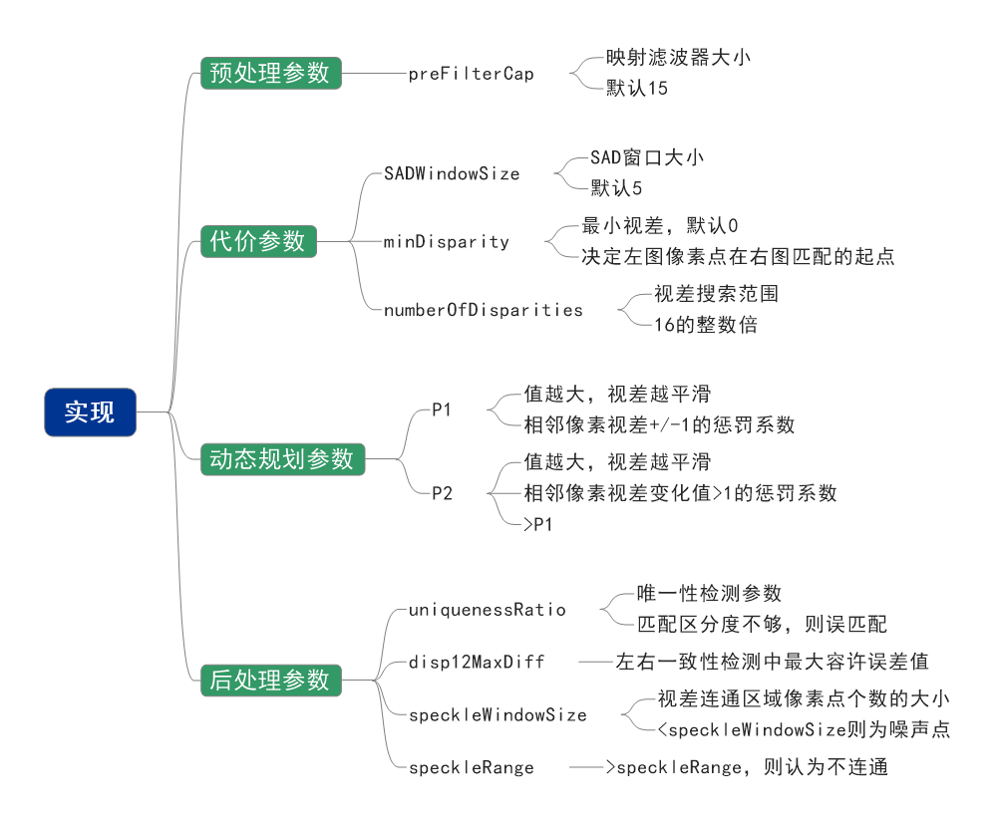

# 基于散斑双目三维系统开发

> **在不确定性中找确定性，做时间的盆友;      ---罗振宇**
>
> **不谋全局者,不足以谋一域;不谋万世者,不足以谋一时；   ---陈澹然[清]** 
>
> **虚构的故事，想象的现实；                                                  ---尤拉尔-赫拉利**


### 1.1项目背景\需求：

用于避障、定位建图、识别

### 1.2技术调研：

现在业界对于扫地机人的方案基本都是双目结构光相机

分析原因：实时性、价格、精度要求不够

### 1.3算法流程：

其工作流程主要包含 4 步:==双目标定、图像校正、立体匹配和三维重建==,而立体匹配是关键的步骤 。立体匹配算法实现流程主要分为 4 步:==代价计==
==算、代价聚合、视差计算和视差求精==[^3]；

### 1.4日程排期：

- [x] 文档查阅，梳理开发流程，日常安排；

- [x] 完整demo跑通；

- [x] 标定实现；

- [x] 校准实现；

- [x] 立体匹配实现；

- [x] 三维重建；


------


### 2.1知识储备：

#### **`主干技术流程`：**



```c++
单目标定：
error_L = calibrateCamera(corners_xyz_all,  // 世界坐标
                                  corners_uv_all_L, // 像素坐标
                                  imgSize,          // 标定图像大小
                                  M_L,              // 相机内参
                                  D_L,              // 畸变系数
                                  rvecs_L,          // 旋转矩阵
                                  tvecs_L,          // 平移矩阵
                                  0x02000);         // 鱼眼相机(k1,k2,k3)CV_CALIB_FIX_K3
error_R = calibrateCamera(corners_xyz_all,
                                  corners_uv_all_R,
                                  imgSize,
                                  M_R,
                                  D_R,
                                  rvecs_R,
                                  tvecs_R,
                                  0x00080);
双目标定：
error_LR = stereoCalibrate(corners_xyz_all,  // 标定板世界坐标
                                   corners_uv_all_L, // 像素坐标(左)
                                   corners_uv_all_R, // 像素坐标(右)
                                   M_L, D_L,         // 相机内参\畸变系数(左)
                                   M_R, D_R,         // 相机内参\畸变系数(右)
                                   imgSize,          // 标定图像大小
                                   R,                // 旋转矩阵(右->左)
                                   T,                // 平移矩阵(右->左)
                                   E,                // 本质矩阵(同一点在左\右像素坐标系下的相互转换矩阵,单位mm)
                                   F,                // 基础矩阵
                                   CALIB_FIX_INTRINSIC,
                                   TermCriteria(CV_TERMCRIT_ITER + CV_TERMCRIT_EPS, 100, 1e-5));
图片矫正：
stereoRectify(M_L, D_L,M_R, D_R,imgSize,R, T,
                         		  rt_L, rt_R,   //-输出矩阵，第一个摄像机的校正变换矩阵（旋转变换）输出矩阵，第二个摄像机的校正变换矩阵（旋转矩阵）
           						  P_L, P_R,   //输出矩阵，第一个摄像机在新坐标系下的投影矩阵 输出矩阵，第二个摄像机在想坐标系下的投影矩阵
         						   Q,                   //4*4的深度差异映射矩阵
     							   CALIB_ZERO_DISPARITY,  -1,imgSize,&validROI_L, &validROI_R);

initUndistortRectifyMap(M_L, D_L, rt_L, P_L,imgSize, CV_16SC2, mapx_L, mapy_L);
initUndistortRectifyMap(M_R, D_R, rt_R, P_R,imgSize, CV_16SC2, mapx_R, mapy_R);


remap(imgL, imgL_r, mapx_L, mapy_L, INTER_LINEAR);
remap(imgR, imgR_r, mapx_R, mapy_R, INTER_LINEAR);
```

#### **`相机标定：`**


$$
\begin{pmatrix}  
  u \\   v \\1\\1\\ 
\end{pmatrix} =A\begin{pmatrix}  
  R & T \\  0 & 1  
\end{pmatrix} \begin{pmatrix}  
  X_{w} \\   Y_{w}\\    Z_{w}  \\  1  \\  
\end{pmatrix}       
\longrightarrow 
\begin{pmatrix}  
  u \\   v \\1\\
\end{pmatrix} =A\begin{pmatrix}  
  R \parallel T \\  
\end{pmatrix} \begin{pmatrix}  
  X_{w} \\   Y_{w}\\    Z_{w}  \\  1  \\  
\end{pmatrix}
\longrightarrow 
\begin{pmatrix}  
  u \\   v \\1\\
\end{pmatrix} =A\begin{pmatrix}  
  R _{1}& R _{1}&T \\  
\end{pmatrix} \begin{pmatrix}  
  X_{w} \\   Y_{w}\\  1  \\  
\end{pmatrix}
$$

$$
Z c\left[\begin{array}{c}
u \\
v \\
1
\end{array}\right]=\left[\begin{array}{ccc}
\frac{f}{d_{x}} & 0 & u_{0} \\
0 & \frac{f}{d_{y}} & v_{0} \\
0 & 0 & 1
\end{array}\right]\left[\begin{array}{c}
X_{\mathrm{C}} \\
Y_{\mathrm{C}} \\
Z_{\mathrm{C}}
\end{array}\right]=\left[\begin{array}{ccc}
f_{x} & 0 & u_{0} \\
0 & f_{y} & v_{0} \\
0 & 0 & 1
\end{array}\right]\left[\begin{array}{c}
X_{\mathrm{C}} \\
Y_{C} \\
Z_{\mathrm{C}}
\end{array}\right]=K\left[\begin{array}{c}
X_{\mathrm{C}} \\
Y_{\mathrm{C}} \\
Z_{\mathrm{C}}
\end{array}\right]
$$

$$ {三角关系}
三角关系得出3D-2D\quad {\huge {\huge } } 
Z_{c} u=fx  \quad     Z_{c}v=fy
$$



  **存在疑问？**

- 不经过校准后是否直接拿来匹配？
- 实际拍摄的棋盘格物理尺寸square_size是否需要？单目标定需要？双目标定？
- 本质矩阵？基础矩阵？投影矩阵？重投影矩阵？单应性矩阵？
- 同样数据单目标定误差0.3 结果满足要求 双目标定误差特别大，至今没找到原因！

  **核心总结！**

   张正友标定逻辑：1.下图的相机模型：

​                               2.计算单应性矩阵;（z=0简化模型，每四个点即可获取一个H，齐次9-1=2*4） 单一性矩阵是可以直接求X_w Y_w的 8个自由度 本来是9个自由度                             								   的，最后一行等式是可以得到一个恒等式而减少一个自由度，而Z_w是求不出来的 只能换一个位姿约束求出；

​                               3.分解内外参数

​							   4.先求内参；（4个变量=2*2位姿）

​                                5.求外参；


#### **`极线校准：`**



双目校正是根据摄像头定标后获得的单目内参数据（焦距、成像原点、畸变系数）和双目相对位置关系（旋转矩阵和平移向量），分别对左右视图进行消除畸变和行对准，使得左右视图的成像原点坐标一致、两摄像头光轴平行、左右成像平面共面、对极线行对齐。将左右视图调整成完全平行对准的理想形式（如下图）。








****
#### **`立体匹配：`**

SGBM原理理解：





### 2.2工作进度：

详情看git更新日志及工作汇报情况；

### 2.3开发问题：

#### 		2.3.1 概念理解问题：	

​                     1.标定后校准畸变后再极线校准么？还是标定结果用在后续点云映射？

​					 2.极线校准的理解：光轴平行，像平面垂直光轴？

#### 		2.3.2 工程开发问题：

1.硬件评估：相机焦距可以适度提高，右相机整体偏暗，可能光圈较小引起；

2.opencv双目标定误差较大。问题清除；

------


### 3.1文档整理：


### 3.2项目交付：


------


### 参考资料：

[**[1]李迎松 立体匹配理论与实战**]()

**[[2]奥比中光徐玉华 立体匹配算法原理与应用]()**

[**[3]陈炎,杨丽丽,王振鹏.双目视觉的匹配算法综述.图学学报**](https://kns.cnki.net/kcms/detail/10.1034.T.20200901.1112.014.html)

**[[4]Stefano Mattoccia “Stereo vision: algorithms and applications”](http://vision.deis.unibo.it/~smatt/Seminars/StereoVision.pdf)**

**[[5]标定原理：https://www.zhihu.com/question/29448299/answer/137923952](https://www.zhihu.com/question/29448299/answer/137923952)**

**[[6]《Learning OpenCV》，Stanford University CS 131 Computer Vision Foundations and Applications 2016 - lecture10](https://zhuanlan.zhihu.com/p/259599539)**


[^3]: 

