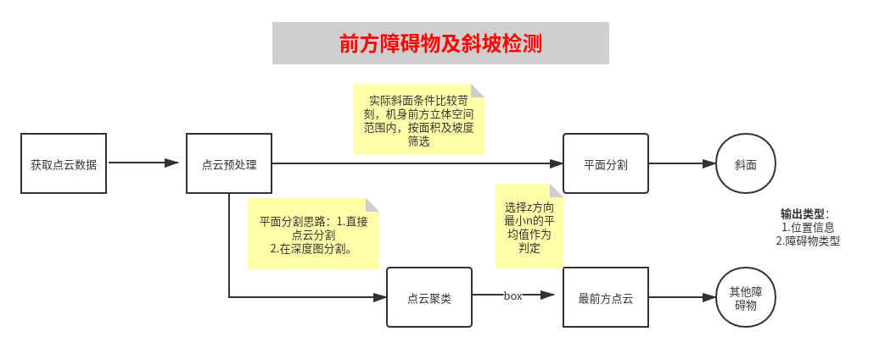

# 扫地机器人3D传感器+激光

### 项目背景：

单线激光雷达在特定高度扫描，获取信息比较单一，在近视域采取3Dsensor可获取大量精准的点云数据，可辅助激光雷达辅助建图。

### 视觉方案：

3D相机固定机器人前端，保持离地面恒定且相机成像面垂直地面，参考扫地机器人自身物理尺寸及相机的fov划取前方立体点云数据，经点云处理提取障碍物特征，判定所属类型。再栅格化映射到二维地图中标记避障区域。

### 输出接口标准：

基于激光栅格化建图，3D传感器输出的数据接口包含以下信息：

1. 前方障碍物的栅格位置信息。
2. 前方障碍物类型。

### 开发环境：

ubuntu18.4+vscode+pcl1.8.1+muxin_sdk+cloudcompare

### 障碍物类型：

结合实际应用场景，包含以下可能的障碍物类型：

|     类型      |      场景       |
| :-----------: | :-------------: |
| ***障碍物***  |   ***墙面***    |
| <u>可翻越</u> | <u>低矮台阶</u> |
| <u>可穿越</u> |   沙发、床底    |
|     悬崖      |      楼梯       |
|  ***斜坡***   | ***斜面台阶***  |

### 算法流程(识别障碍物及斜坡)：

- 获取点云，点云预处理（直通滤波，统计滤波...)
- 聚类分割孤立点云。（判定点云数量及其位置）
- 分割平面，计算倾斜角。
- 特征提取（边界线）。

### 工作安排：

1. 采集障碍物、可翻越物、斜坡三类数据，clouldcompare分析点云特征，设计算法流程。(10.9-10.14)

2. 针对斜坡，开发判定算法，包括平面分割、斜坡面积筛选及坡度计算，输出地面和斜面的交线点云。(10.14-11.20)

3. 针对可翻越障碍物(台阶)，判定微小障碍物与可翻越障碍的特征，提取台阶正面点云。(10.14-11.20)

4. 针对一般障碍物，统计voxel内点云数量，提取前端障碍点云。(1；91.20-12.15)

5. 点云栅格化映射，标记上述三种障碍物的类型及位置，输出地图信息。(11.20-11.25)
   
6. 算法移植到3d_env框架下，接入数据接实时测试。(12.1-12.15)

7. 调试障碍物及坡面检测算法，反馈优化算法，包括以下优化内容。(12.15-12.30)

   - 直接在点云上提取前方边缘线。
   - 在深度图中提取平面，比较和在点云中处理的耗时情况。

   

### 障碍物识别评估：

### 备注：

- 障碍物只关注和机器人等高的前方点云区域。

- 台阶识别思路:获取点云cloud0，截取地面高于台阶以下的数据数据cloud1，提取平面点云cloud_plane，计算平面高度值y，用cloud1-cloud_plane的到余下的点云cloud3，此点云包含了所求的台阶位置点云和旁边障碍物接壤导致产生的点云，如果要去掉点云cloud_obstacle,则需要求cloud1截取高度为y以上的数据得到孤立的点云cloud4，利用kd搜索范围类的点云并去除。得到前沿台阶点云数据。
- 任何一副点云都可求他的一个边界，而所需的边界需要筛选，要明白边界产生的调节。1.障碍物接壤产生。2.相机fov导致的。