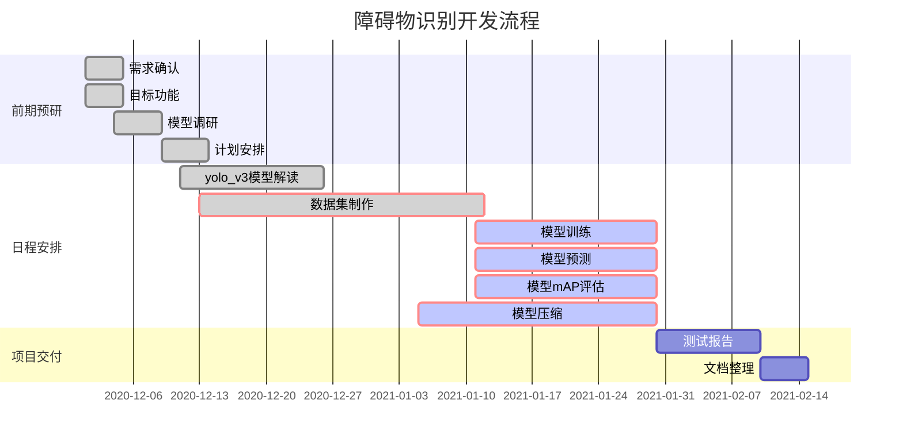
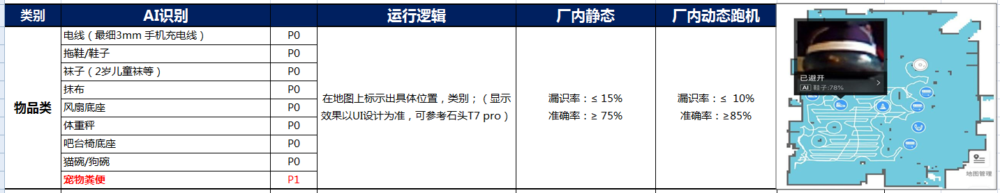
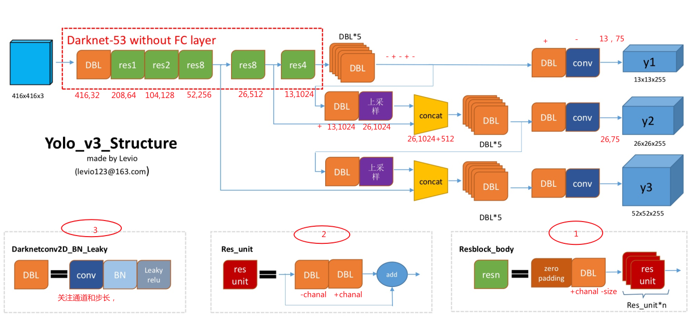
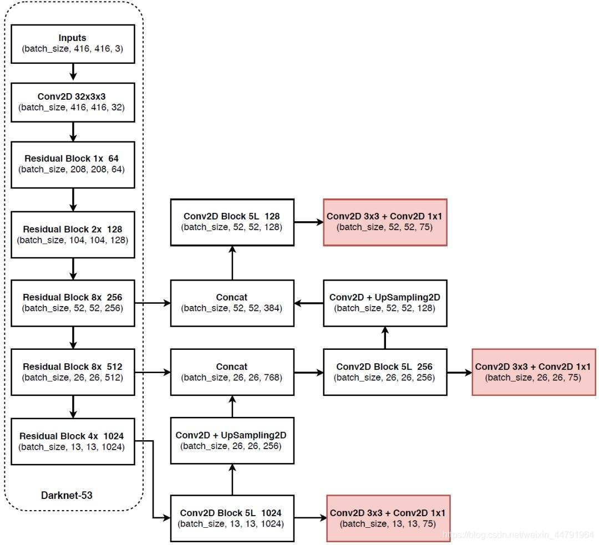
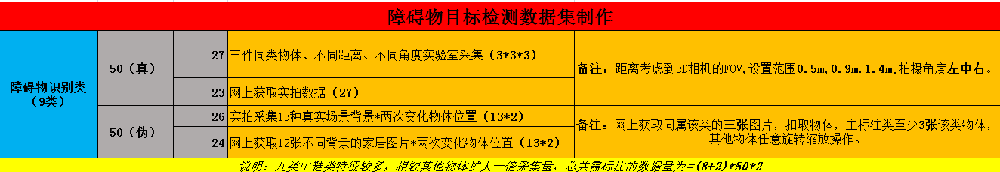
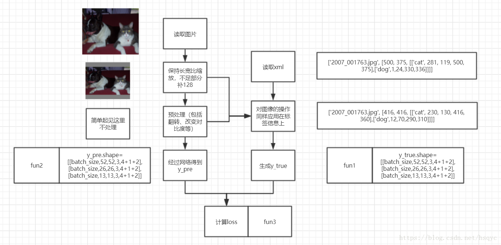
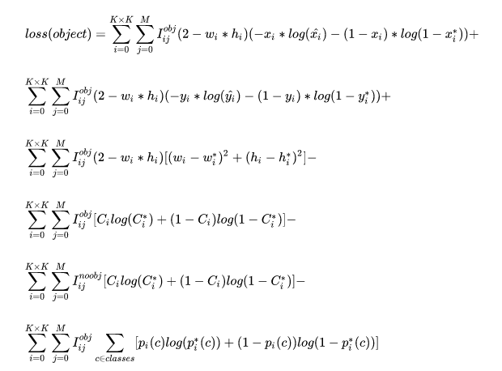
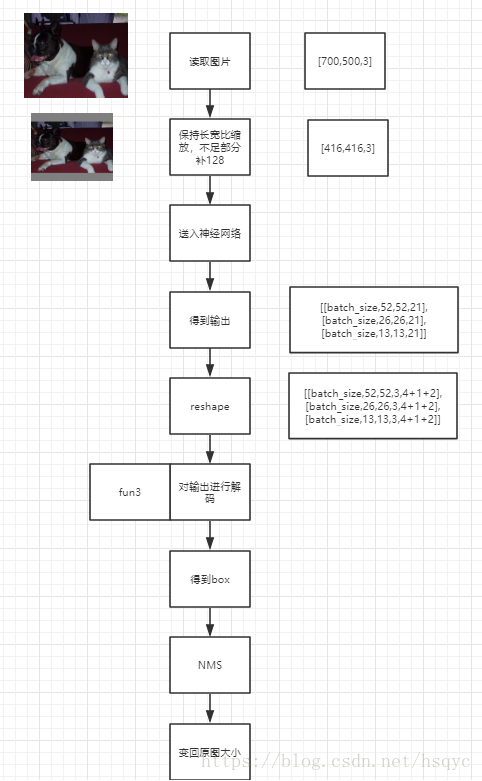
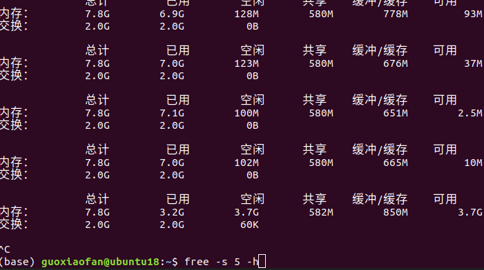

# 深度学习障碍物检测算法开发

> ***一切项目皆为输入输出；***
>
> ***写代码都是后面的事情了，(目的导向)工作流程的思考，==任务排期==，应该筹划到75%才能逐一干事；***
>
> **谋定而后动**

[toc]
------


### (一)开发思路：

**项目需求/技术调研/开发流程/测试验证**

### (二)项目需求（VF11基型）：



### (三)开发环境：

1.anaconda安装：创建环境、激活、修改源、常用命令。

2.pycharm安装：先安装为专业版，一直卡在界面，后续激活为成功，提示发现应该装commnity版本，一样的卡在安装界面，后续sudo ./pycharm解决，拉入yolo3模型直接奔溃。//12.9号

3.vscode配置环境：出现shell空白，改变setting.json.(vs软件配置文件的setting)

4.pytorch安装： conda install pytorch torchvision torchaudio cpuonly 龟速的话更改源  import torch测试导入成功。

5.opencv安装：两种方式安装conda和pip 对于第一种我更新源在terminal和在界面安装都没成功，界面提示说和python3.8不兼容；第二种我在pip安装：pip install opencv-python 成功！在base环境中运行这句话的 然后conda list |grep cv 看见在环境中包含了cv 则说明成功了。

6.vs+code配合使用：

{  "python.pythonPath":  "/home/guoxiaofan/anaconda3/bin/python",  //解决import报红提示

​        "python.linting.pylintArgs": [      "--generate-members"   ]    //解决调用时报红提示}

==备注：==

7.验证环境方式

conda --version  进入python import torch print(torch._ _ version__)  import cv2 print(cv2. _ _version _ _)

- 每次声称了新的文件记得刷新一下，code编辑器不会自动更新。
- anaconda安装时已经给你安装好了python、pip等基础库。

### (四)开发流程：

#### 模型解读：

`基于pytorch的yolo3模型框架的搭建`



![(深度学习的障碍物检测算法开发.assets/屏幕截图.png)



1.源码中先定义了一个DarkNet类，DarkNet([1, 2, 8, 8, 4])实例化为Darknet53，里面主要这样定义model = DarkNet([1, 2, 8, 8, 4])，在定义里面的Resblock_body,再加残差单位BasicBlock得到倒数第一到倒数第三的输出，在特征金字塔多尺度融合得到三个尺度的feature_map.

2.DBL*5包含[512,1024] [1024,512] [512,1024]....反复运行,分别按kernel_size为1、3进行，目的是为了提取特征减少参数，五次DBL后还需卷积一次(一共6次为偶数)变为输出的通道1024，

3.卷积的一个目的是改变通道数，这个是深度学习最基本的，yolo3里面利用卷积代替了全连接层。==五个因素：通道输入输出、核、stride、pading、bias==

4.Darknet53---5个残差块+DBL---多个残差单元   （理清框架关注两个核心：尺寸及通道数的变化）

#### **数据集制作：**

- **数据采集**



抠图工具需要利用ps扣取主体，再贴到背景图上面。

- **标准化数据格式：**

  首先创建一个目录来存储所有数据，如VOCdevkit/来包含VOC训练数据的子目录。创建子目录各文件夹结构如下所示：
  —VOCdevkit
  ——VOC2019
  ———Annotations（标注文件）
  ————Main（生成需要训练的编号.txt）
  ———JPEGImages(采集的各类图片)

- **数据标注**：

  图片及标注可以从网上找，也可自己爬取后使用labelImg标注。图片放入JPEGImages文件夹中。标注xml文件放在Annotions里面。
  对应图片标注生成的XML文件放入Annotations文件夹中。   labelImg下载方式：使用git命令

```c
git clone https://github.com/tzutalin/labelImg
$ sudo apt-get install pyqt4-dev-tools # 安装PyQt4
$ sudo pip install lxml # 安装lxml，如果报错，可以试试下面语句
$ sudo apt-get install python-lxml
python labelImg.py
 #如果報錯 No module named 'libs.resources'
 运行：pyrcc5 -o resources.py resources.qrc
将生成的resources.py拷贝到同级的libs目录下
```

- **生成yolo模型输入格式：**

  在训练前利用voc2yolo3.py文件生成对应的txt（原理相当于从图片中随机选一定比例的作为训练集合验证集），再运行根目录下的voc_annotation.py，运行前需要将classes改成你自己的classes。最终就会生成对应的2007_train.txt，每一行对应其图片位置及其真实框的位置。

- **数据自动生成及数据标注程序** 

  完成任意数据背景及主题的数据集生成，开优化增强数据

`Question&&Ans：`

1.尺寸问题：训练数据的图片大小有无影响？输入的尺寸都不同？

2.聚类候选框的选取？为什么configre是三种尺寸的候选框？处理过？只有w、h,没有x、y？

<u>k-means算法在训练集中所有样本的ground truth box中聚类出具   有代表性形状的宽和高</u>

3.数据采集：320*480?

4.数据增强：旋转平移、非线性变换、

`Processing：`

1.自己采集部分数据和+加别人的数据集+爬虫获取网络图片

2.数据标注：labeimg标注为voc标准格式

3.脚本提取需要的数据的txt文件，再进行xml的提取为标准形式为：路径、box、class；

4.dataset类：包含数据增(平移、翻转、几何、色域变换等)；

5.dataload加载数据；


**1.25号数据优化方案：**

- 增加背景 网图及实拍
- 增加主体  网图及实拍
- 优化自动贴图脚本 增加3种尺寸的数据集 数量灵活生成

#### 训练调参：

##### 训练流程



##### 目标函数



1.22号添加：模型训练优化（伪数据跑通模型，实拍测试误差较大）：

- 在已有的条件下，修改iou/confidence来检查预测结果
- 修改训练参数，batch、epoch、lr来优化
- 数据增强 伪数据 主题及背景  添加真实数据 

#### 映射預測：

##### 预测流程



1.从outputs = self.net(images)出来的，三种尺度的数据解码合并得到接近一万多个检测框。出来的框没有缩放。

2.非极大值抑制？不同尺度的feature_map一起拿来iou判定吗？得到12*(4+2+1)？

3.在预测阶段的即nms里面设置iou和在map里面的iou设置的区别？nms是在所有的候选框大约一万多个框 比较选取合适的结果称为预测框 而map里面设置iou是和标准的GT作比较     

​    *预测阶段设置iou阈值越大，检测框越多，iou小的话没有被抑制。*再对单类物体密集型时需要调高iou阈值 比如人流多的车站


**总结nms的流程**
 每一个image,会预测出N个detetction信息,包括4+1+C(4个坐标信息,1个obj_score以及C个class_probability)

- 首先过滤掉obj_score < confidence的行      
- 每一行只取class_probability最高的作为预测出来的类别
- 将所有的预测按照obj_score从大到小排序
- 循环每一种类别,开始做nms
  - 比较第一个box与其后所有box的iou,删除iou>threshold的box,即剔除所有相似box
  - 比较下一个box与其后所有box的iou,删除所有与该box相似的box
  - 不断重复上述过程,直至不再有相似box
  - 至此,实现了当前处理的类别的多个box均是独一无二的box.


#### 模型评估：

##### mAP的评价

1.mAP计算时是按照confiden排序的 所以画图画出来p开始的时候都是1，图是按照每次计算以此T/F计算更新一次，和之前自己理解的多个iou_tresh及confidence的值来变化的不一样。

#### **移植c封装：**

1.封装为接口融入主框架实时检测。


### (五)开发问题解决：

#### 关键代码汇总：

- yolo_v3标准化数据集(一)

```python
class YoloDataset(Dataset):
```

  读取经脚本生成的标准格式**输入**：imgpath 四个坐标 label     处理后**输出：**归一化、数据随机加强、坐标变为xywh、416*416

- 数据导入阶段：

```python
gen = DataLoader(train_dataset, shuffle=True, batch_size=Batch_size, num_workers=4, pin_memory=True,
                 drop_last=True, collate_fn=yolo_dataset_collate)
```

`dataset：加载的数据集(Dataset对象)`

`batch_size：batch size`

`shuffle:：是否将数据打乱`

`sampler： 样本抽样，后续会详细介绍`

`num_workers：使用多进程加载的进程数，0代表不使用多进程`

`collate_fn： 如何将多个样本数据拼接成一个batch，一般使用默认的拼接方式即可`

`pin_memory：是否将数据保存在pin memory区，pin memory中的数据转到GPU会快一些`

`drop_last：dataset中的数据个数可能不是batch_size的整数倍，drop_last为True会将多出来不足一个batch的数据丢弃`  

#### 调试问题汇总：

- cpu运行问题：<u>RuntimeError: DataLoader worker (pid 24044) is killed by signal: Killed.==</u> 说明Docker的**共享内存不足**，解决办法是，要么改成更小的batchsize，要么退出docker后，重新运行docker并指定更大的共享内存。自己虚拟机是8g,修改batchsize为1，后free -s 5 -h每5s查看内存情况，运行到80%左右崩了。




- Gpu运行看watch -n 1 -d nvidia-smi    实时刷新看内存消耗 
- 开始训练到非冻结代时，爆显卡  RuntimeError: CUDA out of memory. Tried to allocate 12.00 MiB (GPU 0; 7.79 GiB total capacity; 6.37 GiB already allocated; 10.06 MiB free; 6.45 GiB reserved in total by PyTorch)目前8G的Gpu batch_size为8  为16时候不冻结网络会溢出

**2.模块导入问题**

- pycharm具有重构机制，移动某个模块.py 会导致引用该模块的文件的import路径 也不是所有的重构都可以 有些时候需要局部修改
- 再pycharm等ide上运行，编辑器帮我们配置好了路径，一般是从项目root为起始import 


- 在终端运行脚本报错是因为，找不到内部引用的文件，特别是自己写的模块，要在运行的脚本开始加入声明，sys.path.append("../") 	

