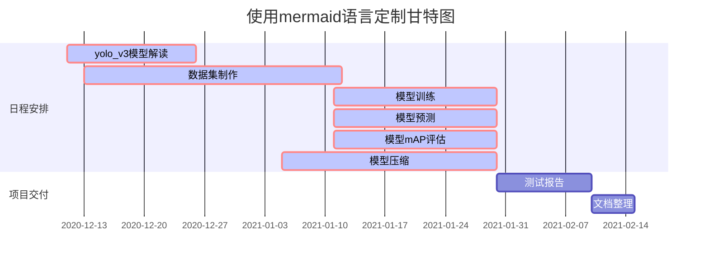

---
dddd
---

[百度](http://www.baidu.com"悬浮显示编写的文字")数据跑通[^1]；

打开这个[链接](https://blog.csdn.net/arthur01p"https://blog.csdn.net/arthur01p"),访问我的blog主页。

[热热热]()

这句话来至于csdn[^2]

卷积网络的含义


single asterisk_single underscores_


数据集加载源码解读及小批量cpu
$$
\begin{pmatrix}  
  a_{11} & a_{12} & a_{13} \\  
  a_{21} & a_{22} & a_{23} \\  
 a_{21} & a_{22} & a_{23} \\  
  a_{31} & a_{32} & a_{33}  
\end{pmatrix}
$$


```

```

This is [an example][id] reference-style link.

Then, anywhere in the document, you define your link label on a line by itself like this:

[id]: http://example.com/  "Optional Title Here"




[^1]: 张正友的引用

[^2]: dd


------

