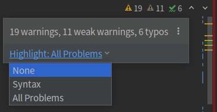
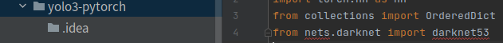
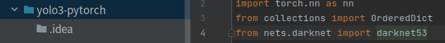

### python语法：

### pycharm：

#### 1.安装问题：

社区版，在bin运行sh sudo sh ./pycharm.sh

#### 2.导入问题：

直接导入yolo源码奔溃，新建工程，把yolo拷贝到工程文件夹下即可。

#### 3.导入文件格式不对问题：

解决1，快捷键：ctrl + alt + L    格式化代码

解决2，按纯编辑器方式，none，但不建议，all problems会提示有些文件import但是没有used

#### 4.导入文件路径不对问题：

python导入必须到当前soruce root根目录，导入可以是文件 类 函数 变量都可以

#### 5.代码仓库本地保存问题：

直接在终端输入 git add .

 git  commit -m "说明"，用pycharm会配置邮箱 不宜上传github

#### 6.python代码调试问题：

F7：直接跳入函数  F8：行调试，跳过内部函数   F9：打调试断点