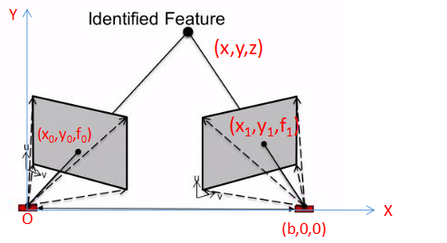
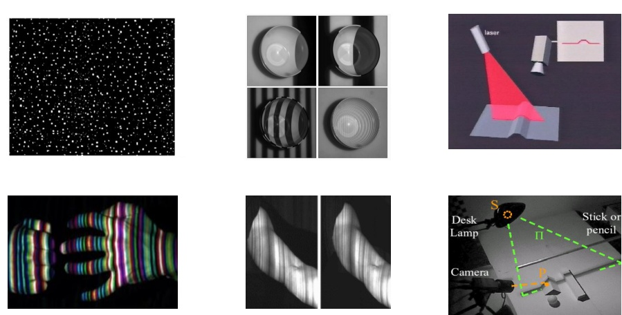
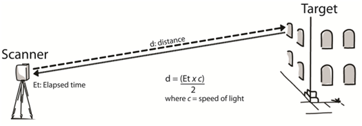
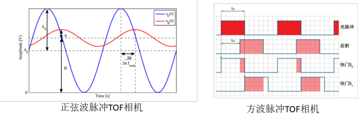
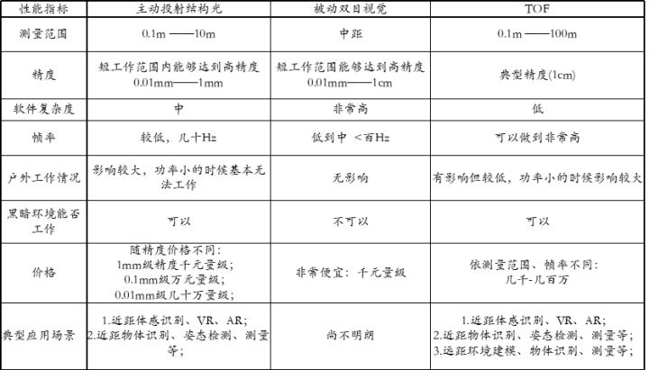

3D相机原理及在扫地机器人上的应用

### 1.相机分类及技术原理：

3D相机测量深度主要分为两大类：

​     1） 基于特征匹配的深度测量原理：计算深度时本质上采用的是特征匹配的方法；

​      2） 基于反射时间的深度测量原理：计算深度信息时采用发射光与反射光之间的时间差计算深度；

#### **1.1  基于特征匹配的深度测量原理**

​    无论是主动投影光斑的结构光深度相机还是基于被动双目视觉原理的深度相机，其本质上均为首先对投影仪投射的光斑与相机之间拍摄图像(或双相机拍摄图像)进行特征匹配，然后在此基础上基于三角测量原理计算特征点距离相机的距离。如下图所示：

上图中O所在位置为Projector光源所在位置或者双目视觉中左相机光心，(b,0,0)所在位置为右相机光心；(x0,y0,f0)和(x1,y1,f1)分别为特征点在左相机像平面和右相机相平面中的投影，通过特征点匹配算法找到对应相机像素坐标系下的位置，计算左右相机的视差。根据上述原理，在特征点已经匹配的基础上，无论是主动投影结构光深度相机还是纯被动双目相机，均可以计算出特征点的深度信息；

**a）主动投射结构光深度相机**

​	结构光(Structured light)：通常采用特定波长的不可见的红外激光作为光源，发射出来的光经过一定的编码投影在物体上，通过一定算法来计算返回的编码图案的畸变来得到物体的位置和深度信息。根据编码图案不同，机构光相机可分为：编码结构光、散斑结构光。

​	结构光相机优缺点包括：

- 方案成熟，相机基线可以做的比较小，方便小型化。
- 资源消耗较低，单帧IR图即可计算深度信息，功耗低。

- 主动光源，暗光线场景也可使用。

- 容易受环境光干扰，室外体验差。

-  随检测距离增加，精度会变差。

**b）被动双目深度相机**

​    被动双目深度相机不对外投射光源，类似人类双眼不布置，通过两个位置已经标定好的2D相机观察同一环境，然后再拍摄到两幅图像根据图像内容进行特征点匹配，进而计算深度。由于不存在任何先验知识，仅依赖于环境图像进行特征匹配，因而，被动双目立体视觉方案比较适合用于光线良好、图像特征比较丰富的领域；由于直接采用环境光采集图像，因而，其非常适合于室外环境中使用，在室内环境中使用时，则需要外部光源的辅助；同时，反光的影响大大降低。采用纯被动双目视觉目前最大的问题在于，分别基于两幅图像，从图像中寻找特征点，进一步的进行特征匹配，整个过程中需要大量异常复杂的算法，巨大的计算量，并且最终的计算结果并不稳定。

#### **1.2 基于反射时间长度的深度测量原理**

​	反射时间测量原理（Time of Flight, 简称TOF）通过 将调制光源投射到被观测物体上，然后观察反射光与入射光之间的时间差计算物体到相机的距离。

​	TOF相机中包含一个激光发生器和一个由光敏而激光或雪崩二极管组成的感光单元，如上图所示，激光发生器发射激光后，遇到障碍物反射回来，相机中的感光单元感受到反射光后，计算出激光从发射出去到接收到反射光所需的时间，进而根据飞行时间乘以光速得到障碍物距离相机的距离。为了测量入射光与反射光之间的时间差，一般将光源调制为连续脉冲光源，如下图：

即如上图所示，正弦波脉冲TOF相机通过向场景平面发射一束调制频率正弦波信号，入射信号被场景表面反射并被传感器吸收。当信号到达被接收后，由于能量衰减，其振幅衰减，并且产生一个相位延迟，根据相位延迟，便可以计算得到入射信号与反射信号的时间差，进而计算环境的深度值；

#### **1.3 三类相机性能对比**

综上所属，常用的三种类型的深度相机：基于主动投射结构光的深度相机、被动双目相机以及TOF相机，其主要优缺点总结如下：

​	在扫地机的实际应用场景中，目前视觉应用主要在物体检测及地图构建上。一方面我们可以选择测量范围较大的TOF类相机，直接通过三维点云来检测物体的类型及距离，同时根据IMU信息来构建稠密的3D地图，但满足远距离检测的TOF相机价格比较高，且算法成本较高，目前该方案难以实现。另一方面可选择测量范围较小的结构光相机来避障和辅助建图，考虑到扫地机在室内作业，环境光对结构光相对影响较小，且结构光相机技术成熟，成本相对较低，是一个理想方案。通过结构光3D传感摄像头收集全面的3D信息，让机器人对每个对象的物理特征进行充分识别，继而提升机器人的导航、轨迹、识别等AI应用能力。

### 2. AI视觉识别功能：

#### 2.1 障碍物检测

​	扫地机器人对所处环境进行主动认知，避开家具、电线、鞋袜等障碍，技术方面已经从传统的超声避障、红外线避障发展到通过深度学习完成的2D避障、3D避障。通过3D相机，分析视场下点云的几何特征来分辨出前方的台阶、悬崖和普通障碍物，并获取前方物理位置，同时融合RGB图片丰富的彩色纹理信息，通过AI技术识别物体的类别。融合2D和3D视觉信息为扫地机器人提供实时避障功能及信息交互能力。

#### 2.2 3D建图

​	机器人高效的路径规划清扫离不开一个智能的地图！传统的建图依靠红外、激光雷达等建立二维的地图，但是限于它们的硬件条件和安装位置等，它们无法知道障碍物的类型，因此机器人在清扫过程中很大可能被前方的电线、袜子等缠绕导致死机，更有可能因无法提前识别前方的台阶而有跌落的情况，而现在随着AI识别的加入，我们可以实时检测前方的障碍物类型，比如电线、袜子、线团、台阶、沙发等等，从二维地图升级为三维地图，这样路径规划可针对具体的障碍物类型进行针对算法处理，可有效避免机器被这些细小缠绕物缠绕抱死，前方台阶等危险地方也可提前识别并减速，可让清扫更高效、更智能、更安全。