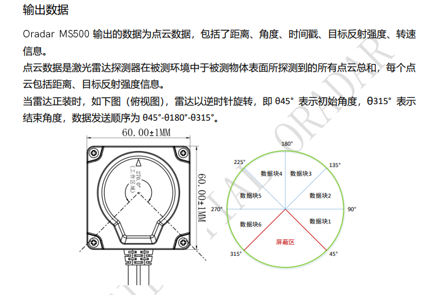
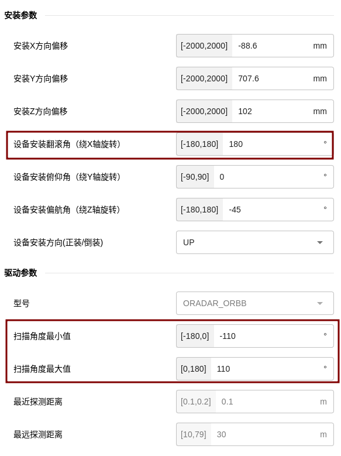
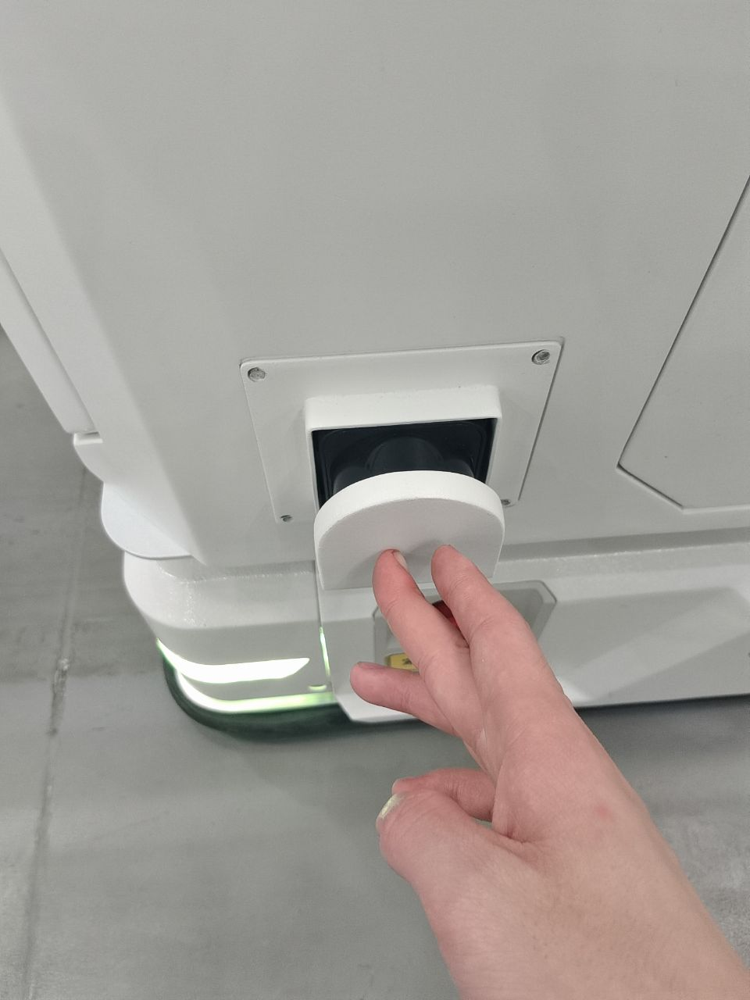
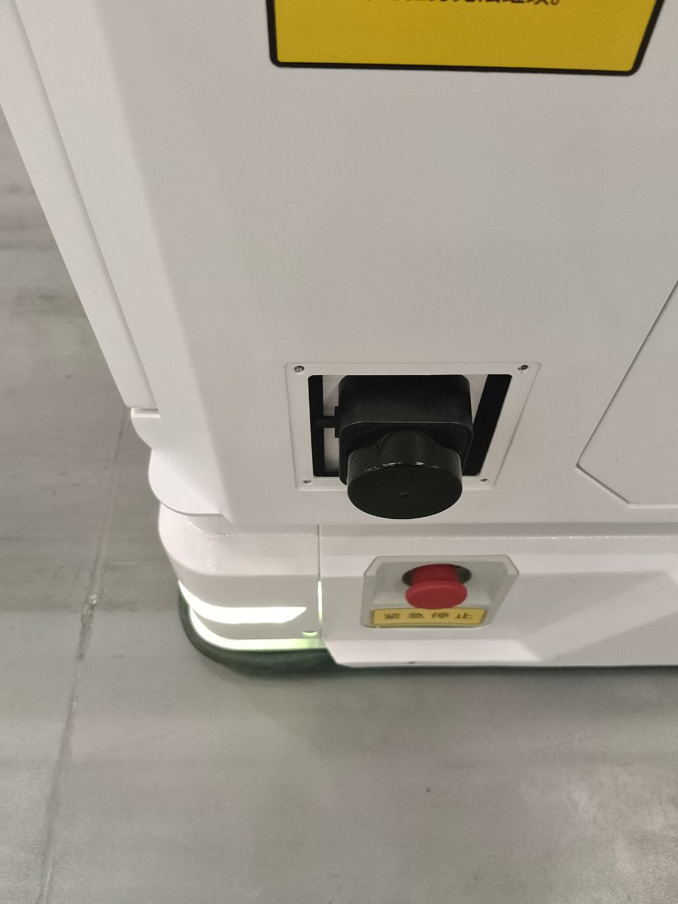
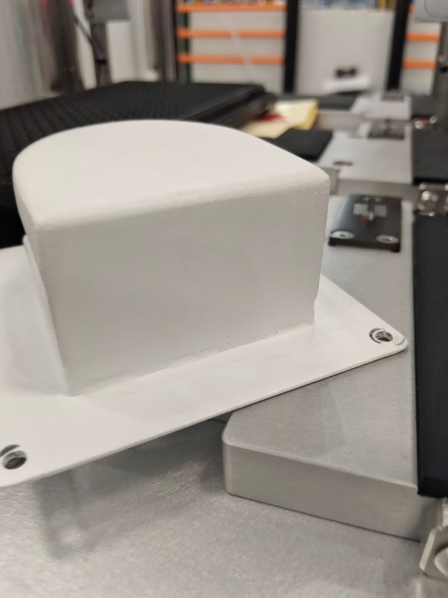
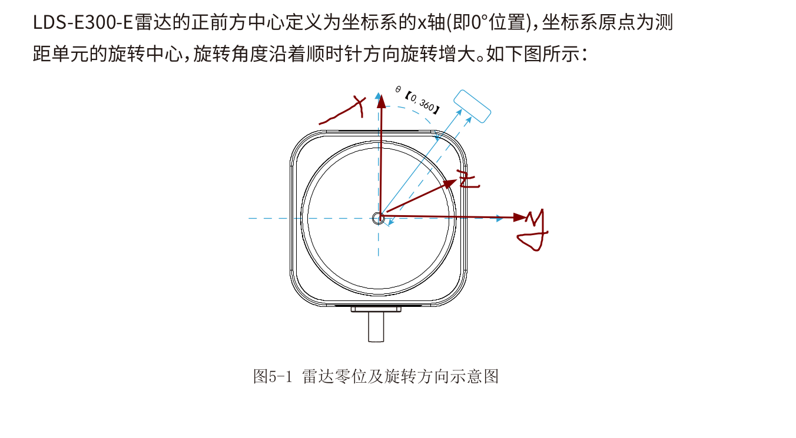
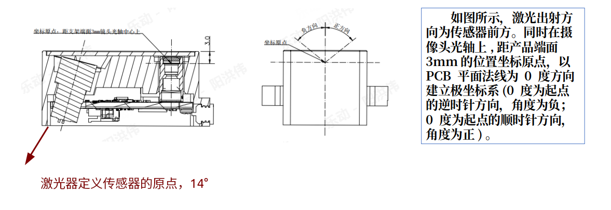
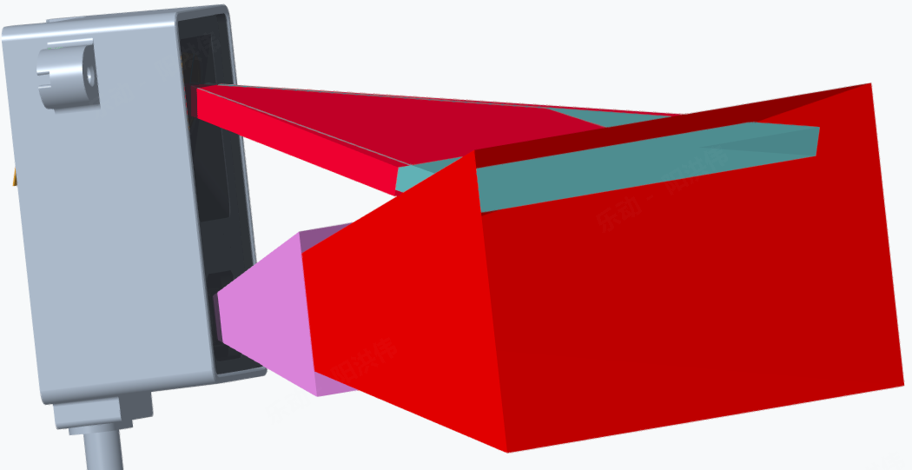

### 2D雷法定义，安装配置及注意事项

> 根据经验，和驱动那边定义的雷达坐标系 数据线的反方向为==X的正方向 ，逆时针（右手系）==

#### 常规雷达安装方案：

600E：

前雷达：右前 -44       [-125,125]

后雷达：左后 136     [-125,125]

#### **蓝海两侧竖装案例：**

**规格书上定义的坐标系：**

#### **三角波雷达小障碍物安装案例：**

- 乐动和EAI的设计高度一致，以激光器的的光心定义为传感器的坐标原点，发射光线垂直于pcb版14°，相机为接收光线，挨着数据连接线，连接线在上是倒装
- 扫描角度为顺时针，-80°到80° 160个点

  

总结：

1.传感器的一帧点云的起止点不确定，旋转方向不确定，只需确定极坐标系（即X方向）就能解决大部分问题
