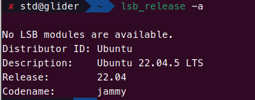
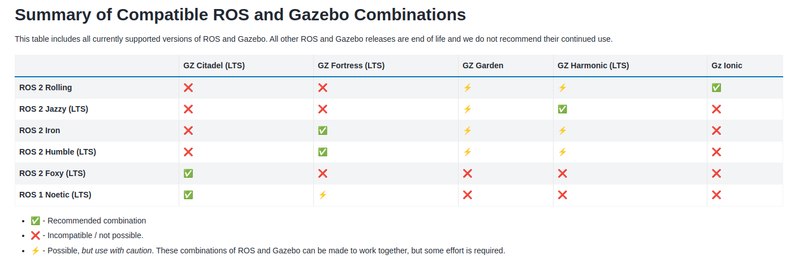
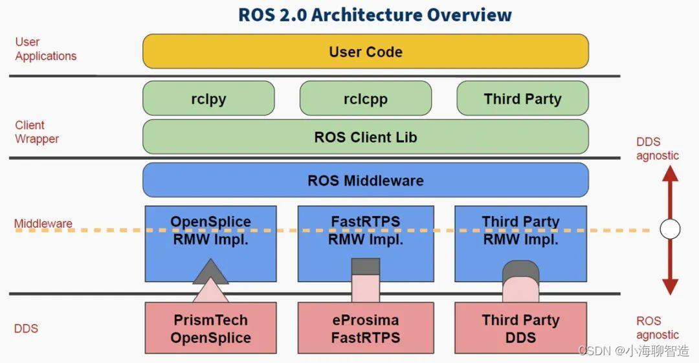

环` `境配置：

- 系统 ：Ubuntu 22.04.2 LTS

- ros2版本：Humble   

- gezebo版本：Garden、Fortress

  

  


- 高精度巡航对接: gazebo仿真构建工厂对接场景,模拟深度相机及雷达数据；
- 高精度巡航对接:ros2环境下基于虚拟数据cartographer局部地图及导航；





#### Ros2基础命令：

```shell
常规检索方式  
1.查看包和节点|运行节点
ros2 pkg executables   ros2 run turtlesim turtlesim_node 
2.查看运行node的话题和查看所有的话题
ros2 node list  ros2 topic list  -t -v
3.查看具体哪个节点的信息|查看具体话题收发情况
ros2 node info /turtlesim  ros2 topic info /turtle1/pose
5查看具体哪个话题的定义
ros2 interface show turtlesim/msg/Pose
6.构造发送数据
ros2 topic pub  /turtle1/cmd_vel  geometry_msgs/msg/Twist "{linear:{x: 0.5, y: 0.0},angular: {z: 0.0}}"


异常处理情况
 pkill -9 -f gazebo  //处理加载仿真环境时候不会更新
 ros2 topic echo /icp_odom | grep head -A 10

```

#### Fishbot_Course:

```shell
 ros2 launch  slam_toolbox  online_async_launch.py  use_sim_time:=True
 ros2 run nav2_map_server map_saver_cli -f room
 ros2 service call /write_state cartographer_ros_msgs/srv/WriteState "{filename: '/home/std/workspace/carto_ws/src/fishbot_cartographer/map/map.pbstream'}" 
```


### 对比总结

| 特性               | URDF                       | SDF                             | Xacro                      |
| ------------------ | -------------------------- | ------------------------------- | -------------------------- |
| 文件格式           | 基于 XML                   | 基于 XML                        | 基于 XML                   |
| 主要用途           | 机器人模型描述             | 仿真场景和机器人模型描述        | 动态生成 URDF 文件         |
| 支持的功能         | 机器人关节和链接描述       | 机器人模型 + 仿真参数           | 参数化、代码复用           |
| 灵活性             | 中等                       | 高                              | 高                         |
| 与 Gazebo 的兼容性 | 需要转换为 SDF             | 原生支持                        | 需先转换为 URDF            |
| 适用场景           | ROS 系统中的机器人模型描述 | Gazebo 仿真中的机器人和环境描述 | 创建动态、复杂的 URDF 文件 |


**优秀项目参考：**

[1]: https://github.com/huangyqs123/ME5413_Final_Project?tab=readme-ov-file	"Autonomous Vehicle SLAM, Perception, and Navigation"


https://app.theconstruct.ai/courses

**[模型库](https://app.gazebosim.org/dashboard)**

[**模型资源库2**](https://github.com/gazebosim/sdformat)

**[SDF](http://sdformat.org/spec?ver=1.11&elem=scene)**


```
ros2 interface show nav_msgs/msg/Odometry

ros2 topic echo /odom  查看实时
ros2 topic echo /icp_odom | grep head -A 10

echo 'source ~/turtlebot3_ws/install/setup.zsh' >> ~/.zshrc
ros2 launch turtlebot3_cartographer cartographer.launch.py use_sim_time:=True
ros2 launch turtlebot3_navigation2 navigation2.launch.py map:=map


```


 ROS 2 四种数据结构的对比

 1. `geometry_msgs::msg::Pose`

 ✅ 作用

- 表示 **一个 3D 位置（Position）+ 方向（Orientation，四元数）**
- **不包含** 时间戳或参考坐标系

 📌 结构

```cpp
geometry_msgs::msg::Pose pose;
pose.position.x = 1.0;
pose.position.y = 2.0;
pose.position.z = 3.0;
pose.orientation.x = 0.0;
pose.orientation.y = 0.0;
pose.orientation.z = 0.0;
pose.orientation.w = 1.0;
```

❌ 限制

- **没有时间戳（时间信息）**
- **没有 frame_id（坐标系信息）**
- 仅适用于 **固定位置描述**

------

 2. `geometry_msgs::msg::PoseStamped`

✅ 作用

- **在 `Pose` 的基础上增加了时间戳 `header.stamp` 和参考坐标系 `header.frame_id`**
- 适用于 **时间同步** 和 **坐标变换**

 📌 结构

```cpp
geometry_msgs::msg::PoseStamped pose_stamped;
pose_stamped.header.stamp = node->get_clock()->now();
pose_stamped.header.frame_id = "map";
pose_stamped.pose.position.x = 1.0;
pose_stamped.pose.position.y = 2.0;
pose_stamped.pose.orientation.w = 1.0;
```

 ✅ 优势

- **包含时间信息**（可与其他数据同步）
- **包含坐标系信息**（可用于坐标变换）

❌ 限制

- **无法表示速度信息**

------

 3. `nav_msgs::msg::Odometry`

 ✅ 作用

- **在 `PoseStamped` 基础上，增加了速度（Twist）信息**
- 适用于 **机器人导航、里程计（Odometry）、运动跟踪**

 📌 结构

```cpp
nav_msgs::msg::Odometry odom_msg;
odom_msg.header.stamp = node->get_clock()->now();
odom_msg.header.frame_id = "odom";
odom_msg.child_frame_id = "base_link";  // 机器人底盘坐标系

// 位姿
odom_msg.pose.pose.position.x = 1.0;
odom_msg.pose.pose.orientation.w = 1.0;

// 速度信息
odom_msg.twist.twist.linear.x = 0.5;
odom_msg.twist.twist.angular.z = 0.1;
```

✅ 优势

- **包含速度信息**
- **有 `child_frame_id`**（描述相对运动，如 `odom → base_link`）
- **支持误差协方差 `covariance`**（提高数据融合精度）

❌ 限制

- **占用数据带宽较大**
- 仅适用于 **机器人运动估计**

------

 4. `geometry_msgs::msg::TransformStamped`

 ✅ 作用

- **用于 TF2 坐标变换（transform tree）**
- 适用于 **机器人导航、机械臂、SLAM、激光雷达建图** 等场景

 📌 结构

```cpp
geometry_msgs::msg::TransformStamped transform_stamped;
transform_stamped.header.stamp = node->get_clock()->now();
transform_stamped.header.frame_id = "odom";  // 父坐标系
transform_stamped.child_frame_id = "base_link";  // 子坐标系

// 变换（位置）
transform_stamped.transform.translation.x = 1.0;
transform_stamped.transform.translation.y = 2.0;

// 变换（旋转）
transform_stamped.transform.rotation.w = 1.0;
```

#✅ 优势

- **用于 TF2 坐标变换**
- **提供 `parent_frame → child_frame` 的层级关系**
- **可被 `tf2_ros::TransformBroadcaster` 直接发布**

❌ 限制

- **无法表示速度信息**
- **只能用于坐标系变换**

------

 **总结对比**

| **消息类型**       | **作用**                      | **包含的关键字段**                                           | **适用场景**       |
| ------------------ | ----------------------------- | ------------------------------------------------------------ | ------------------ |
| `Pose`             | 仅描述 3D 位置和方向          | `position` + `orientation`                                   | 目标位置、目标姿态 |
| `PoseStamped`      | 增加 **时间戳** 和 **坐标系** | `header.stamp` + `header.frame_id` + `Pose`                  | 运动规划、目标跟踪 |
| `Odometry`         | 增加 **速度信息**             | `PoseStamped` + `Twist`                                      | 机器人运动、里程计 |
| `TransformStamped` | TF2 变换（坐标系关系）        | `header.stamp` + `frame_id` + `child_frame_id` + `Transform` | 坐标变换（TF2）    |

------

**何时使用哪个消息类型？**

1. **如果只是表示某个物体的静态位置和姿态（不关心时间/坐标系）** → `Pose`
2. **如果要在某个时刻发布一个位置，并让它能转换到不同坐标系** → `PoseStamped`
3. **如果是机器人里程计（包含位置 + 速度信息）** → `Odometry`
4. **如果需要进行坐标系变换（TF2 坐标变换）** → `TransformStamped`


## 2. 参数被命令行/launch文件覆盖

- ROS2 参数优先级：命令行 > launch文件 > yaml文件 > 默认值

  
