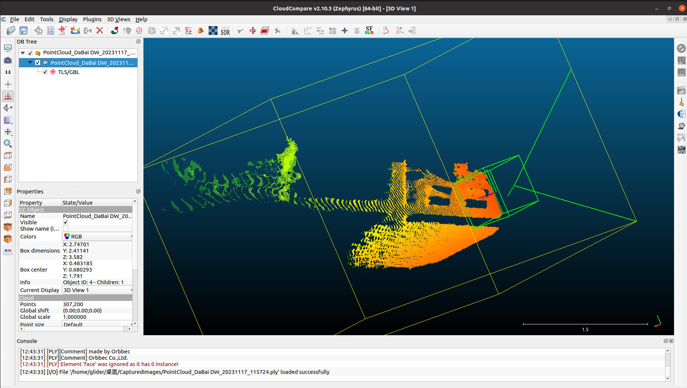
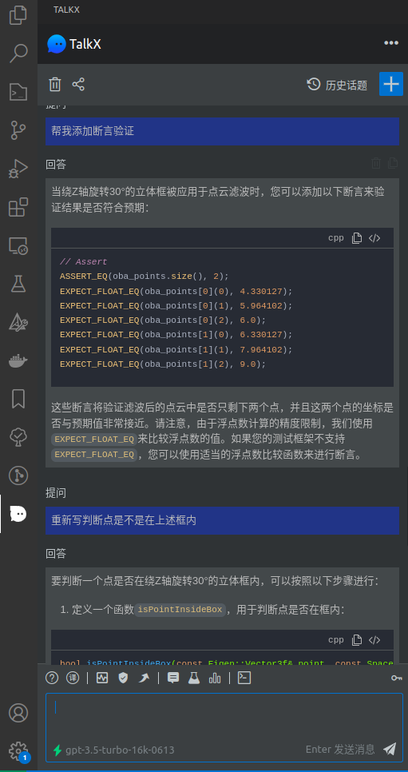
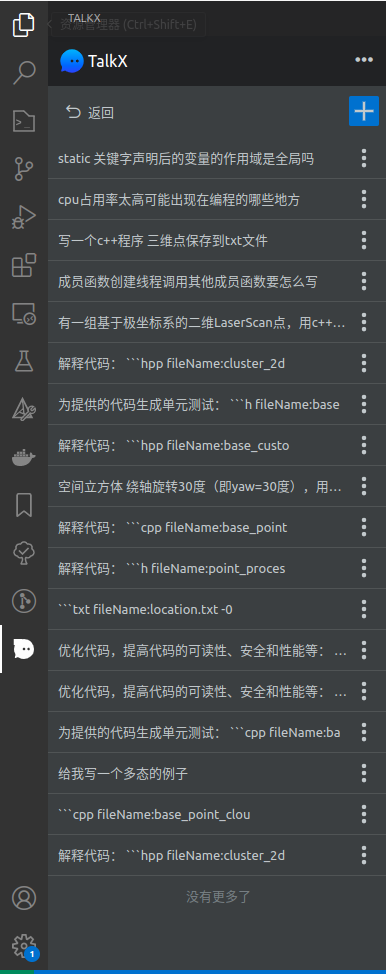
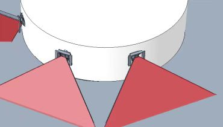

## 郭小凡1-3月述职报告

### 工作内容

#### **一：避障系统2.0 (点云处理模块的重构)**

**工作事项：**

- [x] 熟悉及理解相关避障代码，理解公司产品及业务；               
- [x] point_cloud_process模块处理框架的搭建

- [x] 配置参数的梳理及分类；

- [x] 上下游通信协议确定

- [x] 避障相机算法剥离

- [x] 避障雷达算法抽离

- [x] 定位雷达避障算法抽离

- [x] 雷达细丝、噪点过滤功能开发及完善

- [x] 避障雷达、相机关键点过滤功能开发

- [ ] ==避障算法、业务功能联调...==
- [ ] ==感知相机剥离...==

**改变:**1.与业务剥离，易于排查问题，更专注于算法优化开发，

​		2.架构简明实用，易于维护扩展，后期可接入到感知平台；

#### **二：现场避障问题解决：**

- [x] #61525 雷达细丝、噪点过滤功能开发完善
  https://ones.standard-robots.com:10120/project/#/team/UNrQ5Ny5/task/P7nALjMmF4VtnuYn
- [x] #61934 【SROS V4.19.31】【KIOXIA】车辆转弯时空间避障相机经常误避障
  https://ones.standard-robots.com:10120/project/#/team/UNrQ5Ny5/task/WSSzCAnJtw4cjh4x
- [x] #59662 MSL14-移动任务中左，右，后避障雷达偶发闪避障点 
  https://ones.standard-robots.com:10120/project/#/team/UNrQ5Ny5/task/FZcCBRYjEJLGoOqP
- [x]  #61312 【芜湖中达电子1期】2号车行驶时误报障碍
  https://ones.standard-robots.com:10120/project/#/team/UNrQ5Ny5/task/JzgaQh7JZVtrtnOD
- [x] #61714 【SRP5.8.0_1200E】【系统】【偶现】继续绘图过程中，绘图3分钟左右，车辆一直报：运动控制程序掉线
  https://ones.standard-robots.com:10120/project/#/team/UNrQ5Ny5/task/BGZ7MWhpsfPWSTeo

**改变:**1.解决了2D避障雷达处理小聚类杂点误避障等历史遗留问题；

​		 2.解决现场常反馈的空间避障相机在拐弯处误避障问题；

#### 三：通用

1.**流程：**熟悉使用基于sros的调试开发流程

2.**流程：**掌握目前代码迭代及项目管理流程；

3.**拓展：**了解公司的o/叉车相关产品知识，重点掌握了传感器的配置及检测性能等指标；

4.**分享:**   开发经验分享，工具分享（CloudCompare, TalkX）

​                                                                             

### 经验与不足

**不足：**1.对行业还理解不到位，对ToB端产品对安全性的理解不透彻；

​			2.对公司的避障策略了解不多，存在知识盲区；

**经验：**1.一直从事移动机器人行业，可以迁移一些扫地机器人的经验过来 ;

​			2.3D结构光相机背景，对感知传感器的性能比较了解，可以对很多现场问题做成因分析，更好解决问题；

### 公司的不足

**1.现场问题太杂 占据太多研发精力**

 问题：很多现场问题没有过滤就直接到研发 疲于应付现场问题使得专注于开发的时间少了

 看法：1.需要有一套流程化的东西收敛问题（梳理出一套处理机制：比如说检查清单） 

​			2.同时也对研发有高的要求就是要提升代码的兼容性与扩展性来推动；

 预期：取缔原来打补丁的方式，达到飞轮效应的状态；

**2.仿真系统及数据离线播放功能**

问题：算法验证必须部署在机器上验证，效率较低；（跨平台传输问题、机器使用权问题、验证的合理性问题）

看法：1.各个模块可以尝试先建立自己的做成数据集，开发离线检测程序功能；

​			2.数据即资源 那么多现场数据没充分利用；

预期：算法迭代跟快，出版本更有底气；

### 个人未来规划

- 具体性（**S**pecific）  在已目前的感知平台下，开发出稳定的、高效的、可扩展得智能避障系统，能覆盖公司各产品簇实际需求；            

- 可衡量（**M**easurable）1.避障系统1.0 已有点云算法优化;

  ​										2.避障系统2.0 重构行版本，业务与算法剥离，维护及扩展性提升;

  ​										3.避障系统3.0 安全升级、语义地图;

  ​										4.预研业界避障系统，碰撞创新点，完善智能避障系统；

  ​										  

- 可实现（**A**chievable）  1.老版本的避障系统为依托；

  ​										 2.感知组有深度学习相关计算积累；

  ​										 3.其他行业开发过避障系统的经验；

- 相关性（**R**elevant）和公司目前主线降本增效是一致的，在新感知系统下，对新需求的导入能快速响应 对现场问题能快递定位问题；

- 有时限（**T**ime-Bound）  明年年底完成避障系统3.0 及升级版本，预计时间1年；

