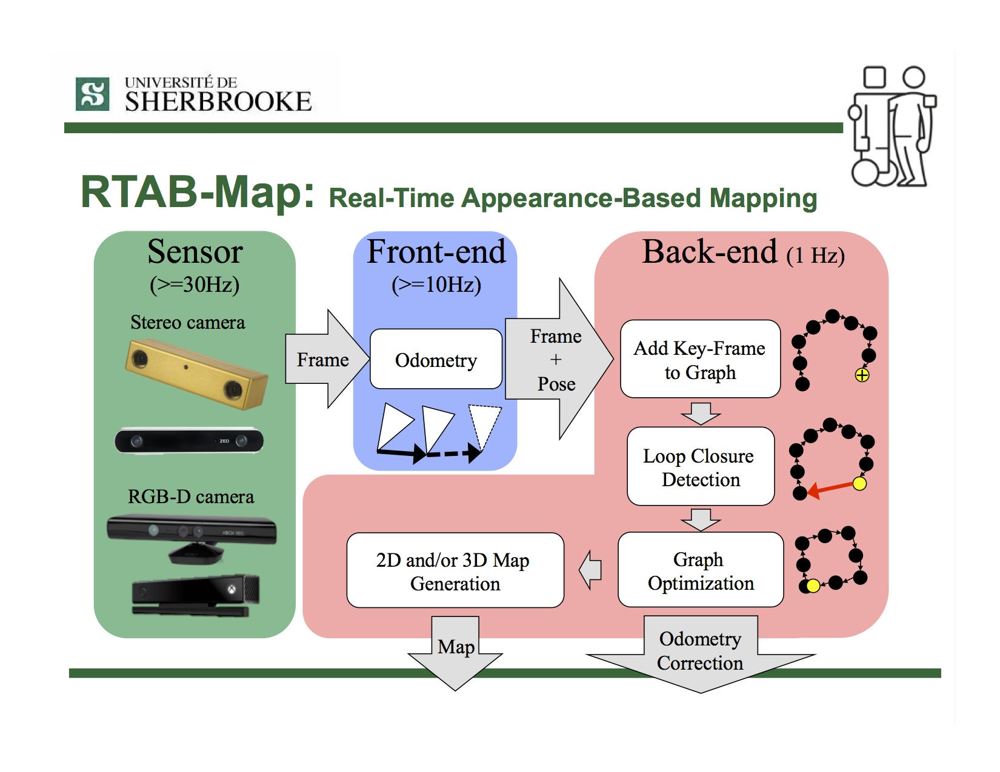

## 自然特征巡航对接（研发专项）

#### 自然特征巡航对接 = 

#### 前置内容：

- 栈板识别的没有使用深度相机的原因： 

​		1.工作距离太远 2.usb连接线移动伸缩不可靠

- 没有用图样的工业级结构光相机

  reson：还是因为在2m的精度达不到
  
- 货架对接：不是依靠局部地图信息，而是依靠当下某次的检测的目标点和位姿调整点

- 目前到站精度现状
  1.

#### 现状描述：

感知：

#### 可行性分析：

- 传感器

  - 用视觉的纹理和点云结构化特征更加明显；

  - 三角测量原理的3D相机近距离精度较高，和对接短距离场景更适配；

  - 可用激光里程计和轮式里程计融合，提升定位可靠性；

    

- 场景

  - 对接速度：一般情况不会太高。
  - 对接载具： 存在直线和平面特征。

  

- 地图管理

  - 可用局部地图来提高对接精度；

  

  

#### 初步方案：

#### 前期验证（cartographer+fast_gicp）：

- [ ] envirment： ros2+ dcw2+fast_gicp         ❌ 

- [ ] envirment： ros2+ oradar+cartographer  

- [ ] envirment： ros2+ dcw2 + rtab(icp_odom) 

- [ ] （NDT + Cartographer） 使用 `ndt_mapping` 增强 Cartographer 定位

  

词汇：

纯用激光

对高精度对接提供了可能性；

#### **参考资料：**

**RTAB-Map**

ros2 http://wiki.ros.org/rtabmap_ros/Tutorials

https://www.ncnynl.com/archives/202407/6389.html

深度相机仿真 turtle3 https://github.com/mlherd/ros2_turtlebot3_waffle_intel_realsense

https://www.ncnynl.com/archives/202204/5179.html

https://github.com/agilexrobotics/limo_ros2_doc/blob/master/LIMO-ROS2-humble.md

算法思路：

https://x.com/i/grok/share/Xh32LW6wfxSv9KdwyF8xU6Qsa

https://gitee.com/gwmunan/ros2/wikis/pages?sort_id=11078218&doc_id=4855084   

#### **个人理解：**

- [ ] 直接纯点云运行rtabmap不会成功，它需要初始化odom-base的tf 这个tf需要icp_odom来发出，即为前端，后端只回环和优化map-odom的tf，不会用局部地图再匹配点云计算位姿，这个区别于cartographer的scan到submap，后端的位姿一直只用icp_odom。

**静止状态前端累加**

<video src="medium/icp里程计静止累加.webm"></video>
#### **rtab后端更新及位姿优化**

 <video src="medium/rtab后端更新及位姿优化.webm"></video>

#### icp_odometry 匹配失败或误差偏大的原因分析

以下是从 **场景**、**传感器性能**、**运动状态** 和 **算法** 四个维度梳理的可能原因、影响和解决方案。

| **维度**         | **原因**                       | **描述**                                                                 | **影响**                              | **解决方案**                                                                 |
|------------------|--------------------------------|--------------------------------------------------------------------------|---------------------------------------|------------------------------------------------------------------------------|
| **场景**         |                                |                                                                          |                                       |                                                                              |
| 特征不足         | 环境缺乏几何特征（如平坦墙面、长走廊、空旷区域）。                        | ICP 无法找到足够的对应点，匹配失败。                                     | 匹配失败，位姿估计不准确。            | - 增加环境纹理（如添加标志物）。 - 调整 `Icp/MaxCorrespondenceDistance`（增大至 0.5）。 |
| 动态障碍物       | 场景中存在移动物体（如行人、车辆），污染点云数据。                        | 动态点云干扰静态匹配，引入虚假对应点。                                   | 匹配失败或误差增大。                  | - 使用动态障碍物检测滤波器（如基于速度阈值移除动态点）。 - 优化场景（如减少动态干扰）。 |
| 环境光照变化     | 光照变化（如阴影、光斑）影响深度相机点云质量（若使用 RGB-D 相机）。         | 点云数据不准确，匹配困难。                                               | 误差累积或匹配失败。                  | - 使用光照鲁棒的传感器（如 LiDAR）。 - 提高点云滤波（如 `Icp/VoxelSize` 增大至 0.2）。 |
| **传感器性能**   |                                |                                                                          |                                       |                                                                              |
| 噪声干扰         | 传感器噪声（如 LiDAR 或深度相机噪声）导致点云数据不准确。                  | 点云包含噪声点，ICP 匹配收敛到错误解。                                   | 误差偏大，匹配失败。                  | - 使用更高质量的传感器。 - 增强预处理（如增大 `Icp/VoxelSize` 至 0.2 进行降采样）。 |
| 传感器分辨率低   | 传感器分辨率不足（如低分辨率深度相机），点云稀疏。                        | 点云特征点数量不足，匹配难度增加。                                       | 匹配失败率升高。                      | - 更换高分辨率传感器。 - 降低匹配要求（如增大 `Icp/MaxCorrespondenceDistance` 至 0.5）。 |
| 传感器视场受限   | 传感器视场（FOV）较小，导致点云覆盖范围不足。                            | 帧间点云重叠区域小，匹配缺乏足够约束。                                   | 匹配失败，误差增大。                  | - 使用广角传感器（如 360° LiDAR）。 - 调整传感器安装位置，增加重叠区域。      |
| **运动状态**     |                                |                                                                          |                                       |                                                                              |
| 帧间位姿变化过大 | 机器人快速移动（如高速平移或快速旋转），帧间位姿差异过大。                 | 初始猜测偏离真实值，ICP 无法收敛或陷入局部最优。                         | 匹配失败，误差累积。                  | - 降低机器人速度。 - 调整 `Icp/MaxTranslation` 和 `Icp/MaxRotation`（增大至 1.0 和 0.5）。 |
| 视角变化         | 机器人转弯或大幅调整姿态，帧间点云视角差异大，重叠区域减少。               | 点云重叠不足，匹配缺乏足够对应点。                                       | 匹配失败或误差增大。                  | - 优化路径规划，减少视角跳变。 - 提高重叠区域检测（如降低 `Icp/CorrespondenceRatio` 至 0.2）。 |
| 运动不连续       | 机器人运动中断或突然加速（如急停后启动），运动模型预测失效。               | 初始猜测不准确，ICP 匹配失败。                                           | 匹配失败，误差累积。                  | - 提供外部位姿猜测（`Odom/GuessMotion: True`）。 - 重置里程计（`Odom/ResetCountdown: 1`）。 |
| **算法**         |                                |                                                                          |                                       |                                                                              |
| 初始猜测错误     | 初始位姿猜测不准确（如外部位姿不可用或上一帧位姿漂移）。                   | ICP 从错误起点开始优化，陷入局部最优或失败。                             | 匹配失败，误差累积。                  | - 启用外部位姿猜测（`/external_odom`）。 - 定期重置（`Odom/ResetCountdown`）。 |
| 参数配置不当     | - `Icp/MaxCorrespondenceDistance` 过小 - `Icp/Iterations` 不足 - `Icp/Epsilon` 过严 | - 对应点距离阈值过低 - 迭代次数不足，未收敛 - 收敛阈值太严格       | 匹配失败率高，精度不足。              | - 增大 `Icp/MaxCorrespondenceDistance`（至 0.5）。 - 增加 `Icp/Iterations`（至 20）。 - 放松 `Icp/Epsilon`（至 0.01）。 |
| 时间同步问题     | 点云和外部猜测（`/odom_guess`）时间戳不匹配，或 `/clock` 异常。            | 外部猜测未被使用，回退到内部推算，匹配失败。                             | 匹配失败，误差增大。                  | - 确保时间戳同步（调整 `Odom/GuessSmoothingDelay` 至 0.2）。 - 验证 `/clock`（`ros2 topic echo /clock`）。 |
| 点云预处理不足   | 点云未充分预处理（如未降采样、未滤波），计算复杂度高或噪声影响大。          | 匹配耗时增加，易因噪声失败。                                             | 耗时超标（>100ms），匹配失败。        | - 增强预处理（如增大 `Icp/VoxelSize` 至 0.2）。 - 优化点云滤波（如移除离群点）。 |

#### 算法判断匹配失败的总结

| **判断条件**              | **描述**                                                                 | **影响**                              | **可能的优化建议**                                                                 |
|---------------------------|-------------------------------------------------------------------------|---------------------------------------|----------------------------------------------------------------------------------|
| **对应点比例不足**         |                                                                          |                                       |                                                                                  |
| - \`Icp/CorrespondenceRatio\` 过低 | ICP 算法计算当前帧和猜测帧的对应点比例低于阈值（默认 0.3，即至少 30% 的点需匹配）。如果对应点太少，算法认为匹配不可靠。 | 匹配失败，位姿估计回退到上一帧或默认值，误差可能累积。 | 降低 \`Icp/CorrespondenceRatio\`（例如至 0.2），允许更少的对应点；提高点云质量（如减少噪声）。 |
| **收敛误差过大**           |                                                                          |                                       |                                                                                  |
| - \`Icp/Epsilon\` 未满足     | 迭代过程中位姿变化的欧氏距离（translation）和旋转角度（rotation）未低于阈值 \`Icp/Epsilon\`（默认 0.005）。如果误差未收敛，算法认为匹配失败。 | 匹配失败，位姿估计不更新，依赖上一帧猜测。 | 放松 \`Icp/Epsilon\`（例如至 0.01），允许更大容差；增加 \`Icp/Iterations\`（例如至 20）以提高收敛机会。 |
| **最大对应距离超限**       |                                                                          |                                       |                                                                                  |
| - \`Icp/MaxCorrespondenceDistance\` 超限 | 对应点之间的欧氏距离超过 \`Icp/MaxCorrespondenceDistance\`（默认 0.2 米）。如果距离过大，算法认为点云不重叠，匹配不可靠。 | 匹配失败，位姿估计不更新，误差可能因运动过大而加剧。 | 增大 \`Icp/MaxCorrespondenceDistance\`（例如至 0.5），适应更大位姿变化；降低机器人速度以减少帧间差异。 |
| **迭代次数耗尽未收敛**     |                                                                          |                                       |                                                                                  |
| - \`Icp/Iterations\` 达到上限 | 达到最大迭代次数（默认 10 次）后，位姿仍未收敛（\`Icp/Epsilon\` 未满足）。算法认为优化未完成，匹配失败。 | 匹配失败，位姿估计回退，匹配精度下降。 | 增加 \`Icp/Iterations\`（例如至 20），提供更多优化机会；检查初始猜测是否准确（启用 \`Odom/GuessMotion\`）。 |
| **点云重叠不足**           |                                                                          |                                       |                                                                                  |
| - 点云重叠区域过小         | 当前帧和猜测帧的点云重叠区域不足（由 \`Icp/CorrespondenceRatio\` 间接反映）。例如，视角变化或环境新区域导致重叠点少。 | 匹配失败，位姿估计偏离真实值，累积误差。 | 优化路径规划减少视角跳变；使用外部位姿猜测（\`Odom/GuessMotion: True\`）改善初始值；调整 \`Icp/RangeMax\` 扩大感知范围。 |
| **初始猜测偏差过大**       |                                                                          |                                       |                                                                                  |
| - 初始位姿与真实值差异大   | 初始猜测（基于上一帧位姿或 \`/odom_guess\`）与当前帧真实位姿差异过大，ICP 陷入局部最优或无法收敛。 | 匹配失败，位姿漂移，连续失败概率升高。 | 启用 \`Odom/GuessMotion\` 并提供高质量外部位姿；调整 \`Icp/MaxTranslation\` 和 \`Icp/MaxRotation\`（增大至 1.0 和 0.5）。 |
