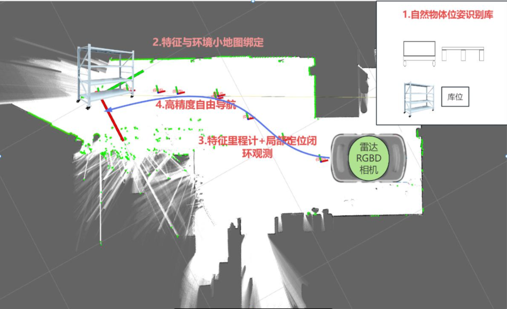
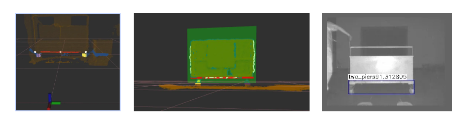
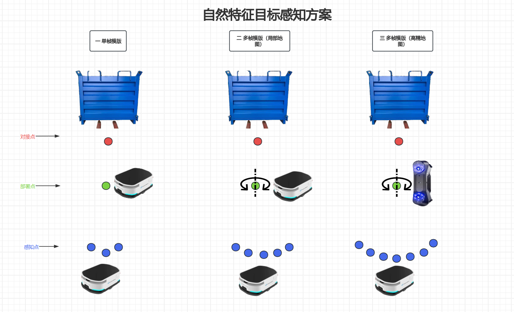
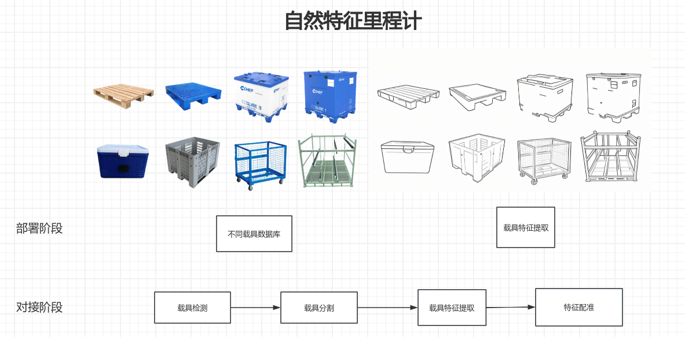
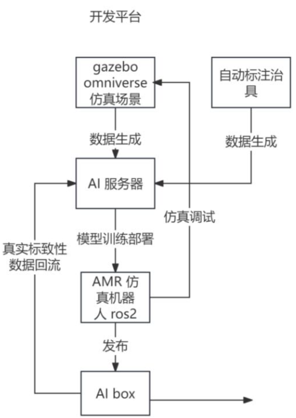

## 自然特征巡航对接（研发专项）

> #### 自然特征巡航对接 = 自然特征目标感知 + 局部高精度定位 + 自由导航

#### 一、目前识别流程

#### 二、现状描述

- 不同传感器和不同载具都要调整算法参数和算法流程，没有做到对接载具的自适应。

- 对接定位走偏依赖二维码和信标等tag标准辅助定位。
- 对接动作

#### 三、可行性分析：

- 传感器

  - 用视觉的纹理和点云结构化特征更加明显；

  - 三角测量原理的3D相机近距离精度较高，和对接短距离场景更适配；

  - 可用激光里程计和轮式里程计融合，提升定位可靠性；

    

- 场景

  - 对接速度：一般情况不会太高。
  - 对接载具： 存在直线和平面特征。

  

- 地图管理

  - 可用局部地图来提高对接精度；
  
    
  

#### 四、初步方案：

**1、自然特征目标感知：**

| 目标感知方式 | 单帧模版           | 多帧模版（局部地图）      | 多帧模版（高精地图）                   |
| ------------ | ------------------ | ------------------------- | -------------------------------------- |
| 传感器       | AMR感知相机        | AMR感知相机               | 高精度深度相机（部署用） + AMR感知相机 |
| 检测范围     | 低（容易视野消失） | 中高（依赖AMR自身传感器） | 高（依赖外部高精度深度相机）           |
| 匹配成功率   | 低                 | 中                        | 高                                     |
| 部署复杂度   | 低                 | 中                        | 高                                     |

**2、自然特征里程计：**

**3、自由导航**

暂无

#### 五、开发平台

#### 六、前期验证

- [ ] envirment： ros2+ dcw2+fast_gicp         ❌ 

- [ ] envirment： ros2+ oradar+cartographer  
- [ ] envirment： ros2+ dcw2 + rtab(icp_odom) 
- [ ] envirment： ros2+ dcw2 +  oradar + rtab 
- [ ] （NDT + Cartographer） 使用 `ndt_mapping` 增强 Cartographer 定位

词汇：

纯用激光

对高精度对接提供了可能性；

用自然特征点云匹配方式替换复杂的多载具人工提取特征的方式来计算目标点（特征到概率）

**静止状态前端累加**

<video src="medium/icp里程计静止累加.webm"></video>
#### **rtab后端更新及位姿优化**

 <video src="medium/rtab后端更新及位姿优化.webm"></video>

#### **参考资料：**

**RTAB-Map**

1. ros2 http://wiki.ros.org/rtabmap_ros/Tutorials
2. https://www.ncnynl.com/archives/202407/6389.html
3. 深度相机仿真 turtle3 https://github.com/mlherd/ros2_turtlebot3_waffle_intel_realsense
4. [ROS2与VSLAM入门教程-整合rtabmap建图](https://www.ncnynl.com/archives/202204/5179.html)
5. [LIMO机器人](https://github.com/agilexrobotics/limo_ros2_doc/blob/master/LIMO-ROS2-humble.md)

**算法思路：**

- https://x.com/i/grok/share/Xh32LW6wfxSv9KdwyF8xU6Qsa

- [建图与导航--RTABMap之双目建图与导航](https://gitee.com/gwmunan/ros2/wikis/pages?sort_id=11078218&doc_id=4855084)

- [感知组2024年终总结](https://k32rofd4qx.feishu.cn/wiki/UsqEwKZ2li5Buzk9O4McU6E8nPg)

