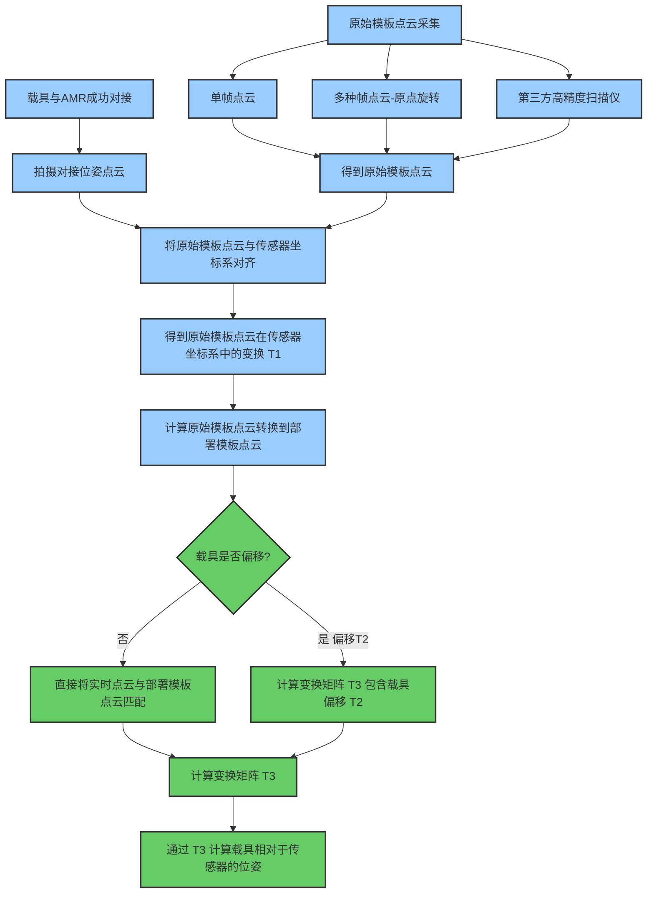
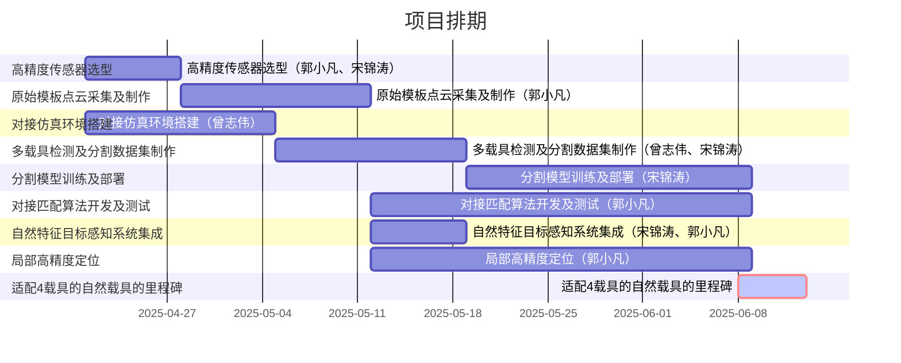
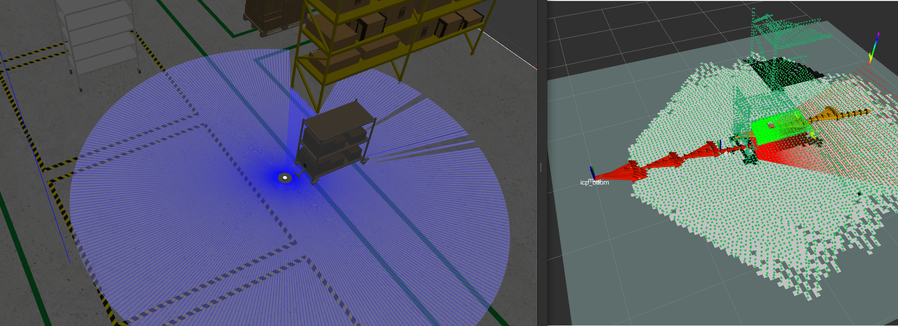

## 自然特征巡航对接（研发专项）

> #### 自然特征巡航对接 = 自然特征目标感知 + 局部高精度定位 + 自由导航


#### 能够将框架泛化到多种不同类型的机器人上。此外，它还能够处理一个包含多种对接位置和对接模型的数据库，以适应异质环境。这项任务服务器被设计为在任务完成或电池电量低时被应用程序BT或自主应用程序调用以进行对接，一、目前识别流程

环境适应性：包含一个数据库，能够存储和管理多种对接位置和对接模型，适应异质环境。

#### 二、现状描述

- 不同传感器和不同载具都要调整算法参数和算法流程，没有做到对接载具的自适应。


- 对接定位走偏依赖二维码和信标等tag标准辅助定位。
- 对接动作


#### 三、可行性分析：

- 传感器

  - 用视觉的纹理和点云结构化特征更加明显；

  - 三角测量原理的3D相机近距离精度较高，和对接短距离场景更适配；

  - 可用激光里程计和轮式里程计融合，提升定位可靠性；

    

- 场景

  - 对接速度：一般情况不会太高。
  - 对接载具： 存在直线和平面特征。

  

- 地图管理

  - 可用局部地图来提高对接精度；

    

#### 四、初步方案：

**1、自然特征目标感知：**




| 目标感知方式 | 单帧模版           | 多帧模版（局部地图）      | 多帧模版（高精地图）                   |
| ------------ | ------------------ | ------------------------- | -------------------------------------- |
| 传感器       | AMR感知相机        | AMR感知相机               | 高精度深度相机（部署用） + AMR感知相机 |
| 检测范围     | 低（容易视野消失） | 中高（依赖AMR自身传感器） | 高（依赖外部高精度深度相机）           |
| 匹配成功率   | 低                 | 中                        | 高                                     |
| 部署复杂度   | 低                 | 中                        | 高                                     |

**2、自然特征里程计：**


**3、自由导航**

暂无


#### 五、开发平台


#### 六、前期验证

- [ ] envirment： ros2+ dcw2+fast_gicp         ❌ 


- [ ] envirment： ros2+ oradar+cartographer  
- [ ] envirment： ros2+ dcw2 + rtab(icp_odom) 
- [ ] envirment： ros2+ dcw2 +  oradar + rtab 
- [ ] （NDT + Cartographer） 使用 `ndt_mapping` 增强 Cartographer 定位





词汇：

纯用激光

对高精度对接提供了可能性；

用自然特征点云匹配方式替换复杂的多载具人工提取特征的方式来计算目标点（特征到概率）


**静止状态前端累加**

<video src="medium/icp里程计静止累加.webm"></video>

#### **rtab后端更新及位姿优化**

 <video src="medium/rtab后端更新及位姿优化.webm"></video>


#### **参考资料：**

**RTAB-Map**

1. ros2 http://wiki.ros.org/rtabmap_ros/Tutorials
2. https://www.ncnynl.com/archives/202407/6389.html
3. 深度相机仿真 turtle3 https://github.com/mlherd/ros2_turtlebot3_waffle_intel_realsense
4. [ROS2与VSLAM入门教程-整合rtabmap建图](https://www.ncnynl.com/archives/202204/5179.html)
5. [LIMO机器人](https://github.com/agilexrobotics/limo_ros2_doc/blob/master/LIMO-ROS2-humble.md)

**算法思路：**

- https://x.com/i/grok/share/Xh32LW6wfxSv9KdwyF8xU6Qsa

- [建图与导航--RTABMap之双目建图与导航](https://gitee.com/gwmunan/ros2/wikis/pages?sort_id=11078218&doc_id=4855084)

- [感知组2024年终总结](https://k32rofd4qx.feishu.cn/wiki/UsqEwKZ2li5Buzk9O4McU6E8nPg)


 需求：


其他

模版制作：



1.建模软件-stl-点云 


ICP调试相关经验

1. 匹配对初始位姿影响很大 、
2. 少数配多数
3. 实时点云的地面点云部门一定要去除。
4. 部署点云模版的位置太近对应匹配有特别要求，所以可以专门对这块做优化；


**相关命令汇总：**

```
ros2 service call /get_model_list gazebo_msgs/srv/GetModelList
ros2 service call /get_entity_state gazebo_msgs/srv/GetEntityState "{name: 'waffle', reference_frame: 'world'}"
```


**遇到问题汇总：**

- 匹配对初始位姿影响很大 、

- 仿真载具移动下匹配位姿是否准确出现的问题

  - gazebo如何修改载具的位姿

    通过界面拖拽的方式（不能准确指定角度）

    通过命令调整的方式

    - amr_factory.world添加lib gazebo_ros_state以获取/set_entity_state服务
    - 修改cart_model2_no_whell模型下<static>0</static>
    - 修改cart_model2_no_whell模型下为<kinematic>1</kinematic>

- 控制机器人时候发现到达目标点后 机器人的老是方向摆动停不下来（调整控制速度解决）

- 部署模版点云位姿时候，离对接载具太近，匹配的位姿准！

  


手持式扫描仪有没有针对载具（货架、料车）等类似尺寸物体的型号推荐
要求：

- 精度毫米级 
- 尽量不贴辅助标志
- 扫描设备尺寸不能太大，便于便捷部署
- 能高效建模尺寸（1.5m立方）载具
- 算力尽量放在扫描设备端
