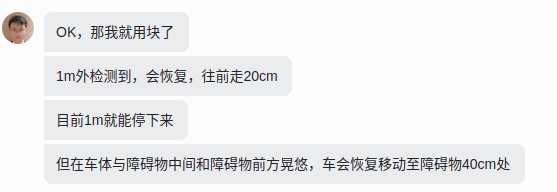
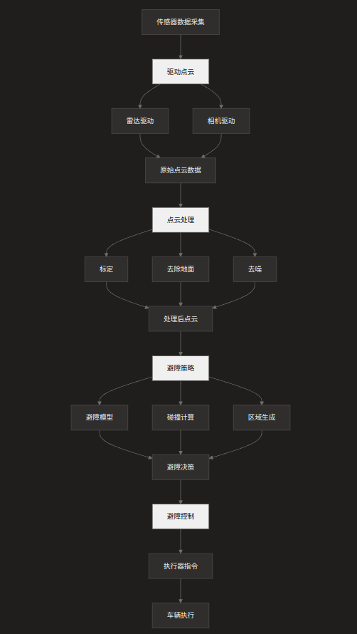
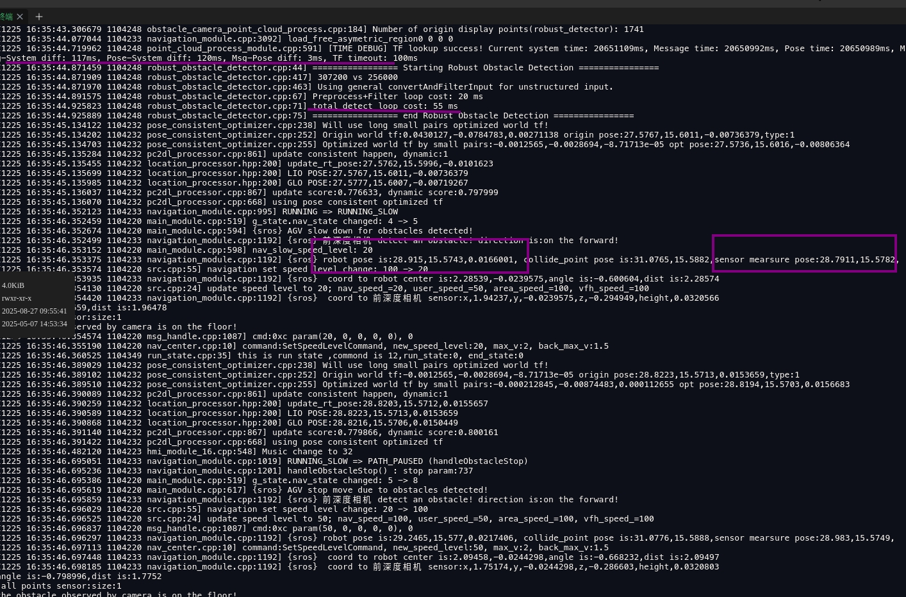
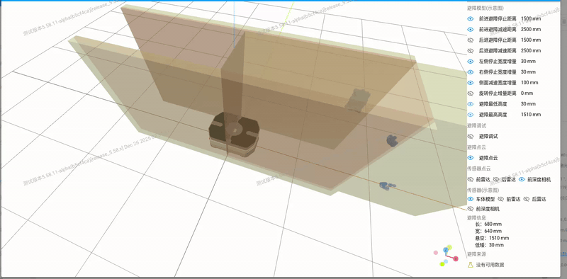
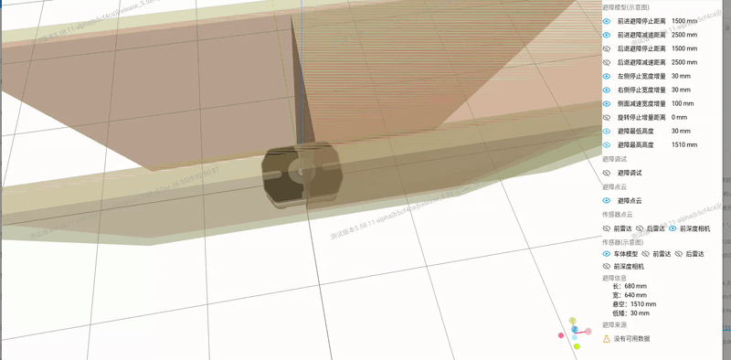

## JN 底盘低矮物体避障问题讨论决策

### 问题现状：

<video src="../../../../文档/飞书20251226-110919.mp4"></video>

<video src="../../../../文档/飞书20251226-110738.mp4"></video>

### 问题分析：

### 

### 解决思路:

- [ ] 驱动：传感器时间延迟验证及时间同步（硬同步？帧率）
- [ ] 感知：点云标定智适应（地面）
- [ ] 感知：小障碍物分层分段处理（优化）
- [ ] 策略：针对小障碍物进行保守的避障策略
- [ ] 系统：细化避障相关数据的实时性监控

### 目前问题：

- [ ] 障碍物检测到后车体也会缓慢前进

- [ ] 误避障地面  

  - [ ] 原因：标定问题和传感器特性
  - [ ] 有解决方案：地面自动标定
  - [ ] 行动项：验证方案有效性

- [ ] 检测不到5cm方块；

  - [ ] 原因：标定问题和传感器特性
  - [ ] 有解决方案：地面自动标定
  - [ ] 行动项：验证方案有效性

- [ ] 四相机同时开启，避障功能尚未测试

- [ ] 同样障碍，同样距离，停障距离不相同，差别较大，几十cm

  

  ### 行动项

  1. 低速测试对比性能   ----李凌宇
  2. 待分析（深度相机点云是检测的到）  -----吕凤池、张杰龙、郭小凡
  3. 感知标定验证方案有效性     ---郭小凡
  4. 四相机同时开启避障测试   ---李凌宇
  5. 停车距离一致性测试   ---赵康
  6. 输出报告                          ---杰龙
  7. 时延                                     ---佳立
  8. 低矮障碍物制动策略区分       ---展航、杰龙

###    

