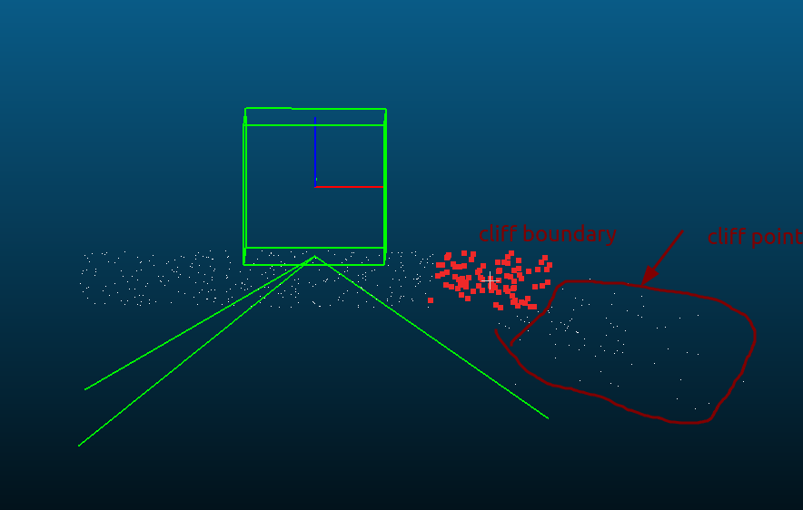
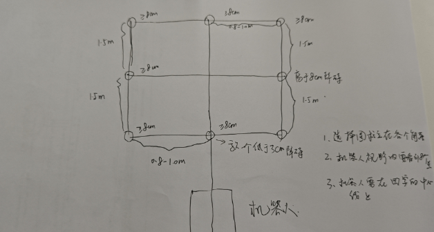
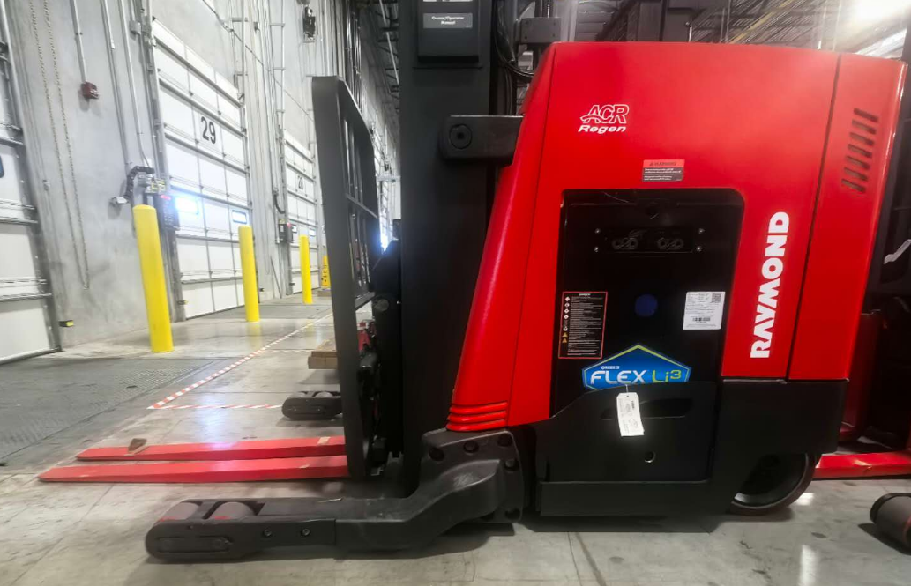
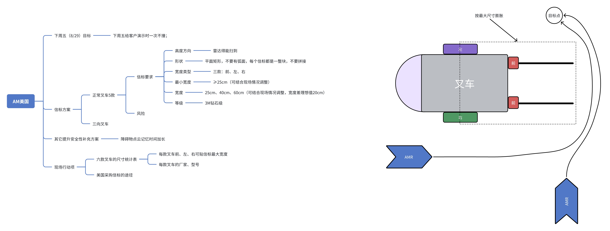
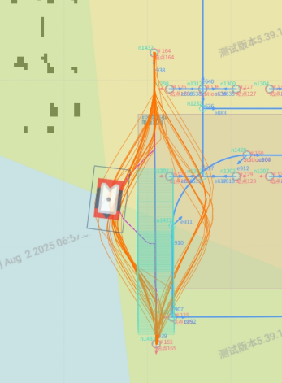
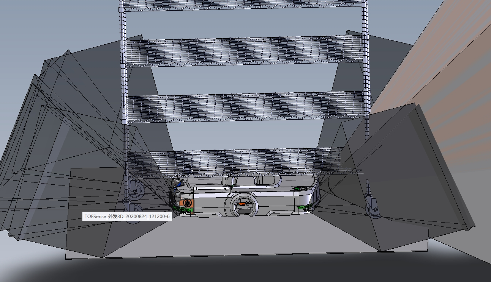
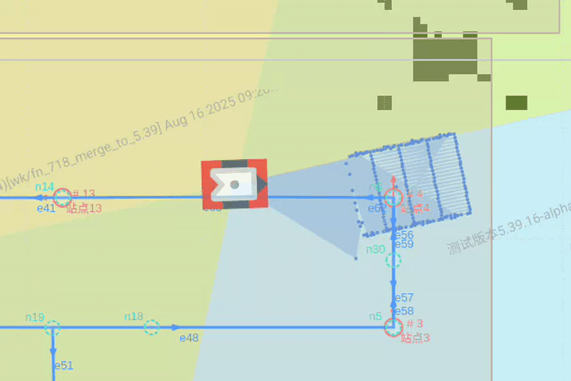
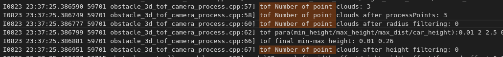
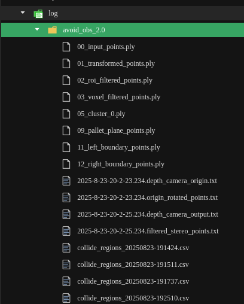

## 项目开发记录

### 悬崖检测



### 高精度特征里程计对接

**问题**

1. 纯点云旋转时候匹配不上（特征跟不上）

   三个参数：MaxCorrespondenceDistance

   ​                   MaxRotation

   ​                    Strategy

2. 点云匹配墙匹配不上

3.变更gazebo机器人位置时，每次加载模型时候发现重复加载

```
[spawn_entity.py-3] [INFO] [1743596258.842814195] [spawn_entity]: Calling service /spawn_entity
[spawn_entity.py-3] [INFO] [1743596258.871298616] [spawn_entity]: Spawn status: Entity [waffle] already exists.
[spawn_entity.py-3] [ERROR] [1743596258.871614580] [spawn_entity]: Spawn service failed. Exiting.
[ERROR] [spawn_entity.py-3]: process has died [pid 18740, exit code 1, cmd '/opt/ros/humble/lib/gazebo_ros/spawn_entity.py -entity waffle -file /home/std/turtlebot3_ws/install/turtlebot3_gazebo/share/turtlebot3_gazebo/models/turtlebot3_waffle/model_amr.sdf -x -1.0 -y -0.5 -z 0.00 --ros-args'].
```

原因：gazebo软件变化环境后保存时把小车保存到world文件里了，脚本再次加载发现重复   **耗时1.5H解决**

### 自由导航插齿识别（长期方案）

> 假如你一个点云算法工程师 我现在用奥比的深度相机拍摄地面  我需要提取地面点云 分割地面 留下地面以上的点云作为障碍物避障   我现在的一个难点是 地面上面有个小的叉臂（离地面高度1-2cm）怎么准确提取地面并保留叉臂的点云
>
> 有好的地面分割算法能解决这种和地面贴合的情况？
>
> 背景：深度相机安装到600E（12-16cm）高度上，奥比深度相机看不到地面，realsense看的到地面，点云图能看到低矮的插齿点云
>
> 思路：
>
> * 如果看得不见地面，用绝对高度的方案可以过滤掉地面以下的点（同时对标定要求比较高）    难点：爬坡和坑洼处问题
> * 如果看得见地面，以平面为参考，用相对高度方式过滤掉地面及地面一下的点云
> * 添加硬件：UWB 10cm精度
> * 调度方案：确定叉车在全局地图的位置                                                                                              难度：关机状态下
> * 感知方案：贴白条、反光条

**池哥方案：语义分割+点云生成**



### 自由导航插齿识别（短期方案）

**雷达信标方案**：





**深度相机信标方案**：

### 自由导航黑色栈板识别

**问题描述**：

> 问题：小车沿矩形栈板L边时候，在拐角处货架碰到栈板。分析以下原因：
>
> 1. 绕障距离大于45cm时黑色栈板点云稀少（零星几个点不稳定）；
> 2. 侧边tof按照位置fov没有看到比避障模型之前的点云；
> 3. 货架的长度；





**其中一个解决办法：实时检测栈板及填充栈板 规划记忆栈板边缘后进行绕障**




**pipline**：

1. 先搭建算法框架（前期应该把架构想好，包括日志、中间过程文件、配置参数文件、分析报告）；
2. 写测试用例（函数级别和算法流程级别）；
3. 集成业务代码（可视化调试、发出协议）；
4. 动态测试；

**Issue**：

1. 填充数量过多；
2. 载货状态下和边界状态下 拍不全三墩栈板；

**现场参数调整**：

问题1：半径滤波滤掉少量点



解决1：oba\_laser\_range\_min改为10  min\_continous\_oba\_back\_scan\_size改为0

**commit**：

* 货架滤波和TOF2,3,8,9解耦开
* 半径滤波滤掉问题  oba\_laser\_range\_min改为10  min\_continous\_oba\_back\_scan\_size改为0
* 点云文件时间戳命名



**自由导航感知参数说明**

| Tof                                       | 说明                     | 使用             |
| ----------------------------------------- | ---------------------- | -------------- |
| enable\_record\_obstacle\_lidar\_back（复用） | 开启TOF2,3,8,9载货下货架不过滤功能 | （300E开启 600关掉） |
| oba\_laser\_range\_min（复用）                | 半径滤波距离参数               | 10             |
| min\_continous\_oba\_back\_scan\_size（复用） | 半径滤波数量参数               | 0              |

| PalletRecognizer             | 说明                     | 使用       |
| ---------------------------- | ---------------------- | -------- |
| enable\_pallet\_recognition  | 启用栈板识别功能               | 自由导航时候开启 |
| pallet\_detection\_frequency | 栈板检测频率                 | 5        |
| enable\_pallet\_debug\_mode  | 启用栈板识别调试模式(单帧保存 格式ply) | false    |
| enable\_pallet\_console\_log | 是否启用栈板识别后台日志模式         | false    |

### 开发思考

1. cursor等大模型开发一个算法时的惯用流程（定协议，梳理需求，搭建框架）
   * 协议决定输入输出接口；
   * 需求文档和算法流程文档（足够细化，尽量拆解）；
   * 算法类要兼容日志系统和文件系统，算法测试必须写单元测试；
   * 最后再集成到业务代码；

^
