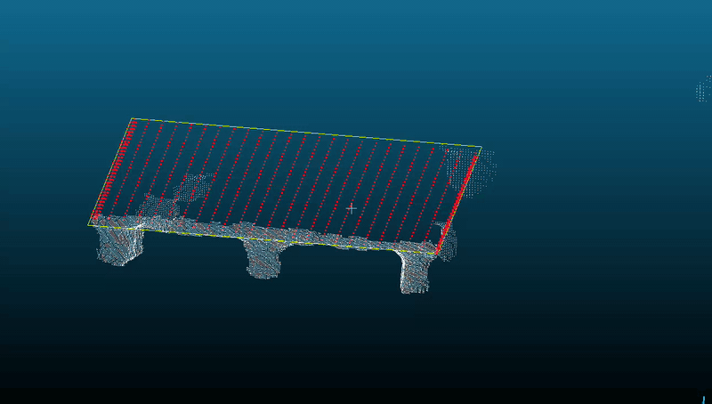

# 开发记录

### 悬崖检测


### 高精度特征里程计对接

**问题**

1. 纯点云旋转时候匹配不上（特征跟不上）

   三个参数：MaxCorrespondenceDistance 

   ​                   MaxRotation

   ​                    Strategy

2. 点云匹配墙匹配不上

   <video src="../../../../视频/录屏/录屏 04-02-2025 02:57:10 PM.webm"></video>

   

3.变更gazebo机器人位置时，每次加载模型时候发现重复加载

```
[spawn_entity.py-3] [INFO] [1743596258.842814195] [spawn_entity]: Calling service /spawn_entity
[spawn_entity.py-3] [INFO] [1743596258.871298616] [spawn_entity]: Spawn status: Entity [waffle] already exists.
[spawn_entity.py-3] [ERROR] [1743596258.871614580] [spawn_entity]: Spawn service failed. Exiting.
[ERROR] [spawn_entity.py-3]: process has died [pid 18740, exit code 1, cmd '/opt/ros/humble/lib/gazebo_ros/spawn_entity.py -entity waffle -file /home/std/turtlebot3_ws/install/turtlebot3_gazebo/share/turtlebot3_gazebo/models/turtlebot3_waffle/model_amr.sdf -x -1.0 -y -0.5 -z 0.00 --ros-args'].
```

   原因：gazebo软件变化环境后保存时把小车保存到world文件里了，脚本再次加载发现重复   **耗时1.5H解决**


### 自由导航插齿识别

> 假如你一个点云算法工程师 我现在用奥比的深度相机拍摄地面  我需要提取地面点云 分割地面 留下地面以上的点云作为障碍物避障   我现在的一个难点是 地面上面有个小的叉臂（离地面高度1-2cm）怎么准确提取地面并保留叉臂的点云
>
> 有好的地面分割算法能解决这种和地面贴合的情况？
>
> 背景：深度相机安装到600E（12-16cm）高度上，奥比深度相机看不到地面，realsense看的到地面，点云图能看到低矮的插齿点云
>
> 思路：
>
> - 如果看得不见地面，用绝对高度的方案可以过滤掉地面以下的点（同时对标定要求比较高）    难点：爬坡和坑洼处问题
> - 如果看得见地面，以平面为参考，用相对高度方式过滤掉地面及地面一下的点云
> - 添加硬件：UWB 10cm精度
> - 调度方案：确定叉车在全局地图的位置                                                                                              难度：关机状态下
> - 感知方案：贴白条、反光条


### 自由导航黑色栈板识别

#### **问题描述：**

> 问题：小车沿矩形栈板L边时候，在拐角处货架碰到栈板。分析以下原因：
>
> 1. 绕障距离大于45cm时黑色栈板点云稀少（零星几个点不稳定）；
> 2. 侧边tof按照位置fov没有看到比避障模型之前的点云；
> 3. 货架的长度；


LLM PROMAT

> 


