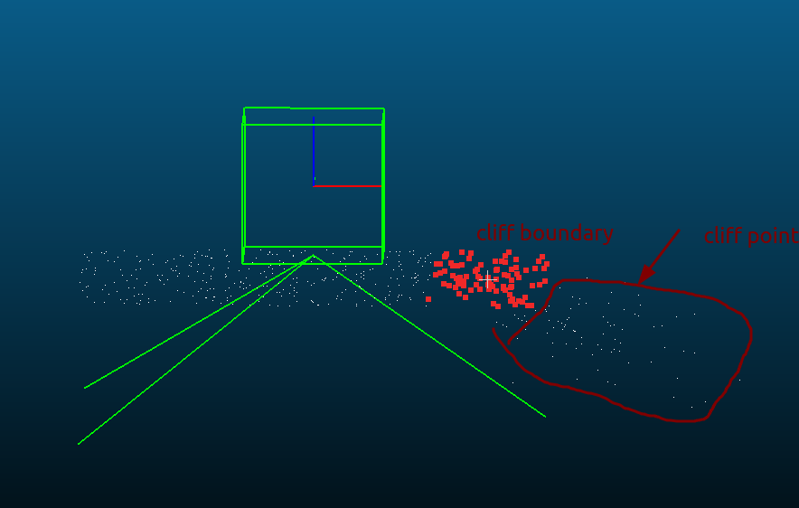

### 悬崖检测




### 高精度特征里程计对接

**问题**

1. 纯点云旋转时候匹配不上（特征跟不上）

   三个参数：MaxCorrespondenceDistance 

   ​                   MaxRotation

   ​                    Strategy

2. 点云匹配墙匹配不上

   <video src="../../../../视频/录屏/录屏 04-02-2025 02:57:10 PM.webm"></video>

   

3.变更gazebo机器人位置时，每次加载模型时候发现重复加载

```
[spawn_entity.py-3] [INFO] [1743596258.842814195] [spawn_entity]: Calling service /spawn_entity
[spawn_entity.py-3] [INFO] [1743596258.871298616] [spawn_entity]: Spawn status: Entity [waffle] already exists.
[spawn_entity.py-3] [ERROR] [1743596258.871614580] [spawn_entity]: Spawn service failed. Exiting.
[ERROR] [spawn_entity.py-3]: process has died [pid 18740, exit code 1, cmd '/opt/ros/humble/lib/gazebo_ros/spawn_entity.py -entity waffle -file /home/std/turtlebot3_ws/install/turtlebot3_gazebo/share/turtlebot3_gazebo/models/turtlebot3_waffle/model_amr.sdf -x -1.0 -y -0.5 -z 0.00 --ros-args'].
```

   原因：gazebo软件变化环境后保存时把小车保存到world文件里了，脚本再次加载发现重复   **耗时1.5H解决**

