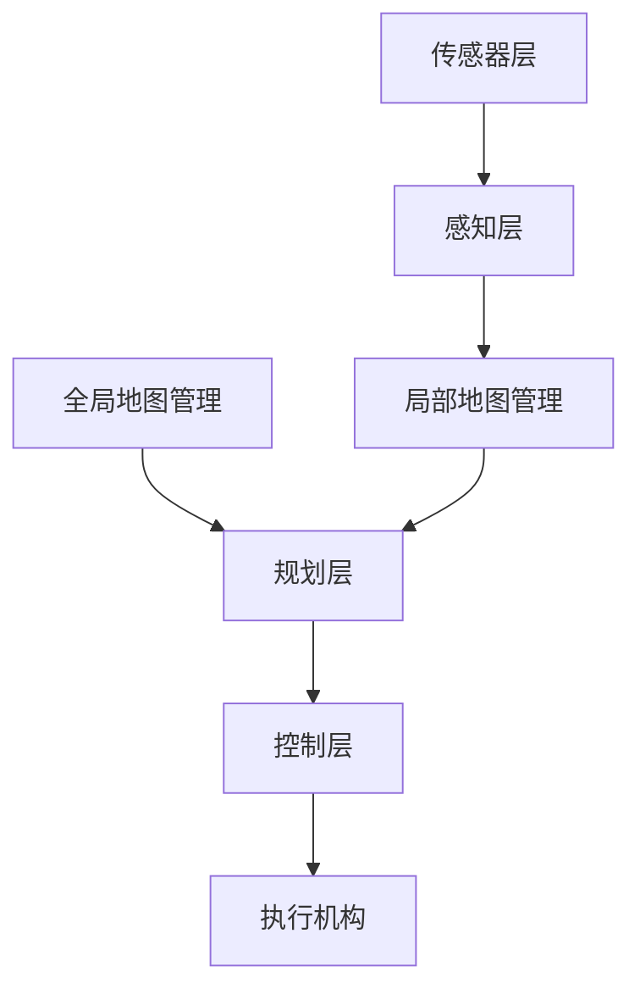
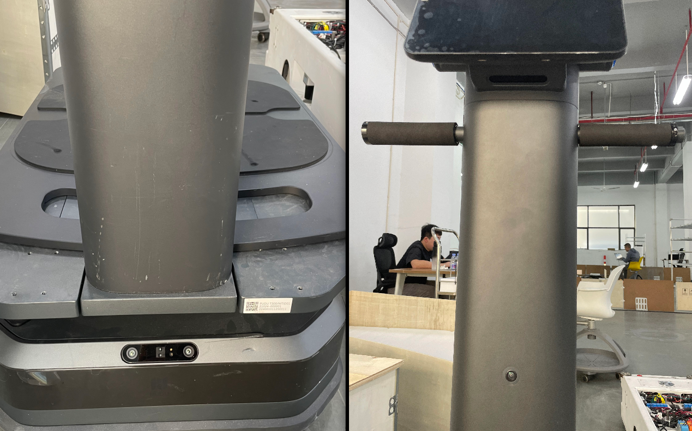

# EasyGo

> 需求：
>
> 1. 满足esay_go项目自由导航为主情况下对感知能力的高要求；
> 2. 搭建完整的感知平台语义感知能力；

别人是什么样的？

我们做成什么样（产品定义）？

- 自由导航时旋转的最大角度？

## 自由导航功能定义：

 感知语义：常规障碍、行人检测、他车检测、黑色栈板、减速带、警示带、警示牌、插齿
地图管理： 全局静态地图、概率栅格、动态标记、业务地图
规划控制：A*、

## 感知方案

# AMR 自由导航算法架构设计（成熟可落地方案）

> 核心理念：  
> **感知决定地图，地图约束规划，规划约束控制**  
> **视野决定自由，未知空间不允许动作**

---

## 1. 系统总体架构

## **传感器选型及布局：**

目的：构建车体周边360度无死角感知，

### 传感器种类：

避障：

- DCW2
- 安思江
- [DaBai+Max+Pro产品规格书（标品）V1.0-对外版20240323(1).pdf](../../../../桌面/std/传感器/easy-go/DaBai+Max+Pro产品规格书（标品）V1.0-对外版20240323(1).pdf) 
- 图漾
- [速腾AC1](https://www.robosense.ai/IncrementalComponents/AC1)
- 64点面tof（45度）
-  [国微感知SS-LD-AS20+规格书+-+v20250605.pdf](../../../../桌面/std/传感器/easy-go/国微感知SS-LD-AS20+规格书+-+v20250605.pdf) 

姿势识别：

### **传感器布局:**

1.安装位置。避免仓鼠视角

2.考虑载货视野遮挡问题

## 自由导航架构：

感知-规划-控制

## 通信协议

感知层 

地图层 

控制层

**下游导航理解：**

1. 感知地图给控制什么？
自由导航的控制核心不是“地图漂亮”，而是控制器能否稳定预测未来 1–3 秒的安全空间。
换句话说，控制器最需要的是：

一张局部、以车体为中心、无死角的占用状态图（cost map / occupancy map）+ 障碍物运动趋势。

你给我的感知地图只要满足三件事，我的控制就能自由：

1. 车体四周 360° 的障碍状态（静态/动态）

2. 障碍物几何形状或至少膨胀后的占用区

3. 更新频率 ≥10Hz，延迟低

再花哨的 BEV、点云语义、检测分类都只是锦上添花。

## 参考项目

## 自由导航架构

## 风险点

1. 移动状态下轨迹预测
1. 多传感器融合（观察视角），中间层？
1. 时间同步，驱动层？

## 空间语义感知

### 识别任务：

| 类别       | 实例                                     | 属性 | 安全等级 |
| ---------- | ---------------------------------------- | ---- | -------- |
| 行人       |                                          | 主动 | 最高     |
| AMR        |                                          | 主动 | 最高     |
| 叉车       | 地牛、隐叉                               | 主动 | 最高     |
| 载具       | 栈板、货架、料车、料箱、                 | 被动 | 中等     |
| 悬空物体   | 悬空电脑桌                               | 被动 | 最高     |
| 小障碍物   |                                          | 静止 | 最低     |
| 悬崖       | 楼梯、洞洞板、电梯井                     | 静止 | 最高     |
| 警示物     | 车道线、人车分流线、警示牌、警示线、栏杆 | 被动 | 最低     |
| 减速带     |                                          | 静止 | 最高     |
| 充电桩     |                                          | 静止 | 中等     |
| 库位       | 缓存架、接驳台、库位线                   | 静止 | 中等     |
| 斜坡       |                                          | 静止 | 中等     |
| 机台       |                                          | 静止 | 中等     |
| 常规物体   |                                          | -    | -        |
| 可通行区域 |                                          | -    | -        |

## 参考

**公司一：locus**

1. [locus-origin](https://locusrobotics.com/locusone/fleet/locus-origin-collaborative-robot)
2. https://www.youtube.com/watch?v=3xlm4nSHVx0&list=PLR-JSs-stynyEIpEHhy7LBJ9posHD3hEx&index=2
3.  [Origin-Product-Sheet.pdf](../../../../下载/Origin-Product-Sheet.pdf) 

**公司二：mir**

1. https://www.youtube.com/shorts/HwLAqPAYMUg、
2. https://mobile-industrial-robots.com/zh/products/mir-go/nord-modules-qm220-quick-mover

**公司三：otto**

1. https://www.youtube.com/watch?v=zshAly6fUhY

[llm_easy_go](https://chatgpt.com/c/692d0100-8100-8321-a821-d07f3e14ce59)

