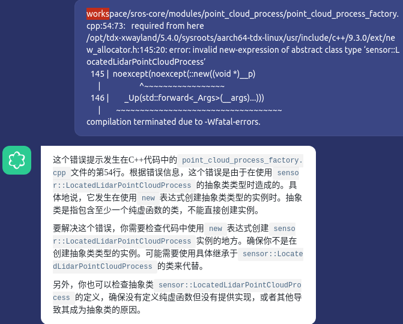
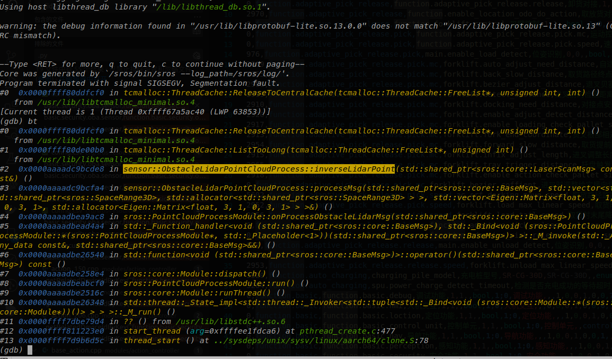
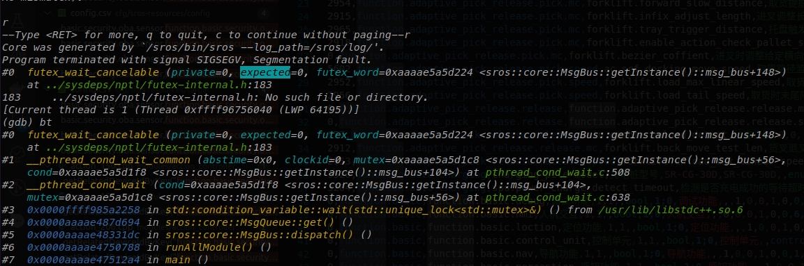
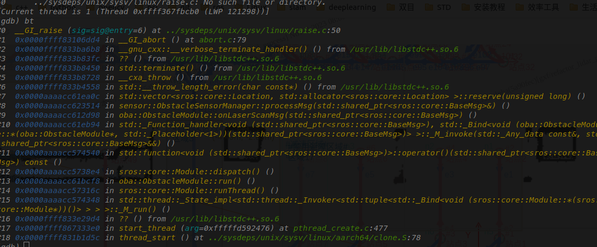

# 工程开发调试问题汇总

#### 1.重构版本架构编译出错

**问题描述：**

**结论：**    void transformPointsToRobot(const StdPoints &input_points, StdPoints &output_points);误删没有在子类定义

#### 2.剥离避障雷达问题

**问题描述：**重构三个避障雷达时候，出现原版本和重构版本的输出不一致情况，且程序==偶发==崩溃，gdb调试的位置不一致；

**问题分析：**

- [ ] 参数一致性问题；
- [ ] 单独测一个后侧雷达, 其他统统关掉；
- [ ] 开启inverse函数就开始偶发崩溃
- [ ] 开启三个雷达就崩的更明显
- [ ] 怀疑通信，一个话题多个消息干扰导致；
- [ ] 恩辉提示是不是指针操作inverse里面；

**结论：**

- 重构版本和obstacle模块同时订阅一个话题，而算法里面的inverse对rangs进行处理，多线程运行导致其他模块出现问题，表现出gdb位置不一致；
- 关于多线程的问题很多情况偶发出现，很难排查；
- 订阅数据，不确定自己有写操作时候，习惯性的拷贝一份数据，不要直接操作指针；

#### 3.添加录bag功能所遇问题

- [ ] 静态成员函数在h文件声明后 cpp文件是否需要声明该函数；
- [ ] 类成员模版函数在h文件声明后 能够放在cpp文件吗？必须放在类外定义吗？

#### 4.添加录bag功能所遇问题

- [ ] 容器启动ip地址
- [ ] 没有sros_INFO.log
- [ ] 点云处理模块没有起来；